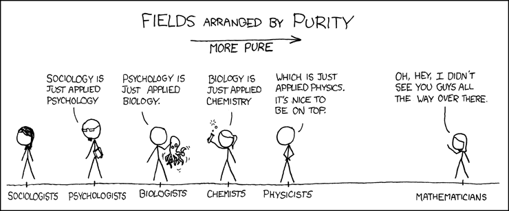
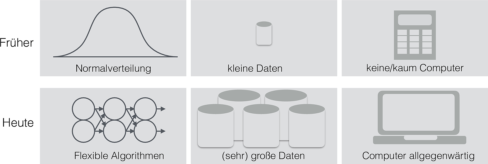
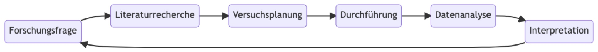
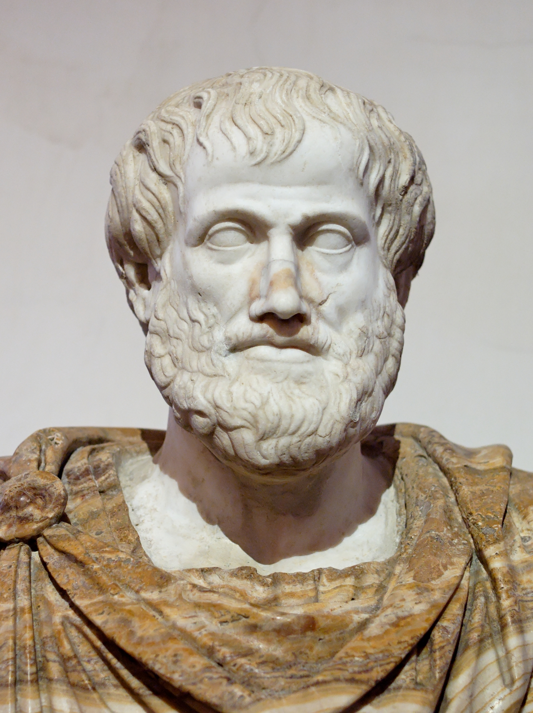
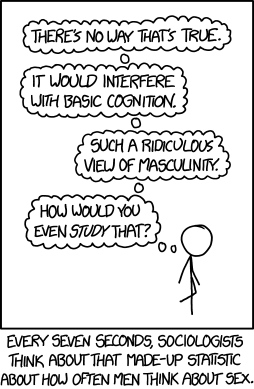

# Rahmen: Hallo, Forschung!


```{r}
#| include: false
library(dplyr)
```


{width="25%"}


:::{.xsmall}
This image and their code are taken from the [phantastic Spiro R package](https://wjschne.github.io/spiro/articles/Gallery/Gallery.html) bei [W. J. Schneider](https://github.com/wjschne). Eine schöne Fraktalsammlung findet sich bei [Flickr](https://www.flickr.com/search/?text=fractal). Eine interessante, aber recht eigenwillige Antwort auf die Frage " Wer bist und wer bin ich?" liefert @hofstadter_ich_2008.
:::


## Lernsteuerung


### Lernziele

- Sie können einige Beispiele von psychologischen Studien nennen und einige Informationen zu diesen Studien wiedergeben.
- Sie können Definitionsbestandteile für Wissenschaft nennen und diskutieren.
- Sie können die drei Schlussarten der Wissenschaft erläutern und mit Beispielen verdeutlichen.
- Sie können KI-Tools nutzen, um wissenschaftliche Texte zusammenzufassen und zu interpretieren.
- Sie können den Nutzen der Wissenschaft für die Gesellschaft erläutern und mit Beispielen versehen.


### Blick zum Fahrplan und Projektplan

Sie stehen am Anfang Ihrer Reise 😄.
Wenn Sie es mir nicht glauben, werfen Sie einen Blick auf @fig-ueberblick und @fig-projektplan.


>   😈 Welcher Rat führt am sichersten zu einer schlechten Note?

>    👹 Ok, hier ist der Monster-Rat: "Lass dir Zeit, ach, dass kannst du nächste oder übernächste Woche auch noch erledigen, oder irgendwann halt!"


<!-- ## Zum Einstieg -->


<!-- 🤔 ✅  ❓   Quiz! -->

<!-- [Quiz: Prognosefähigkeit psychologischer Effekte](https://antworte.jetzt/quiz/Prognosef%C3%A4higkeit%20psychologischer%20Effekte%20%20%20%20(Projekt-Team:%20Dr.%20Stephanie%20Lichtenfeld,%20Dr.%20Vanessa%20B%C3%BCchner%20&%20M.Sc.%20Caroline%20Zygar%20mit%20gro%C3%9Fer%20Unterst%C3%BCtzung%20von%20B.Sc.%20Larissa%20Sust)) -->

## Wissenschaft zum Anschauen


Wissenschaftsmagazine wie [In-Mind](https://de.in-mind.org/), [Alltagsforschung.de](https://www.alltagsforschung.de/) oder [Psychologie Heute](https://www.psychologie-heute.de/) arbeiten psychologische Forschungsarbeiten auf und präsentieren sie "sofagerecht", also einfach zu rezipieren.

::: {.content-visible unless-format="pdf"}

{width="50%"}
:::


Der Nachteil solcher Magazine ist die Oberflächlichkeit der Darstellung: Viele Fragen zu der vorgestellten Forschung wird ein Bericht aus einem solchen Magazin unbeantwortet lassen.
Der Nutzen solcher Magazine ist in ihrem Inspirationscharakter zu sehen:
Man liest von faszinierender Forschung, fängt an, Fragen zu stellen und entwickelt Ideen (und Freude) auf eigene Forschung.
Grund genug, dass wir uns einmal mit solchen Magazinen beschäftigen.

:::{#exr-inmind}
#### Erarbeiten Sie eine Studie aus einem Wissenschaftsmagazin!
Suchen Sie sich eine Studie aus einem Wissenchaftsmagazin und arbeiten Sie die Kernaspekte heraus. 
Erarbeiten Sie ein Profil der Studie. Orientieren Sie sich an dem Leitfaden aus @tbl-studienprofil.
Sie können [dieses Dateigerüst](https://docs.google.com/document/d/19JLtjAH4A5CSguCyLffWau9Bvf5VcpQ-GPqBxrZITJ4/edit?usp=sharing) verwenden, um Ihre Ergebnisse aufzuschreiben.
:::


```{r}
#| echo: false
#| label: tbl-studienprofil
#| tbl-cap: "Vorlage zur Erstellung eines Studienprofils"
d <- tribble(
  ~Kriterium,
  "Forschungsfrage",
  "Ursache (UV)",
  "Wirkung (AV)",
  "Hauptergebnis",
  "Stichprobengröße",
  "Studienablauf",
  "Stärkster Aspekt",
  "Schwächster Aspekt",
  "Interessant ist ...",
  "Ansatzpunkt für weitere Studien..."
) %>% 
  mutate(id = 1:n(),
         Text = "...") %>% 
  relocate(id, .before = 1)
kable(d)
```

Ein Studienprofil wie in @tbl-studienprofil passt nicht auf jede Studie, aber auf viele. 
Modifizieren Sie ggf. die Vorlage des Studienprofils, so dass es zu Ihrer Studie passt.


### Popscience-Bücher

Fachartikel zu Fachbuch verhält sich wie Wissenschaftsmagazin zu Popscience-Buch.
Hier sind einige Beispiele für solche Bücher.

:::{#exm-popscience}
### Auswahl an lesenswerten Popscience-Büchern
@kahneman2012schnelles, @Ariely2012, @cialdini_psychologie_2017, @ariely_denken_2015
:::

:::{#exr-yourpop}
### Welche Popscience-Bücher kennen Sie?
Stellen Sie ein Popscience-Buch kurz vor! Orientieren Sie sich an folgender Gliederung:

1. Kernaussage des Buches ist ...
2. Gut fand ich an dem Buch, ...
3. Weniger gut fand ich an dem Buch, ...
4. Interessant fand ich ...

Tipp: Lassen Sie sich ähnliche Bücher wie in @exm-popscience vorschlagen, wenn Sie keinen Zugang finden.
:::


### Echte Forschung aus studentischer Feder


Auf der Seite [des Instituts für Wirtschaftspsychologie (iwp) der FOM Hochschule](https://www.fom.de/forschung/institute/iwp-institut-fuer-wirtschaftspsychologie/publikationen/iwp-schriftenreihe.html) finden Sie eine Auswahl an insgesamt gut aufbereiteten psychologischen Studien aus studentischer Feder.

Empfehlenswert ist z.B. die Arbeit zum Thema [Selbstwirksamkeit, Selbstregulation und Prokrastination – Überprüfung eines Mediationsmodells](https://forschung.fom.de/fileadmin/fom/forschung/iwp/Schriftenreihe/FOM-Forschung-iwp-Schriftenreihe-Band-11-Schuhmacher-Beatrice-Prokastination-2022.pdf). Die Arbeit ist frei im Netz verfügbar.


:::{#exr-iwp}
### Einblick in studentische Forschung
Fassen Sie eine studentische Forschungsarbeit zusammen und präsentieren Sie die wesentlichen Ergebnisse! Nutzen Sie @tbl-studienprofil zur Gliederung Ihrer Analyse. 

Wenn es Lizenz der Arbeit zulässt, können Sie auch einen KI-Dienst zur Zusammenfassung der Artikels nutzen.G
Wichtig: Versuchen Sie die Stichhaltigkeit der Antworten der KI nachzuprüfen.

Teilen Sie sich dabei in Gruppen auf; nutzen Sie verschiedene KI-Dienste, s. @tbl-ki-summ-pdf. $\square$
:::

| Nr 	| Name                                                                                                         	|
|:---	|:--------------------------------------------------------------------------------------------------------------|
| 1  	| [Custom GPT: AskYourPDF Research Assistant](https://chatgpt.com/g/g-UfFxTDMxq-askyourpdf-research-assistant) 	|
| 2  	| [SciSpace](https://scispace.com/)                                                                            	|
| 3  	| [Gemini](https://gemini.google.com/app)                                                                      	|
| 4  	| [ChatPDF](https://www.chatpdf.com/)                                                                          	|
| 5  	| [Google Notebook LM](https://notebooklm.google.com/)                                                          |
| ?   | ...                                                                                                           |


: KD-Dienste zur Textzusammenfassung {#tbl-ki-summ-pdf .striped .hover}


:::{#exr-summ-ai}
### KI zur Textzusammenfassung
Es gibt eine Reihe von KI-Tools, die Texte für Sie zusammenfassen.
Dabei stellt sich naturgemäß die Frage, wie gut bzw. zuverlässig diese Dienste arbeiten?

Vergleichen Sie die Güte der Zusammenfassung verschiedener KI-Dienste.
Wichtig: Lesen Sie den Text in Auszügen auch selber, um so herauszufinden,
ob nicht vielleicht alle KI-Dienste einen Sachverhalt nur ungenau treffen.

Vergleichen Sie die dabei verschiedenen KI-Dienste, s. @tbl-ki-summ-pdf.

Schreiben Sie Ihre Erfahrungen auf [dieser Schreibwand](https://padlet.com/profsebastiansauer/tldr-ki-tools-zur-textzusammenfassung-nhsg6h0jozlay9j0) zusammen. $\square$
:::


:::{#exr-text-extract}
### Text aus PDF extrahieren
Reiner Text ist für eine KI einfacher zu verarbeiten als ein PDF.
Daher kann es Ihre Ergebnisse verbessern, wenn Sie einer KI nicht ein PDF zum Zusammenfassen geben (besonders, wenn es sehr lang ist), sondern eine Textdatei, die eben nur den zusammenfassenden Text enthält, s. @lst-extract-pdf. Teilweise haben KI-Dienste auch Obergrenzen für Textmengen,
die mit einer Textdatei besser steuerbar sind, als mit einer PDF-Datei.

Extrahieren Sie den Text aus einer wissenschaftlichen Arbeit in eine Textdatei.
Überprüfen Sie dann, ob und inwiefern ein bestimmter KI-Dienst damit besser zurecht kommt. $\square$
:::

```{r}
#| lst-label: lst-extract-pdf
#| lst-cap: "So kann man Text aus einem PDF extrahieren."
#| eval: false
library(pdftools)  # ggf. das Paket vorab installieren

# Text aus PDF extrahieren; hier geben Sie IHREN Pfad an:
pdf_text <- pdf_text('https://raw.githubusercontent.com/sebastiansauer/fopra/main/pdf/02.pdf')

# Text in einer beliebigen Textdatei speichern:
writeLines(pdf_text, "Material/text_aus_kapitel2.txt")
```


## Was ist Wissenschaft?


### Definitionsversuche


:::{#def-science}
### Wissenschaft

Wissenschaft ist ein systematisches Unterfangen, das Wissen erzeugt und organisiert, 
primär in Form von testbaren Erklärungen über beobachtbare Phänomene. $\square$
:::


Disziplinen, die wissenschaftliche Erkenntnisse zur Lösung praktischer Probleme nutzen (wie Medizin oder Wirtschaftspsychologie), nennt man auch angewandte Wissenschaft; Wissenschaftszweige mit weniger (direktem) Anwendungsbezug nennt man Grundlagenwissenschaft.

Aspekte der Wissenschaft, die die Erzeugung von Wissen in den Vordergrund stellen, nennt man Forschung.

Die Art und Weise einer Wissenschaft nennt man ihre wissenschaftliche Methode. Die wissenschaftliche Methode ist geprägt von dem Versuch, das Universum objektiv, korrekt, reproduzierbar und so einfach wie möglich zu erklären. Damit ist gemeint, dass rationale und fachlich informierte Menschen zu der gleichen Einschätzung eines wissenschaftlichen Arguments kommen sollten. Die Falsifizierung einer Hypothese stellt für viele das Kennzeichen wissenschaftlichen Fortschritts dar. Verifizieren wird hingegen von vielen als kein starkes Mittel wissenschaftlichen Fortschritts gesehen. Daraus kann die Relevanz des Zweifelns (Skeptizismus) für die Wissenschaft abgeleitet werden.


Da die Phänomene der Welt (Evolution, Gravitation, Liebe, Inflation, Agression, ...) komplex sind, neigen auch die Erklärungsansätze der Wissenschaft dazu, kompliziert zu sein.
Allerdings sollten die Erkärungsansätze so einfach wie möglich sein (und so komplex wie nötig).


:::{#def-theorie}
### Theorie
Die Wissenschaft organisiert ihr Wissen (auch) in Theorien. 
Theorien sind ein Bündel von Aussagen. Diese Aussagen sind 

- aufeinander bezogen
- widerspruchsfrei
- häufig Kausalaussagen
- prüfbar $\square$
:::


:::{#exm-science}
### Beispiele für Theorien
Zu den bekanntesten und einflussreichsten Theorien gehören die Evolutionstheorie oder die Relativitätstheorie.$\square$
:::


### Eigenschaften von Wissenschaft

Zu den (gewünschten^["Desiderata"]) Eigenschaften von Wissenschaft gehören:

- *Objektivität*: Ein Befund hängt nicht davon ab, wer Messungen oder einen Versuch durchführt. Die Sprache ist nüchtern und unvoreingenommen.
- *Offenheit*: Der Leser muss nicht glauben, sondern kann selber nachprüfen.
- *Abstraktion*: Eine wissenschaftliche Aussage soll möglichst weite Gültigkeit besitzen, Spezifika von Einzelfällen werden auf zugrundeliegende Konstanzen verallgemeinert
- *Analyse*: Komplexe Probleme werden soweit als möglich in Einzelaspekte aufgebrochen^[<https://www.savagechickens.com/2021/07/big-question.html>]
- *Evidenzgründung*: Schlüsse werden auf Basis von Daten (Fakten, Messungen, etc.) gezogen. Dabei wird zwischen Fakt und Schluss (und Meinung) klar unterschieden.
- *Quellen*: Aussagen werden mit Quellenangaben untermauert.


Zitate zu den Eigenschaften von Wissenschaft


>   Non-reproducible single occurrences are of no significance to science. – Karl Popper


>   Der Fortgang der wissenschaftlichen Entwicklung ist im Endeffekt eine ständige Flucht vor dem Staunen.^[Vgl. <https://www.savagechickens.com/2022/04/so-many-questions.html>] – Albert Einstein

>    Auf die Frage, was der Nutzen von Grundlagenforschung sei (im Gegensatz zur praktischen Relevanz angewandter Forschung), soll Michael Faraday gesagt haben: „Sir, what is the use of a new-born child“?


>   Ohne Spekulation gibt es keine neue Beobachtung. – Charles Darwin


>   In Wissenschaft geht es nicht um Wahrheit, sondern darum, auf bessere Art falsch zu sein. – Thomas Schofield

>    Wenn alle Experten sich einig sind, ist Vorsicht geboten. – Bertrand Russel


### Mathematik als Grundlage der Wissenschaft?


::: {.content-visible unless-format="pdf"}


:::


Im XKCD-Cartoon [435](https://www.explainxkcd.com/wiki/index.php/435:_Purity) wird Mathematik als Grundlage der Wissenschaften dargestellt.

:::{#exr-xkcd} 
### Ist die Mathematik die Grundlage der Wissenschaften?
Beziehen Sie Stellung zu dem Cartoon und den damit verbundenen Aussagen!
:::


### Was ist ein Modell?


:::{#def-modell}
Ein wissenschaftliches Modell ist eine vereinfachte (aber kohärente) Auffassung eines Forschungsgegenstands (d.h. ein Auszug der Realität). Häufig spielen Metaphern oder Analogien dabei eine Rolle (z. B. lehnt sich das Atommodell nach Bohr an das Sonnensystem an).$\square$
:::


Modelle können z. B. grafisch, mathematisch oder statistisch ausgebildet sein.
Modelle erläutern das Zusammenspiel mehrerer Merkmale innerhalb des Modells.
Der Nutzen von Modellen besteht darin, komplexe Sachverhalte verständlich und „greifbar“ oder „anschaulich“ zu machen. Häufig versucht man, wesentliche Größen (wie Einflussfaktoren) in das Modell aufzunehmen und unwesentliche außen vor zu lassen. Die Güte eines Modell kann man an diesem Spagat bemessen.


:::{#exm-modell}
Beispiele für Modelle: Globus, Klimamodelle, Doppelhelix der DNA. $\square$
:::

Es hat sich herausgestellt, dass viele Phänomene des Universums kompliziert (oder besser: komplex) sind, so dass („richtiges“) Vereinfachen in Form von Modellbildung nützlich ist – tatsächlich der zentrale Weg des wissenschaftlichen Denkens darstellt.

Modelle ermöglichen damit die Beschreibung, Erklärung und Vorhersage von Phänomen (und damit auch die Einflussnahme).
Modelle sind ähnlich zu Theorien, aber meist kleiner gefasst und die Analogie oder Metapher steht im Vordergrund.

:::{exm-sciences-types}
### Beispiele für Wissenschaften
@tbl-sciences stellt Beispiele vor für Wissenschaften und ihre Einordnung. 

```{r}
#| echo: false
#| tbl-cap: Beispiele für Wissenschaften und ihre Einordnung
#| label: tbl-sciences
d <- read.csv("children/sciences-tab.csv")
kable(d)
```

$\square$
:::


### Die drei Ziele einer empirischen Wissenschaft

@fig-ziele zeigt die drei Ziele einer empirischen Wissenschaft.
Es gibt nur diese drei!
Allerdings könnte man auch von Ziel*arten* sprechen.

```{mermaid}
%%| fig-cap: Zielarten der empirisichen Wissenschaft
%%| label: fig-ziele

graph TD
  subgraph Ziele
    A[beschreiben]
    B[vorhersagen]
    C[erklären]
  end
```


Beispiele für die einzelnen Zielarten:

- *Beschreiben*: "Wie groß ist der Gender-Paygap in der Branche X im Zeitraum Y?"
- *Vorhersagen*: Wenn eine Person X^[z. B. ich] 100 Stunden auf die Statistikklausur lernen, welche Note kann diese Person dann erwarten?
- *Erklären*: Wie viel bringt das Lernen auf die Statistik-Klausur?

<!-- ### Taxonomie der psychologischen Modalitäten -->

<!-- - Denken -->
<!-- - Fühlen -->
<!-- - Handeln -->


## Wozu Wissenschaft?


### Ich will kein Wissenschaftler werden!


:::{#exm-job}
### Unternehmensberatung und Wissenschaft
Toni arbeitet bei einer Unternehmensberatung. Um als Unternehmensberater zu arbeiten, braucht es wissenschaftliches Denken, sagt Toni. Sie arbeitete erst als Wissenschaftlerin, jetzt in der Unternehmensberatung.


Arbeitsweisen in beiden Feldern:

- Evidenzbasiertes Vorgehen: Zahlen, Daten, Fakten
- Systematisches Vorgehen: Hohe Qualitätsstandards bei den Kernprozessen
- Annahmen und Ideen testen: Nicht glauben, sondern überprüfen
- Gute Schätzungen erstellen: "Tacheles reden" $\square$
:::

### Wissenschaft im Alltag


:::{#fig-science-everyday layout-ncol=2}

{#fig-phone}

{#fig-vaccine}

Wissenschaftliche Errungenschaften, die aus dem Alltag nicht wegzudenken sind.
:::


### Wissenschaft und Lernen

:::{#exm-science2}

### Aus der Forschung

Handschriftliche Notizen merkt man sich besser als mit der Tastatur getippte [@mueller_pen_2014].$\square$
:::


### Wissenschaft als Wert an sich

Wir verdanken den technischen Fortschritt und damit Wohlstand, Gesundheit, Langlebigkeit und Komfort der Wissenschaft.

Der Geist der Wissenschaft ist: Selber denken. Damit ist Wissenschaftlichkeit die Grundlage der freien Gesellschaft.


:::{.callout-important}
Habe den Mut, dich deines eigenen Verstandes zu bedienen! Das Motto Kants fasst die Idee der Wissenschaft zusammen. Damit kann Wissenschaft verstanden werden als die Grundlage einer aufgeklärten Gesellschaft.
:::


### Reproduzierbarkeit


:::{#def-repro}
### Reproduzierbarkeit

Reproduzierbarkeit ("Wiederholbarkeit") ist das Vermögen, eine Analyse durch Dritte zu wiederholen und zu einem ähnlichen (gleichen) Ergebnis wie in der ursprünglichen Analyse zu bekommen.  $\square$
:::

Es handelt sich um ein Kernkriterium für wissenschaftliche Qualität.

Wenn ein Befund nicht reproduzierbar ist, ist es dann echtes Wissen?


### Forschung früher und heute




### Ein Prozess der Forschung

@fig-prozess-wiss stellt eine mögliche Gliederung des Prozesses der Forschung dar.

{#fig-prozess-wiss}


### Ursachensuche


Die Suche nach den Ursache ist vielleicht die wichtigste Aufgabe der Forschung.


{width="33%"}

[Bildquelle: Jastrow, Wikipedia, Gemeinfrei](https://de.wikipedia.org/wiki/Aristoteles#/media/Datei:Aristotle_Altemps_Inv8575.jpg)


```{mermaid}
flowchart LR
  Ursache --> Wirkung
```


- Die Ursache U eines Ereignisses E (Wirkung) ist eine notwendige und/oder hinreichende Bedingung, damit E eintritt.

- Ein Ereignis kann mehrere Ursachen haben.

- Zu jedem Ereignis E gibt es mindestens eine Ursache U.

- Zufall ist keine Ursache, sondern eine Umschreibung für die Tatsache, dass die Ursache unbekannt ist.

- Kennt man eine Ursache eines Ereignisses, so schließt das nicht aus, dass es andere Ursachen gibt.

- Kenntnis der Ursache(n) von E ist i. A. nötig, um den Verlauf bzw. das Eintreten einer Wirkung zu beeinflussen.

- Kenntnis der Ursache(n) von E ist i. A. hilfreich, aber nicht nötig, um den Verlauf bzw. das Eintreten einer Wirkung vorherzusagen.


## Wissenschaftliches Schließen

### Arten des Schließens

Es gibt drei Arten, wie man zu Wissen (über nicht beobachtbare Dinge) kommen kann [@walach_psychologie_2013].

Bohnen! Die Grundfesten der Wissenschaft!


{width="50%"}

[Quelle: James_Maynard Pixabay Licence](https://pixabay.com/de/photos/pinto-bean-pintobohnen-bohne-bohnen-3728767/)

#### Induktion

>   Hm ich habe schon 30 Bohnen aus dem Sack gezogen … . Alle weiß. Noch 30 Bohnen … schon wieder alle weiß. Ich hab’s: Die Bohnen müssen alle weiß sein!

- Beschreibung: Sammlung vieler Einzelbeobachtungen; atheoretisch bzw. „theorielos“
- Stärke: Nahe an der „Wirklichkeit“
- Schwäche: Einzelaussagen können nie sicheres Wissen erzeugen; Die Auswahl von Beobachtungen benötigt eine Theorie


#### Abduktion


>    Vor mir steht ein Sack; ich sehe, dass Bohnen darin sind. Ich finde eine weiße Bohne irgendwo im Raum auf den Boden. Daraus schließe ich: „Die Bohne muss aus dem Sack sein!

- Beschreibung: Lose verknüpfte Einzel-beobachtungen werden zu einer Theorie verknüpft.
- Stärke: Kreativ, schafft neues Wissen im Sinne einer „kühnen Vermutung“
- Schwäche: Fehleranfällig


#### Deduktion


>    Ich habe die Bohnen in den Sack gefüllt. Sie waren alle weiß. Jetzt nehme ich eine Bohne aus dem Sack: sie ist weiß!


- Beschreibung: Aus einer Allgemeinaussage (Theorie) werden Hypothesen logisch abgeleitet.
- Stärke: Sicheres Wissen bei korrekter Ausführung; „logisch zwingend“
- Schwäche: Keine wirklich neuen Erkenntnisse möglich


:::{#exm-schlussarten}
#### Beispiele zu den Schlussarten

*Induktion* „In meiner Studie-Stichprobe war der IQ im Mittel 120. Daraus schließe ich, dass in der Grundgesamtheit aller Studies der IQ im Mittel 120 beträgt“ (Verallgemeinerung).

*Abduktion* "Joachim, Du hast 10 Mal am Stück Kopf geworfen; das passiert selten bei fairen Münzen. Daher schließe ich, dass Deine Münze nicht fair ist“ (Spekulation! Joachim könnte Glück gehabt haben).

*Deduktion* „In einer Normalverteilung liegen 2/3 aller Werte höchstens eine SD-Einheit vom Mittelwert entfernt. Mir liegt ein Messwert aus einer Normalverteilung vor, der nur als eine halbe SD-Einheit vom Mittelwert ist. Daher schließe ich, dass er zu den inneren 2/3 aller Werte gehört“ (wenn die Regel der Normalverteilung wahr ist, dann muss der Schluss richtig sein, mit Sicherheit).$\square$
:::


:::{.callout-caution}
Gerade die Deduktion kann man falsch anwenden.
*Beispiel für korrekte Anwendung*

Annahmen:

1. (Alle) Nobelpreisträger sind schlau.
2. Albert Einstein ist Nobelpreisträger.

Folgerung:

Albert Einstein ist schlau (richtig!).

*Beispiel für falsche Anwendung*

Annahmen:

1. (Alle) Nobelpreisträger sind schlau.
2. Alber Einstein ist schlau.

Folgerung:

Albert Einstein ist Nobelpreisträger (falsch!). Nicht alle Schlauen sind Nobelpreisträger. $\square$
:::


### Alle zwei Minuten ein Einbruch?


Auf der Webseite eines Anbieters für Sicherheitstechnik war zu lesen:


>   Alle zwei Minuten findet in Deutschland ein Einbruchversuch statt.


{width="33%"}


:::{#exr-einbruch}
### Wie viele Einbrüche passieren in Deutschland? 
Wie fundiert ist obige Aussage zu "alle zwei Minuten" wohl? 
:::


## Qualität von Studien: Orientierung an der CONSORT-Checkliste

Eine hilfreiche Orientierung zur Bewertung von Studienqualität bietet die  
[CONSORT-Checkliste](https://www.consort-spirit.org/) (*Consolidated Standards of Reporting Trials*).  

Sie wurde ursprünglich für randomisierte kontrollierte Studien entwickelt, 
eignet sich aber sehr gut als **allgemeines Raster**, um Studien systematisch zu prüfen.

Ziel ist nicht, „perfekte“ Studien zu finden – sondern **transparent zu machen, was berichtet wird (und was nicht)**.


### Zentrale Qualitätskriterien entlang von CONSORT

#### 1. Titel & Abstract: Wird klar, worum es geht?
- Ist das Studiendesign erkennbar (z. B. Experiment, RCT)?
- Werden zentrale Ergebnisse berichtet?

Erste Hinweise auf Qualität: unklare Abstracts = oft unklare Studien


#### 2. Einführung: Ist die Fragestellung begründet?
- Wird eine klare Hypothese formuliert?
- Ist die Studie theoretisch eingebettet?

Achtung bei:

- vagen oder nachträglich wirkenden Hypothesen


#### 3. Methode: Wie wurde die Studie durchgeführt?

##### a) Stichprobe
- Wer hat teilgenommen?
- Ein- und Ausschlusskriterien klar?
- Rekrutierung nachvollziehbar?

Problematisch:

- „Convenience Samples“ ohne Reflexion


##### b) Design & Ablauf
- Gibt es Kontrollbedingungen?
- Wurden Teilnehmende randomisiert?
- Ist der Ablauf klar beschrieben?

Leitfrage:

> Könnte ich die Studie exakt nachbauen?


##### c) Operationalisierung
- Wie wurden zentrale Variablen gemessen?
- Sind die Messinstrumente valide und reliabel?

Häufige Schwäche:

- unklare oder fragwürdige Messungen


##### d) Intervention / Manipulation
- Was genau wurde gemacht?
- Ist die Manipulation ausreichend beschrieben?

Wenn Details fehlen → schlechte Reproduzierbarkeit


#### 4. Ergebnisse: Was wurde gefunden?

##### a) Stichprobenfluss (Flow)
- Wie viele Personen haben teilgenommen?
- Gab es Ausfälle (Dropouts)?

CONSORT betont hier Transparenz (z. B. Flussdiagramme)


##### b) Analysen
- Welche statistischen Verfahren wurden verwendet?
- Sind Effektgrößen berichtet (nicht nur p-Werte)?

Achtung:
- nur Signifikanz ohne Effektstärke = eingeschränkte Aussagekraft


#### 5. Diskussion: Wie werden die Ergebnisse interpretiert?

- Werden Limitationen benannt?
- Wird vorsichtig oder übertrieben interpretiert?
- Gibt es alternative Erklärungen?

Warnsignal:

- sehr starke Schlussfolgerungen bei schwachen Daten


#### 6. Transparenz & Reproduzierbarkeit

- Sind Materialien, Daten oder Analysen zugänglich?
- Wird die Studie ausreichend detailliert beschrieben?

Kernfrage:

> Könnten andere Forschende die Ergebnisse reproduzieren?


### Anwendung

Für die Analyse einer Studie kann man sich an folgenden Leitfragen orientieren:

1. **Verstehen**
   - Was ist die zentrale Hypothese?
   - Wie ist das Studiendesign aufgebaut?

2. **Bewerten (CONSORT-orientiert)**
   - Was ist gut berichtet?
   - Was fehlt oder ist unklar?

3. **Kritik**
   - Wo liegen mögliche Schwächen?
   - Welche Verzerrungen könnten vorliegen?

4. **Reproduzierbarkeit**
   - Könntet ihr die Studie selbst durchführen?
   - Welche Informationen fehlen euch?


:::{#exr-quali-brain}
### Beurteilen Sie die Qualität des Brain-Drain-Artikels

Beurteilen Sie die Qualität [dieses Artikels](https://journals.plos.org/plosone/article?id=10.1371/journal.pone.0219233) anhand der CONSORT-Checkliste!
Berichten Sie dann Ihre Ergebnisse im Plenum. $\square$
:::


### Fazit

Die CONSORT-Checkliste hilft dabei, Studien nicht nur inhaltlich, sondern vor allem **methodisch und strukturell** zu bewerten.

> Eine Studie ist nicht nur dann gut, wenn ihre Ergebnisse überzeugend sind – sondern wenn ihr Aufbau so transparent ist, dass andere sie überprüfen können.


## KI-Arbeitsmittel


:::{.callout-caution}
Prüfen Sie, welche KI-Hilfsmittel für Ihre Qualifizierungsarbeit erlaubt sind. 
Informieren Sie sich, was einen Plagiatsfall darstellt und stellen Sie sicher, keinen Plagiatsfall zu begehen. $\square$
:::


:::{.callout-caution}
Prüfen Sie die Nutzungsrechte, die Ihnen der Urheber einräumt.
Geben Sie keine personenbezogenen Daten Dritter an eine KI weiter. Auch bei den *eigenen* personenbezogenen Daten sollten Sie sparsam ein. $\square$
:::


### Nutzungsregeln für KI-Tools (z. B. ChatGPT) in Studium und Forschung


Grundprinzip:

> **Man darf nur Inhalte hochladen, für die man die nötigen Rechte hat.**


Erlaubte Inhalte sind:

- Eigene Inhalte
  - Eigene Texte, Notizen, Hausarbeiten
  - Selbst erstellte Daten oder Auswertungen

- Open-Access-Publikationen
  - Frei zugängliche wissenschaftliche Artikel (z. B. arXiv)
  - Inhalte mit offenen Lizenzen (z. B. CC-BY)

- Inhalte mit ausdrücklicher Erlaubnis
  - Materialien, für die Sie eine Nutzungslizenz haben


### Suchen Sie nach CC-BY-Artikeln

Woran erkennt man ein CC-BY-Paper?

Im Paper steht typischerweise sowas wie:

>   This article is distributed under the terms of the Creative Commons Attribution License (CC BY 4.0).

Oder ein Symbol:
[CC BY 4.0](https://creativecommons.org/licenses/by/4.0/deed.de)


### Wo man CC-BY-Paper findet

1. Open-Access-Journals (sehr häufig CC-BY)

Viele große Verlage veröffentlichen Open-Access-Artikel standardmäßig unter CC-BY:

- [Public Library of Science (PLOS)](https://plos.org)  
  → fast alle Artikel sind CC-BY

- [BioMed Central (BMC)](https://www.biomedcentral.com)  
  → ebenfalls überwiegend CC-BY

- [Springer Nature (Open Access)](https://www.springernature.com/gp/open-research)  
  → oft CC-BY bei Open Access

- [Elsevier Open Access](https://www.elsevier.com/open-access)  
  → teilweise CC-BY (nicht immer!)

Tipp: Die Lizenz steht meist direkt im Artikel (oben oder unten auf der Seite).


2. Suchmaschinen mit Lizenzfilter

- [Google Scholar](https://scholar.google.com)  
  → keine direkte CC-BY-Filterung, aber oft Hinweise im PDF  

- [CORE](https://core.ac.uk)  
  → viele CC-lizenzierte Inhalte  

- [BASE – Bielefeld Academic Search Engine](https://www.base-search.net)  
  → erlaubt gezielte Open-Access-Suche  

---

3. Preprint-Server (aufpassen!)

- [arXiv](https://arxiv.org)  
  → oft CC-BY, aber nicht immer (verschiedene Lizenzen!)  

- [bioRxiv](https://www.biorxiv.org)  
  → häufig CC-BY oder CC-BY-NC  

Wichtig: Lizenz immer direkt im Dokument prüfen!


###  Vorsicht bei diesen Inhalten

#### CC-BY-NC (Non-Commercial):

- Nutzung nur für **nicht-kommerzielle Zwecke erlaubt**
- Problematisch bei:
  - Nutzung im Unternehmen
  - kommerziellen Projekten
  - möglicher Weiterverarbeitung durch KI-Anbieter

Empfehlung: Nur im privaten oder universitären Kontext nutzen


####  Nicht erlaubte Inhalte

- Paywalled Artikel (z. B. Elsevier, Springer PDFs)
- Inhalte aus Uni-Datenbanken ohne Weitergaberecht
- Gekaufte oder lizenzpflichtige Texte ohne Erlaubnis
- Vertrauliche oder personenbezogene Daten


####  Besonderheit bei KI-Systemen

Beim Hochladen von Inhalten:
- erfolgt eine **technische Verarbeitung**
- ggf. auch **Speicherung oder Weiterverwendung**

Das kann rechtlich als Nutzung oder Vervielfältigung gelten

---

### Kommerzielle vs. nicht-kommerzielle Nutzung

| Nutzungskontext | Bewertung |
|----------------|----------|
| Studium / Lehre | ✅ erlaubt |
| Private Nutzung | ✅ erlaubt |
| Forschung an Uni | ✅ meist erlaubt |
| Nutzung im Unternehmen | ⚠️ kritisch |
| Kommerzielle Projekte | ❌ oft unzulässig |


### Wissenschaftliche Integrität

#### Transparenz
- KI-Nutzung offenlegen (je nach Vorgabe der Hochschule)

#### Eigenleistung
- KI ist ein Hilfsmittel, kein Ersatz für eigene Arbeit

#### Quellenangaben
- Ergebnisse aus KI überprüfen und korrekt zitieren

---

### Datenschutz beachten

Keine sensiblen Daten hochladen:

- personenbezogene Daten
- Prüfungsleistungen anderer
- interne Dokumente

---

### Faustregeln für den Alltag

- „Darf ich das Dokument einfach weitergeben?“  
  → Wenn nein: **nicht hochladen**

- „Ist das frei im Internet verfügbar?“  
  → Wenn ja: meist unproblematisch

- Im Zweifel: **weniger hochladen, mehr selbst formulieren**

---

### Empfehlung

Für rechtssichere Nutzung:
- Bevorzuge **Open Access** oder **CC-BY**
- Nutze **eigene Zusammenfassungen**
- Vermeide **CC-BY-NC in unklaren Kontexten**

---

### Hinweis

Diese Regeln bieten eine Orientierung, ersetzen aber keine individuelle Rechtsberatung.  
Die rechtliche Lage (insbesondere bei KI) entwickelt sich derzeit weiter.

---


### Sammlung an KI-Tools

Schauen Sie sich mal diesen Überblick über [KI-Arbeitsmittel für Forschung](https://docs.google.com/document/d/1mb4SWtqyi1iEGCn2uTnHkPHqW3UoQr8b0xv5_81a-4Y/edit) an.


Bei vielen Diensten müssen Sie sich ein Konto anlegen, um den Dienst nutzen zu können.
Mithilfe eines anonymen EMail-Kontos minimieren Sie die Daten, die Sie preisgeben.


### Grundlagen des Promptings

Large-Language-Modelle wie [ChatGPT](https://chatgpt.com/) oder [Google Gemini](https://gemini.google.com/app)
haben ein Chatbot-Interface. Man spricht das Programm mit einem sog. Prompt an.
Dabei gilt die Grundregel: Garbage in, garbage out. 
Anders gesagt: Je besser Ihr Prompt, desto besser die Ausgabe der KI (tendenziell).

KI-Modelle basieren auf umfangreichen Textdatensätzen, 
was die bessere Leistung bei englischen Prompts erklärt.
Die KI versucht, die wahrscheinlichsten folgenden Wörter vorherzusagen, 
wobei der Prompt diese Vorhersage steuert.
Je spezifischer der Prompt, desto fokussierter die Vorhersage.


*1. Spezifität ist entscheidend*

Begründung: KI analysiert Muster in Daten. Vage Anfragen führen zu ungenauen Ergebnissen.
Umsetzung: Anstatt "Fasse dies zusammen" sollte man präzisieren: "Fasse diesen Artikel zusammen, konzentriere dich auf die Hauptargumente des Autors und erstelle eine Zusammenfassung mit drei Stichpunkten." Ebenso ist es besser, anstelle von "Schreibe Code" zu sagen: "Schreibe eine Python-Funktion, die die Fakultät einer gegebenen ganzen Zahl berechnet."

*2. Kontext ist unerlässlich*

Begründung: KI benötigt ein Verständnis des "Warum" hinter der Anfrage.
Umsetzung: Zum Beispiel: "Erkläre die Ursachen der Französischen Revolution aus der Perspektive eines Geschichtsprofessors, der zu Gymnasiasten spricht." Oder: "Bestimme anhand eines Datensatzes von Schülernoten und eines Bewertungsrasters die Endnote für jeden Schüler."

*3. Die genaue Angabe des gewünschten Formats ist wesentlich*

Begründung: KI kann verschiedene Ausgabeformate liefern, von Absätzen bis zu Tabellen oder Code.
Umsetzung: Anfragen wie "Gib eine Liste mit fünf Schlüsselpunkten" oder "Formatiere die Ausgabe als Tabelle mit den Spalten 'Name', 'Datum' und 'Zusammenfassung'" oder "gebe das Ergebniss im JSON Format zurück" führen zu präziseren Ergebnissen.

*4. Beispiele sind hilfreich*

Begründung: KI lernt durch Beispiele.
Umsetzung: Man kann beispielsweise angeben: "Hier ist ein Beispiel für den gewünschten Stil: [Beispieltext]. Schreibe nun einen ähnlichen Text über [Thema]." Oder man gibt Beispiele für die Eingabe und die gewünschte Ausgabe.


*5. Iterative Verfeinerung ist notwendig*

Begründung: Das erste Ergebnis ist selten perfekt.
Umsetzung: Bei unbefriedigenden Ergebnissen sollte der Prompt angepasst werden, indem man ihn umformuliert, mehr Kontext hinzufügt oder das Format ändert.


Praktische Ratschläge:

- Klare Begrenzer (z. B. dreifache Anführungszeichen oder Bindestriche) erleichtern die Trennung von Anweisungen und Kontext.
- Komplexe Aufgaben sollten in kleinere Prompts unterteilt werden.
- Experimentieren ist wichtig, da es keine allgemeingültige Methode gibt.
- Sie können den Bot auch fragen, ob Sie alle nötigen Informationen in Ihrem Prompt übermittelt haben, die der Bot für ein gutes Ergebnis benötigt. 
- In ähnlicher Form können Sie den Bot auch anweisen, Ihren Prompt zu verbessern.


## Fazit

>   👺 Wieso solltest du überhaupt noch irgendwas lernen müssen!? Das macht doch alles die KI für dich. Mach dich locker und chill dein Leben!


>   🕺 Wenn du nicht mehr kannst als eine KI, warum sollte dich irgendeine Firma einstellen?


:::{.callout-important}
Wir alle müssen uns ständig bemühen, Dinge zu können, die die Maschine (z.B. eine KI) noch nicht kann. Dass Maschinen uns Arbeit abnehmen, ist schon immer so -- das ist der Fortschritt, der uns das Leben komfortabel macht. Dennoch müssen wir, schon im eigenen Interesse, immer daran arbeiten, der Gesellschaft Mehrwert gegenüber Maschinen bieten zu können. $\square$
:::


Übrigens: Vorsicht, Forschung kann süchtig machen, s. [XKCD 1564](https://www.explainxkcd.com/wiki/index.php/1564:_Every_Seven_Seconds).


::: {.content-visible unless-format="pdf"}

{width="50%"}
:::


## Vertiefung

Was ist Wissenschaft? -- Antworten auf diese Frage versucht u.a. @chalmers_wege_2007 zu geben.
Einen breiteren Fokus auf die methodologischen Grundlagen der Psychologie liefert @walach_psychologie_2013. 
Wer sich mit den Grundlagen der Logik befassen möchte - als Fundament vernünftiger Aussagen -, der findet etwa bei @suppes_introduction_1999 eine nützliche Einführung.
Sie zweifeln, ob die Psychologie überhaupt eine Wissenschaft ist? Das ist keine Blasphemie, wie man @galliker_ist_2016 nachlesen kann.
Dass Psychologie eine Wissenschaft ist, ist für @dienes_understanding_2008 klar. Übrigens ist dieses Buch weit rezipiert worden, mit positivem Echo.
Wer Lust hat auf einen Klassiker der Wissenschaftstheorie, der kommt an @popper_logik_2013 nicht vorbei.


