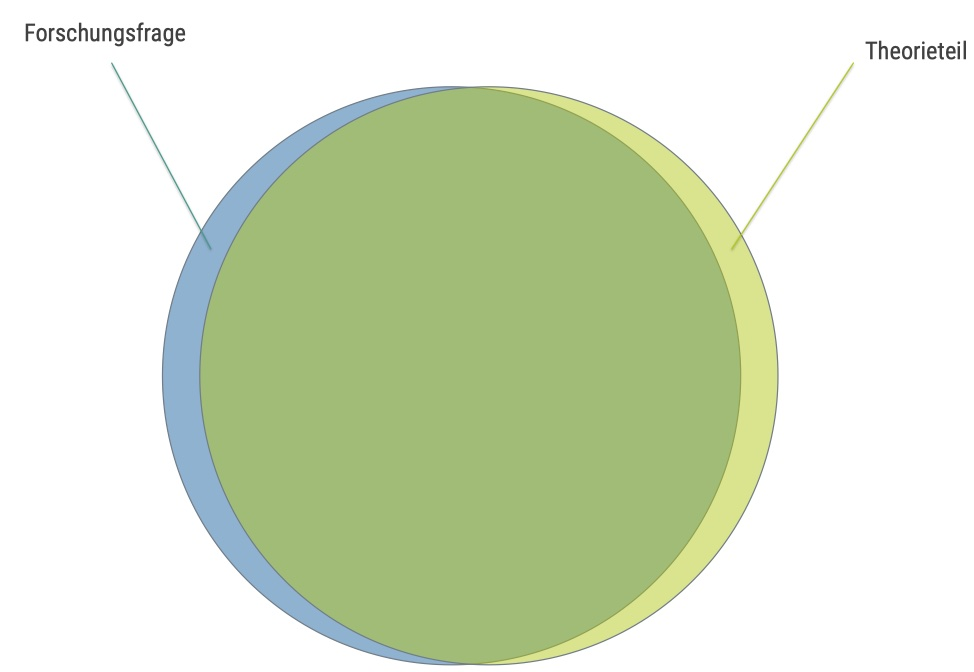
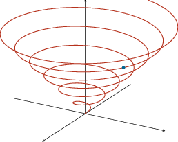
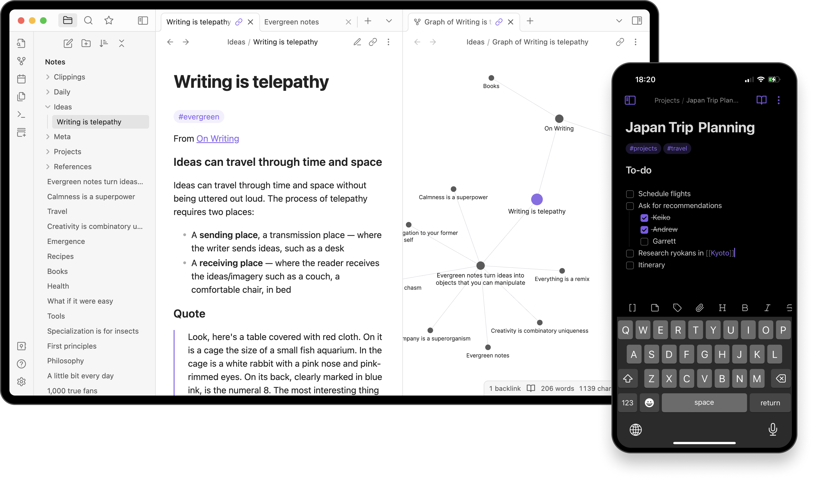
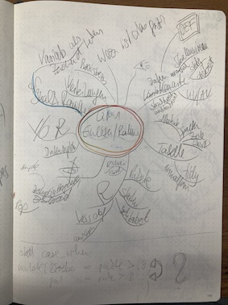
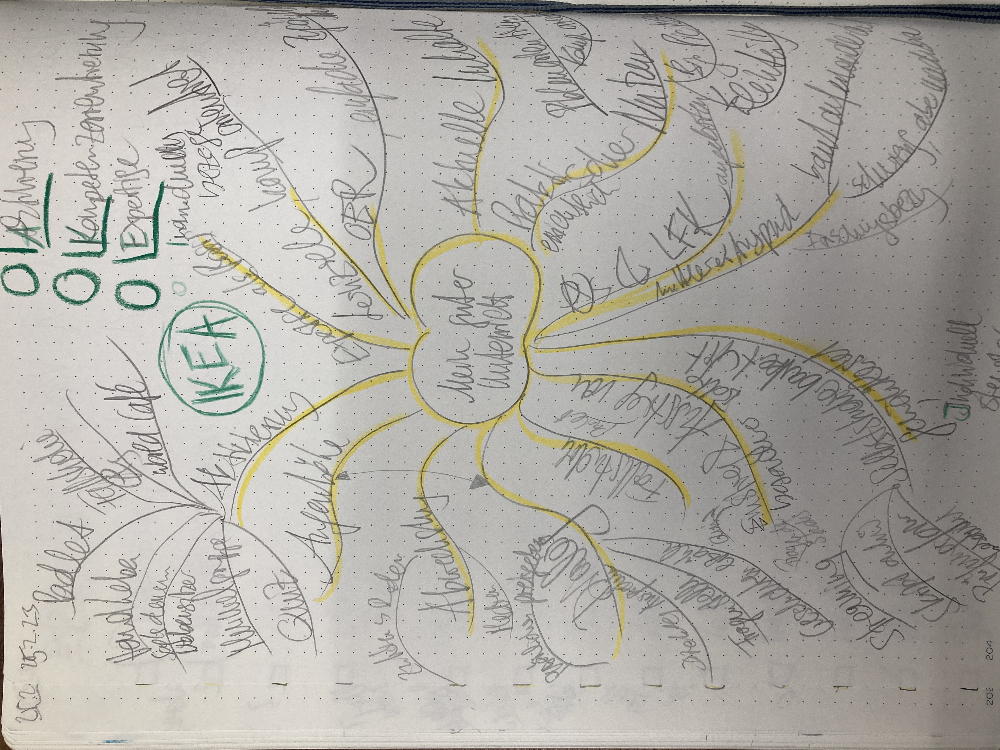
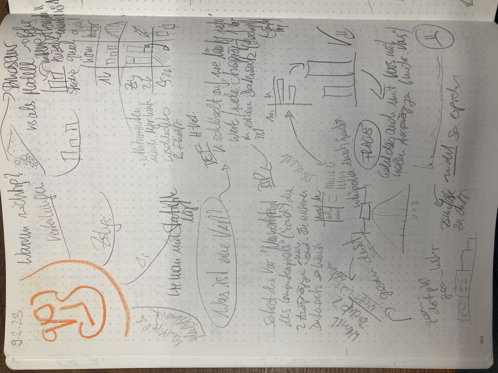
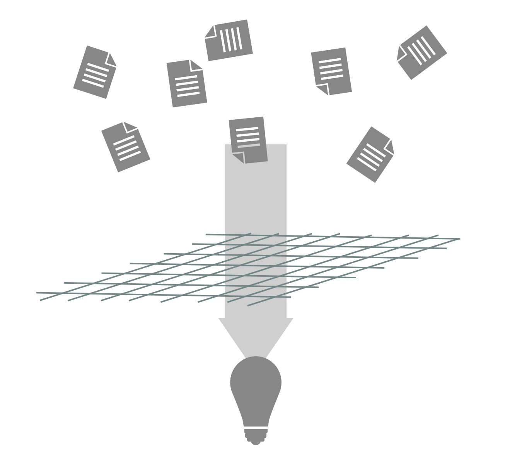

# Einlesen


```{r}
#| include: false
library(tidyverse)
```


```{r}
#| echo: false
library(ggplot2)
theme_set(theme_minimal())
```

## Lernsteuerung


### Lernziele


- Sie können Strategien anwenden, um sich eine Forschungsfrage zu erarbeiten.
- Sie können eine Zeitplanung erstellen für Ihre Projektarbeit.
- Sie können einen Fachartikel effizient lesen.
- Sie können eine Sach-, eine operationalisierten Hypothese und statistische Hypothese unterscheiden und jeweils formulieren.
- Sie können Literatur recherchieren.
- Sie können aus Notizen eine Wissenslandkarte erstellen.


### Position im Lernpfad

Sie befinden sich im Abschnitt "Themawahl" in @fig-ueberblick.
Behalten Sie Ihren Fortschritt im Projektplan im Blick, s. @fig-projektplan.


### Benötigte Software

Für dieses Kapitel benötigen Sie [Zotero](https://www.zotero.org/) und [Obsidian](https://obsidian.md/) (sowie einen Browser).


## Vom Thema zur Forschungsfrage


Beginnt man (zum ersten Mal) mit der Planung einer wissenschaftlichen (empirischen) Studie, so ist es ganz natürlich sich zu fragen, was denn das Thema sein soll.
Wie Sie aber im Folgenden sehen werden, ist nicht das Thema, sondern die Forschungsfrage oder gar die Hypothese der Dreh- und Angelpunkt Ihrer Studie, s. @fig-hyp-exp.


```{r}
#| echo: false
#| label: fig-hyp-exp
#| fig-cap: "Die Exaktheit verschiedener Varianten Ihres Themas"
d <- tibble(
  x = 0:5,
  y = exp(x),
  text = c("kein\nPlan", "Thema", "Forschungs-\nfrage", "Sach-\nhypothese", "O-Hypothese", "Statistik-\nHypothese")
)

ggplot() +
  xlim(-1, 20) +
  # ylim(-50, 200) +
  geom_function(fun = function(x) exp(x)) +
  geom_label(data = d, aes(x = x, y = y, label = text)) +
  labs(x = "",
       y = "Exaktheit",
       caption = "O-Hypothese: Operationalisierte Hypothese") +
  scale_x_continuous(labels = NULL) +
  expand_limits(x = 6, y = -20) +
  scale_y_continuous(breaks = NULL) +
  theme_minimal()
```


### Wo fange ich an?


Am Anfang hat man (manchmal/oft/immer) keinen Plan. 
Hey, das ist ganz normal.
Oft hilft es, den ersten Schritt zu tun: Hauptsache man fängt an.
Das kennt man vielleicht vom Sport: Hauptsache man fängt an, dann geht es fast wie von alleine.
Deswegen ist es wichtig, dass Sie einen ersten Schritt tun: 
Fangen Sie, ein "Thema" zu suchen, s. @fig-themawahl.


 
```{mermaid}
%%| echo: false
%%| fig-cap: "Von *Keine Ahnung* bis zu *Ich hab meine Forschungsfrage*"
%%| label: fig-themawahl
flowchart LR
  subgraph D[Literaturarbeit]
    B[Studie lesen] --> C[etwas mehr Plan]
    C --> B
  end
  A[Kein' Plan] --> F[Idee für ein Thema]
  F --> D
  D --> E[genaue<br>Forschungsfrage]
```


### Forschungsfrage 
Beachten Sie, dass ein "Thema" keinesfalls ausreichend ist, um eine wissenschaftliche Studie durchzuführen und zu dokumentieren.
Ein "Thema" als solches ist viel zu unpräzise.
Was Sie brauchen ist eine präzise Forschungsfrage.


:::{#def-forschungsfrage}
### Forschungsfrage
Eine Forschungsfrage ist die Frage (das Problem), die Sie in Ihrer Arbeit versuchen zu beantworten.$\square$
:::


Eine Forschungsfrage ist häufig so aufgebaut, s. @fig-fofra: "Führt X zu Y"?
Synonym könnte man auch fragen: "Hat X einen (kausalen) Einfluss (synonym: Effekt) auf Y?"


```{mermaid}
%%| label: fig-fofra
%%| fig-cap: "Prototyp einer Forschungsfrage"

flowchart LR
  X --> Y
```


Beachten Sie, dass eine Forschungsfrage nicht so aussehen muss. 
Aber häufig sind Forschungsfragen in dieser Struktur aufgebaut.

Die genaue Forschungsfrage muss man nicht zu Beginn seiner wissenschaftlichen Arbeit kennen.
Das kann man auch gar nicht.
Vielmehr schält sich die Forschungsfrage im Zuge Ihrer Beschäftigung mit dem Thema heraus.


### Taxonomie von Forschungsfragen {#sec-taxo}


Man kann Forschungsfragen in drei Arten gliedern, s. @fig-ziele. 

```{mermaid}
%%| fig-cap: Zielarten einer Datenanalyse
%%| label: fig-ziele

graph TD
  subgraph Ziele
    A[beschreiben]
    B[vorhersagen]
    C[erklären]
  end
```


Beispiele für die einzelnen Arten von Forschungsfragen.

*Beschreiben:* 

-  „Männer sind im Schnitt 10cm größer als Frauen.“
-  „Frauen parken im Mittel um 10cm schneller aus als Männer (in der Sauerschen Ausparkaufgabe).“ 

*Vorhersagen:* 

- ︎ „Die nächste totale Sonnenfinsternis in Deutschland findet am 3.9.2081 statt.“ (Quelle) 
-  „Wenn du 100 Stunden lernst, solltest du die Statistikklausur knapp bestehen, angesichts deines Vorwissens.“ (na, toll) 

*Erklären:* 

- „Die Ursache von Hüftgold ist zu viel Essen.“
- ︎ „Je mehr du lernst, desto höher dein Klausurerfolg (auch in Statistik).“
-  „Impfen verringert die mittlere Schwere von Covid-19-Erkrankungen.“


Die Forschungsfrage ist der Leitstern Ihrer Arbeit: (Fast) alles in der Studie sollte darauf ausgerichtet sein, s. @fig-leitstern. Eine Forschungsfrage ist insofern eine Präzisierung des Themas.
Die Forschungsfrage ist noch nicht so konkret (operationalisiert) wie eine Hypothese, aber dafür verständlich und drückt das Wesentliche aus.
Aus der Forschungsfrage leiten sich alle Teile der Arbeit ab.
Eine Arbeit sollte nur eine Forschungsfrage haben.


{#fig-leitstern width="50%"}

:::{#exm-fofrage}
### Beispiele für Forschungsfragen
1. „Eiswasser-Challenge“: Reduziert die Zeit, die jemand seine Hand in Eiswasser taucht, seine Durchhaltekraft bei schwierigen Mathe-Aufgaben?

2. Cognitive Reflection Test: Wie ist der Einfluss einer Ablenkung/Zeitdruck/Induktion negativer Gefühle auf die kognitive Performanz? 

3. 12 vs. 6 Beispiele für Durchsetzungsfähigkeit: Schätzen sich Probanden, die nur 6 Beispiele nennen mussten, wirklich als durchsetzungsfähiger ein, als solche, die 12 Beispiele nennen mussten?$\square$
:::


:::{.callout-important}
Die Forschungsfrage ist das Fundament Ihrer Studie (und Ihrer Prüfungsleistung).
Ohne gute Forschungsfrage daher keine gute Studie. 
Ohne gutes Fundament macht es keinen Sinn, ein Haus darauf zu bauen,
denn der Aufwand wäre verschwendet.
Investieren Sie also viel Energie in Ihre Forschungsfrage.
Und der Schlüssel zu einer guten Forschungsfrage lautet: viel Lesen.
Genauer gesagt müssen Sie drei Dinge tun: Lesen. Lesen. Lesen.$\square$
:::


:::{#exr-laie}
### Übersetzen Sie von der Laiensprache zur wissenschaftlichen Forschungsfrage
In der Laienformulierung lautet die Forschungsfrage: 

>    Wer viel am Handy rumdaddelt, der ist halt nicht so auf Zack, im Hirn, und so, vor allem bei Jungs, übrigens, liegt an den Genen. Ach ja, wer sich halt nicht im Griff hat, der daddelt halt mehr.$\square$

:::


:::callout-tip
Fragen Sie eine AI wie ChatGPT nach möglichen Forschungsfragen zu Ihrem Thema. 
Erwarten Sie nicht eine abschließende Antwort.
Aber Anregung, Ideen und Inspiration dürfen Sie erwarten. $\square$
:::


### Die Verständnisspirale


>   🧑‍🎓 Am Anfang des Studiums war ich verwirrt. Am Ende des Studiums bin ich immer noch verwirrt. Aber auf einem höheren Niveau.


Die Verständnis-Spirale: Durch Einlesen in ein Themengebiet schält sich langsam ein Thema und dann ein konkrete Forschungsfrage heraus.
Der Fortschritt ist mitunter langsam, aber stetig.
Wenn Sie dranbleiben und sich weiter einarbeiten steigt Ihr Verständnis spiralförmig an, s. @fig-spirale.

{#fig-spirale}


## Literaturrecherche


### Ablauf

Sogenannte "Abläufe" wie die Wahl des Themas einer Forschungsarbeit, 
die Literaturrecherche oder das Schreiben sind in Wahrheit gar keine Abläufe. 
Es sind eher *Kreise*, da man die gleichen Tätigkeiten öfters wiederholt.
Optimistischer ausgedrückt, sind es weder Abläufe noch Kreise, sondern Spiralen, 
s. @fig-spirale, da sich die Tätigkeiten zwar wiederholen, 
aber auf höherem oder verfeinertem Niveau.
@fig-litsearch stellt die einzelnen Schritte des Wissensaufbau im Überblick dar.

```{mermaid}
%%| fig-cap: Der Ablauf des Wissensaufbau
%%| label: fig-litsearch
flowchart LR
Suchen-->Screenen-->Sammeln-->Lesen-->Zusammenfassen-->Verbinden-->Suchen
```


1. *Suchen* ist das Ausfindigmachen geeigneter Literatur. 
Dazu sucht man meist in einschlägigen wissenschaftlichen Literatur-Datenbanken wie z. B. Google Scholar. 
Sie finden Literaturquellen, die für Ihre Forschungsfrage relevant sein könnten.
Beim Suchen von muss man unterscheiden zwischen dem Finden von 

    a. 🖋️ *Zitierinformationen* wie Autor, Titel, Datum der Veröffentlichung oder ID-Nummer (wie DOI oder ISBN)
    b. 📌 *(Always-)Open-Access-Elemente* wie Titel, Abstract und Literaturverzeichnis
    c. 📖 *Volltexten*, d.h. dem kompletten Text eines Werks

2. Im nächsten Schritt, *Screenen*, sind zumeist die Open-Access-Elemente am wichtigsten, damit man einschätzen kann, ob das Werk geeignet ist. Der Volltext ist an dieser Stelle nicht (unbedingt) nötig. Sie verschaffen sich also einen Überblick über Passung von Forschungsfrage sowie methodischer Angemessenheit der identifizierten Literaturquellen.

3. Geeignete Werke *sammelt* man in einer Liste, z. B. mit dem Literaturprogramm Zotero. Dabei werden pro Werk die Zitierinformationen festgehalten.

4. Jetzt folgt das *Lesen*^[Ein eigener Ablauf mit mehreren Schritten] eines geeigneten Werks. 

5. *Verbinden*: Sie setzen die zentralen Inhalte der Literaturquellen so miteinander in Bezug, dass Sie eine "Landkarte" von Wissen (inkl. der Quellenangaben) bekommen.

6. Zentrale Inhalte *fasst* man aus dem Werk *zusammen* und hält sie an geeigneter Stelle fest, z. B. als Tag oder Notiz in Zotero oder im [Zettelkasten](https://zettelkasten.de/overview/).


:::{#def-litsearch}
### Literaturrecherche
Die Literaturrecherche ist ein Suchprozess mit dem Ziel, ein Literaturwerk (kurz: Werk) oder mehrere für die Forschungsfrage geeignete Werke zu finden. $\square$
:::


:::{#def-werk}
### Was ist ein "Werk"?
Unter einem wissenschaftlichen Werk versteht man meist 

- einen Aufsatz 
- es kann aber auch manchmal ein Buch oder eine andere Art von Werk sein
- der wissenschaftlichen Qualitätsmaßstäben standhält
- oft  ein (anonymes) Begutachtachtungsverfahren durch andere Wissenschaftler ("Peer Review") erfolgreich durchlaufen hat
- in den Sozialwissenschaften oft empirischer Natur ist (also Daten untersucht) $\square$
:::


### Datenbanken

Die Anzahl der Suchmaschinen bzw. Datenbanken bzw. (AI-)Suchdienste wächst und schwankt, 
so dass es schwierig ist, einen umfassenden Überblick zu geben. @tbl-suchdienste versucht, einen Überblick über einige empfehlenswerte Dienste zu geben. 
Zu beachten ist, dass die Zahl der Zitationen angebeben sind, also der Metadaten von Forschungsartikeln.
Die Suchmaschinen haben Zugriff auf den Volltext einer Teil der Zitationen.
Das bedeutet aber nicht, dass man über die Suchmaschinen Volltextzugriff bekommen kann.
Bei "geschützten" (sog. paywalled) Artikeln ist diese nur mit Bezahlzugang möglich.
Mit etwas Glück hat Ihre Bib Zugang zum betreffenden Artikel.


| Nr. 	| Name                                                                    	| offen 	| Anbieter                        	| Umfang 	|
|-----	|-------------------------------------------------------------------------	|-------	|---------------------------------	|--------	|
| 1   	| [Google Scholar](https://scholar.google.com)                            	| ja    	| Google                          	| 200M   	|
| 2   	| [elicit](https://elicit.com/)                                           	| ja    	| Ought/Elicit (non-profit?)      	| 200M   	|
| 3   	| [Research Gate](https://www.researchgate.net/)                          	| ja    	| Research Gate (?)               	| 160M?  	|
| 4     | [SciSpace](https://scispace.com/)                                         | ja      | ?                                 | 200M+   |
| 5     | [Semantic Scholar](https://www.semanticscholar.org/)                      | ja      | ?                                 | 200M+   |
| 6     | [Consenus](https://consensus.app/search/)                                 | ja      | ?                                 | 200M+   |
| 7     | [Paper Digest](https://www.paperdigest.org)                              | ja      | ?                                 | 200M+   |
| 8     | [Open Read](https://www.openread.academy/)                                | ja      | ?                                 | 300M+   |


: (AI-)Suchdienste für wissenschaftliche Werke {#tbl-suchdienste}


Ein "Treffer" in einer Literaturdatenbank bedeutet: man hat ein passendes Werk gefunden.
Das wiederum heißt:

1. ✅ Die Zitierinformationen  sind  zugänglich
2.  ✅ Die Always-Open-Acces-Elemente sind zugänglich
3. 🙅‍♀️   Der Volltext ist nicht immer  zugänglich


### Literatursoftware

Sie haben also ein super Buch gefunden. Und dann noch einen wichtigen Artikel.
Und noch einen und noch einen ... Irgendwann müssen Sie Ihre Artikel geordnet einsortieren.
Dann können Sie sie künftig gut nutzen: Zum einen, indem Sie Wissen aus diesen Literaturstellen zitieren und zum anderen, indem Sie neues Wissen aus den Literaturstellen entwickeln.
Es gibt gute Software, die Ihre Literatur verwaltet.
Ich empfehle Ihnen [Zotro](https://www.zotero.org/), s. @fig-zotero.


{#fig-zotero width=50%}


:::{#exr-litrecherche}
### Literaturrecherche

>   Forschungsfrage: Effekt von Achtsamkeit auf Konzentration

Suchen Sie geeignete Literatur (nur Fachartikel) für die Forschungsfrage zu obiger Forschungsfrage:
Finden Sie 5 hoch relevanten Fachartikel und schreiben Sie eine Zusammenfassung dieser Quellen.
Sie müssen *keine* Volltexte bereitstellen. 
Sie müssen die Quellen auch nicht im Detail lesen;
es reicht, wenn Sie einen Überblick über diese Quellen haben.
Arbeiten Sie in Kleingruppen. Nutzen Sie einen (oder mehrere) KI-Dienst; 
geben Sie an, welche(n) KI-Dienst(e) Sie verwendet haben.
Schreiben Sie Ihre Ergebnisse in [dieses Dateigerüst](https://docs.google.com/document/d/1ewdihvc-LUgwGCXtWwChNd-ISGbHRgKeNSnB3f4SSv0/edit?usp=sharing). 
Nutzen Sie einen eigenen Tab für Ihre Gruppe. Geben Sie an, welche (KI-)Dienste Sie verwendet haben. $\square$
:::


:::{#exr-zotero1}
### Legen Sie eine offene Zoterogruppe an.

Legen Sie eine offene Zoterogruppe an und füllen Sie diese mit Inhalten (aus @exr-litrecherche); "offen" soll heißen, 
dass die Inhalte dieser Gruppe öffentlich lesbar sind.
Arbeiten Sie in Kleingruppen. Teilen Sie dann den Link zur Gruppe im Plenum. $\square$
:::


### Volltext-Zugriff {#sec-volltext}

Um an Volltexte zu gelangen, gibt es verschiedene Wege:

- *Googeln* Sie nach dem Titel (in Anführungszeichen, damit eine Exakt-Suche ausgeführt wird) plus dem Suchterm "PDF".
- *Google Scholar* zeigt an, ob ein Volltext zu einem Werk frei zugänglich im Internet ist.
- Melden Sie sich bei Ihrer *Bibliothek* an und prüfen Sie, welche Quellen dort zugänglich sind.
- Melden Sie sich bei anderen (Hochschul-)Bibliotheken an. Meist kann man kostenlos einen Zugang bekommen. Einige Hochschulen sind sehr gut mit Volltexten ausgestattet. Ein Nachteil ist, dass man als externer Student keinen VPN- (d.h. Fern-)Zugriff bekommt, sondern über dem Campus dieser Hochschule zugreifen muss.
- Einige Bibliotheken verfügen über eine gute Ausstattung an Fachartikeln und gewähren zusätzlich einen VPN- (d.h. Fern-)Zugriff -- und das kostenfrei. Die [bayerische Staatsbibliothek](https://www.bsb-muenchen.de/) in München ist dafür ein Beispiel. Nachteil: Man muss einmal dort persönlich (mit Personalausweis) erscheinen.
- Suchen Sie nach einem *Preprint* auf Preprint-Diensten wie Researchgate
- Schreiben Sie die *Autoren* an.
- Verzichten Sie auf diesen Artikel und wählen Sie stattdessen einen *ähnlichen*, auf den Sie einfacher zugreifen können 🤷‍♂️
- Verschiedene (KI-)Suchdienste zeigen an, ob ein Volltext verfügbar ist (z.B. Semantic Scholar).
- Volltextdienste wie "S c i h u b" werden nicht als legale Quellen angesehen.

:::{#exr-volltext}
### Volltexte finden

Versuchen Sie, die Volltexte für Ihre 5 Papers aus @exr-litrecherche zu bekommen. $\square$
:::


## Zettelkasten

### Wissen vernetzen mit dem Zettelkasten

Eine Sammlung von Literaturstellen alleine nützt nicht viel.
Notizen zu Literaturstellen alleine nutzen nicht viel.
Viele Notizzettel für sich genommen nutzen nicht viel.
Viele Notizen ("Zettel"), ohne Verbindung, sind nur ein Haufen (von Zetteln).

Um die Zusammenhänge Ihrer Notizen zu sehen, 
brauchen Sie, ja: Zusammenhänge zwischen den Notizen.

Sie müssen also Querverweise (Links) zwischen den Notizen schaffen.
Hashtags den Notizen zuweisen ist ebenfalls nützlich.

Solche Verbindungen erst lassen ein Wissens-Netzwerk oder eine Wissens-Landkarte entstehen.
Und nur diese Wissenslandkarte ist nützlich. Der Zettelhaufen ist es nicht.
Das Resultat von den verlinkten Notizen (Zetteln) ist, was Niklas Luhmann als "Zettelkasten" bezeichnete.
@ahrens2017 stellt die Methode des Zettelkastens näher vor -- empfehlenswert.

Es gibt verschiedene Methoden, die helfen, eine Wissenslandkarte (einen Zettelkasten) zu erstellen, 
indem Wissensverbindungen erstellt werden.
Eine davon heißt [Obsidian](https://obsidian.md/), s. @fig-obsidian1.
Obsidian hat ein paar Vorzüge:

- kostenfrei
- speichert Ihre Notizen offline als Textdateien
- einfach zu bedienen
- vernetzt Ihre Gedanken

{#fig-obsidian1 width=75%}


Notizen schreibt man auf (Papier-)Zetteln (zumindest früher auf Paper, 
heute eher auf digitalen Zetteln; morgen ist Papier vielleicht wieder in Mode).
Die Zettel sammelt man in einem (physischen) Zettelkasten (zumindest früher, heute eher in einer Datenbank).
Joschua Meyer erläutert im Video, wie ein (digitaler) Zettelkasten unser Denken und Schreiben in das nächste Level bringen könnte.




:::::{#exr-obs}
### Notizen erstellen mit und ohne Obsidian

:::{.panel-tabset}
### Aufgabe

1. Fassen Sie den folgenden Text mit Hilfe von einer (oder mehrerer) Notizen sinnvoll zusammen.
2. Reflektieren Sie:
   - Wie gut helfen Ihre Notizen zum Verständnis des Textes?
   - Wie gut helfen Ihre Notizen bei der Vorbereitung auf eine Prüfung?


### Text zum Zusammenfassen


**Korrelation vs. Kausalität**

In der empirischen Forschung wird häufig untersucht, ob zwei Variablen miteinander zusammenhängen. Ein solcher Zusammenhang wird als **Korrelation** bezeichnet. Wenn beispielsweise festgestellt wird, dass Personen, die mehr Zeit mit Lernen verbringen, tendenziell bessere Prüfungsnoten erzielen, spricht man von einer positiven Korrelation zwischen Lernzeit und Leistung.

Eine Korrelation beschreibt jedoch zunächst nur, **dass zwei Variablen gemeinsam variieren**. Sie sagt nichts darüber aus, **warum** dieser Zusammenhang besteht. Insbesondere erlaubt eine Korrelation keine Aussage darüber, ob eine Variable die andere verursacht.

Im Gegensatz dazu bezeichnet **Kausalität** einen Ursache-Wirkungs-Zusammenhang. Wenn ein kausaler Effekt vorliegt, bedeutet dies, dass eine Veränderung in Variable A direkt eine Veränderung in Variable B bewirkt. Ein klassisches Beispiel ist die Wirkung eines Medikaments: Wenn ein Medikament nachweislich Symptome reduziert, kann man von einem kausalen Effekt sprechen.

Das zentrale Problem besteht darin, dass Korrelationen oft fälschlicherweise als Kausalität interpretiert werden. Dafür gibt es mehrere Gründe:

Erstens kann eine **Drittvariable** (auch Störvariable oder Confounder genannt) beide Variablen beeinflussen. Ein bekanntes Beispiel ist der Zusammenhang zwischen Eisverkauf und Ertrinkungsfällen. Beide steigen im Sommer an, sind aber nicht ursächlich miteinander verbunden. Die Temperatur ist hier die Drittvariable, die beide beeinflusst.

Zweitens ist auch die **Richtung des Zusammenhangs** unklar. Selbst wenn zwei Variablen korrelieren, kann nicht ohne Weiteres bestimmt werden, welche Variable die andere beeinflusst. Beispielsweise könnte gute Leistung zu mehr Lernmotivation führen – und nicht nur umgekehrt.

Drittens können Zusammenhänge auch **zufällig** entstehen, insbesondere bei kleinen Stichproben oder bei vielen getesteten Variablen.

Um Kausalität nachzuweisen, sind daher strengere Forschungsdesigns erforderlich. Besonders wichtig sind **Experimente**, bei denen eine Variable gezielt manipuliert wird und andere Einflussfaktoren kontrolliert werden. Durch Randomisierung kann sichergestellt werden, dass sich Gruppen nur in der untersuchten Variable unterscheiden.

Zusammenfassend gilt: 
**Korrelation ist eine notwendige, aber keine hinreichende Bedingung für Kausalität.**
Nur weil zwei Variablen zusammenhängen, bedeutet das nicht, dass eine die Ursache der anderen ist.

:::
::::


### Texte zusammenfassen

Beim Zusammenfassen reduzieren Sie einen Text auf die Kernaussage, s. @fig-kern.


```{r fig-kern, echo = FALSE, engine='tikz', fig.ext='png', out.width="20%", fig.align="center", fig.cap = "Der Kern einer Aussage"}
\begin{tikzpicture}
    \draw(0,0) circle (1cm);
    \fill (0,0) circle (2pt);
\end{tikzpicture}
```


Ist es wirklich noch zeitgemäß, einen Text zusammenzufassen ("exzerpieren")?
Schließlich ist das viel Aufwand. 
Und die KI fasst mir den Text ja null-komma-nix zusammen.
Wozu also der Aufwand?

Das Problem ist, wenn Sie das Wesentliche eines Textes nicht aufschreiben,
dann können Sie sich kaum an diesen Inhalt erinnern, wenn Sie es brauchen.
Nur wenn Sie über schriftliche Notizen verfügen, 
können Sie auch nach längerer Zeit auf das Wissen zugreifen.
Es führt also kein Weg an schriftlichen Notizen vorbei.

Außerdem schärft das Schreiben Ihre Gedanken.
Manche Leute gehen soweit zusagen, dass das Denken erst beim Schreiben passiert.
Durch das Aufschreiben - immer in eigenen Worten - sind Sie gezwungen,
den Text zu verstehen.

Wenn Sie einen Text zusammenfassen, vertrauen viele Leute auf Unterstreichen bzw. Anstreichen der relevanten Textstellen.
Besser ist es aber, sich zu einer wichtigen Textstelle eine Notiz zu machen.
Diese Notiz kann auf einem Schmierzettel sein oder in einer App oder in einem Notizbuch.
Wichtig ist aber, dass Sie in eigenen Worten zusammenfassen. 
Vergessen Sie auch die Quellenangabe nicht,
da Sie ja zu jedem Gedanken die Quelle angeben müssen.


## Lesen 2.0

### Lesen ohne KI?

Ja. Lesen Sie ohne KI. Letztlich müssen *Sie* der Experte bzw. die Expertin sein in Ihrem Thema. Nicht die KI.


### Nicht schreiben

Es hört sich vielleicht komisch an, aber das Wichtigste beim Schreiben einer Projektarbeit o.Ä. ist nicht das Schreiben.
Das Schreiben sollte auch nicht den größten Teil Ihrer Zeit beanspruchen.
Das Problem mit dem Schreiben ist,
dass man leicht zwei Tätigkeiten vermischt, die man auseinander halten muss:
Das Denken und das Formulieren.

Bevor Sie Ihre Gedanken in geschliffene Sätze gießen, 
brauchen Sie erstmal ausgereifte Gedanken.
Wenn Sie versuchen, beides auf einmal zu tun - Gedanken reifen lassen und formulieren - dann kommen Sie in die Bredouille.

:::{.callout-important}
Erst Denken. Dann Lesen. Zuletzt Schreiben.
:::

Ihr Workflow sollte eher so aussehen (s. @fig-nicht-schreiben):
Sie lesen einen Artikel. Dann skizzieren Sie Ihre Gedanken. Am besten auf einem Blatt Papier. Es kann ein Schmierzettel sein. Zur Not ein Tablet wie ein iPad.
Das Skizzieren Ihrer Gedanken mit einem Stift (nicht Tippen) ist das Entscheidende.
Dabei reifen Ihre Gedanken.
Sie sollten Ihr Hirn während dieser hochproduktiven Arbeit keinesfalls mit irgendwelchen Schnörkeln (wie geschliffenen Formulierung oder gutes Deutsch) belasten.
Ganz im Gegenteil: Haben Sie keine Scheu, Gedanken niederzuschreiben. 
Den Zettel nachher wegzuschmeißen, weil Sie später einen besseren Gedanken hatten, ist kein Stress.


```{mermaid}
%%| label: fig-nicht-schreiben
%%| fig-cap: "Erst lesen, dann denken, dann notieren, dann schreiben"
flowchart LR
  subgraph V[nicht schreiben, denken]
    lesen --> notieren --> denken --> lesen
  end  
  KP[Kein Plan]  --> V
 
  V --> S[schreiben]
  S --> Y[Oh yeah]
 
```


Wenn Sie sich fragen, wie Notizen ("Skribbel") aussehen könnten, dann orientieren Sie sich an @fig-skribbel.

:::{#fig-skribbel layout-ncol=3}

{#fig-notiz1}

{#fig-notiz2}

{#fig-notiz3}

geskribbelte Notizen -- Eine kurze Verbindung zwischen Gehirn und Hand
:::


Lassen Sie uns mal Ihre Tätigkeiten in dieser Phase der Studie zusammenfassen, s. @fig-todos.


```{r}
#| echo: false
#| label: fig-todos
#| fig-cap: "Das sind Ihre Todos, und wie wichtig jedes ist, am Anfang der Studie."


d <- tribble(
  ~Tätigkeit, ~Relevanz,
  "Suchen", 100,
  "Lesen", 90,
  "Denken", 80,
  "Skribbeln", 70,
  "Schreiben", 20
)

d %>% 
  ggplot(aes(x = reorder(Tätigkeit, -Relevanz), y = Relevanz)) +
  geom_col() +
  theme_minimal() +
  labs(x = "Tätigkeit")

```


:::{#exr-prq4}

### PQ4R-Methode

Die PQ4R-Methode ist eine Methode, um ein größeres Verständnis von Texten zu gewinnen als mit dem herkömmlichen Von-vorne-nach-hinten-Lesen.
Recherchieren Sie, wie diese Methode funktioniert und erklären Sie es einem vertrauenswürdigen Menschen!$\square$
:::


:::{.callout-caution}
### Brain-Drain

Laut @ward_brain_2017 verringert die *bloße Anwesenheit* eines Handies o.Ä. auf Ihrem Schreibtisch oder in Ihrer Tasche Ihren IQ.
Wenn Sie arbeiten, sollten Sie sich daher vornehmen: "Ich werde jetzt konzentriert arbeiten und mich nicht ablenken lassen".
Schalten Sie Ihr Handy aus und stellen Sie sicher, dass Sie nicht gestört werden. Am besten legen Sie es in ein anderes Zimmer.
:::

:::callout-tip
### Tools für Notizen
Es gibt (IT-)Tools, die Sie beim Notizen machen unterstützen, etwa [Notion](https://www.notion.so/product/ai), [Zotero](https://www.zotero.org/),  [Zettelkasten](https://zettelkasten.de/introduction/) oder Hipster-Notes (Papier-Notizbücher), s. @fig-leo. $\square$
:::

{#fig-leo width=50%}


### So liest man technische Literatur


Lesen Sie "technische" Literatur nicht von vorne nach hinten, wie Sie einen Roman lesen würde.
Lesen Sie stattdessen vom Wichtigsten zum Zweitwichtigsten zum Drittwichtigsten. 
Häufig reicht es, danach mit dem Lesen dieses Dokuments aufzuhören.
Lesen Sie also zuerst die Abschnitte mit der höchsten Inhaltsdichte.
Welche das sind, ist in @tbl-hot dargestellt.


```{r}
#| echo: false
#| label: tbl-hot
#| tbl-cap: "Die Inhaltsdichte nach Abschnitte eines Fachartikels"
d <- tribble(
  ~Inhaltsdichte, ~Abschnitt,
  "🔥🔥🔥", "Titel",
  "🔥🔥", "Abstract",
  "🔥", "Abbildungen, Diskussion (Anfang), Gliederung",
  "🥶", "Rest"
)

gt::gt(d)
```


Beachten Sie, dass die Einteilung von @tbl-hot nicht zwingend ist.
So kann es sein, dass ein Titel eine "Nebelkerze" ist, also wenig aussagekräftig.
Umgekehrt sind in Forschungsartikel die Gliederung oft inhaltsarm,
es kann aber auch anders sein.


Es ist übrigens nicht notwendig, einen fremdsprachigen Artikel Wort für Wort zu übersetzen. 
Bei den ersten Fachartikeln in englischer Sprache werden Sie für das Lesen wahrscheinlich einige Zeit benötigen. 
Allerdings gibt es z. B. Übersetzungsdienste, die eine Webseite auf Deutsch übersetzen, was komfortabel ist.
Da sich der wissenschaftliche „Jargon“ allerdings in den meisten Veröffentlichungen wiederfindet, werden Sie nach wenigen Übungseinheiten deutlich schneller werden.


### Die Methode der drei Blicke

Die Methode der "drei Blicke" erlaubt Ihnen, das Wesentliche (oder einen Teil davon) eines Fachartikels in kurzer Zeit zu erfassen.


#### 👁️ Blick 1: Die Essenz

1. Was ist *die* Forschungsfrage des Artikels?
2. Wie lautet *die* Antwort darauf?
3. Wie ist der Ablauf der Studie (aus Sicht der Versuchsperson)?


#### 👁 Blick 2: Die Qualität

1. Sind Kausalaussagen möglich?
2. Ist die theoretische Basis solide?
3. Gibt es Ungereimtheiten ([Intransparenz](http://www.sciencecartoonsplus.com/pages/gallery.php), Interessenskonflikte, ...)?


#### 👁 Blick 3: Die Details

1. Auf welche Theorien und Befunde wurde zurückgegriffen?
2. Welche empirischen Methoden wurden verwendet?
3. Wie lauten die Ergebnisse im Detail?


### Fachartikel erarbeiten


>   🧑‍🎓  Ja, aber, was soll ich eigentlich lesen? 

>   👨‍🏫  Fachartikel zu dem Thema, zu dem Sie Ihre Studie durchführen wollen.


Habe ich schon erwähnt, dass es für das Gelingen Ihrer Studie essenziell ist,
dass Sie zu Beginn viel lesen?
Falls nein: Es ist wichtig, dass Sie zu Beginn viel lesen, s. @fig-sieb. Die beste Literaturart sind Fachartikel.


{#fig-sieb width="50%"}


### KI-Tools zum Zusammenfassen oder selber das Abstract lesen?

Es gibt AI-Tools, die Ihnen beim Lesen helfen können.
Der Nutzen liegt darin, dass Sie eine Zusammenfassung des Volltextes bekommen. 
Bleibt zu hoffen, dass die Zusammenfassung korrekt ist.


>    🧑‍🎓 Aber könnte ich nicht einfach den Abstract des Papers lesen?

>    👨‍🏫 Äh, ja, das könnte auf das Gleiche rauskommen.


Bei [ChatGPT](https://chat.openai.com) kann man z. B. schreiben *tldr: 'Positive' Results Increase Down the Hierarchy of the Sciences*.
Dann gibt ChatGPT drei Sätze zur Zusammenfassung dieses Artikels. Alternativ könnten Sie auch schreiben: "Fasse folgenden Artikel zusammen:".
4. *Verbinden*: Sie setzen die zentralen Inhalte der Literaturquellen so miteinander in Bezug, dass Sie eine "Landkarte" von Wissen (inkl. der Quellenangaben) bekommen.ü

Andere Dienste, wie [ChatPDF](https://www.chatpdf.com/), erlauben das Hochladen von PDF-Dokumenten und der Dienst liefert auf dieser Basis eine Zusammenfassung.

:::callout-caution
Beachten Sie geltendes Recht, wie Datenschutz, Persönlichkeitsrechte und Urheberrechte, wenn Sie Texte wie Fachartikel an Dritte (z.B. ChatGPT) weitergeben. 
Literatur, die nur  bestimmten Käufern oder Abonnenten zugänglich ist, würde durch Ihr Hochladen unberechtigt an Dritte weitergegeben werden.
Auch Open-Access-Literatur, die mit dem Zusatz "non-commercial" versehen ist,
dürfte vermutlich nicht hochgeladen werden.
Die Rechtsprechung ist noch nicht ausgegoren, da es sich um neue und dynamische Entwicklungen handelt. $\square$
:::


:::callout-important
### Der Mensch bleibt verantwortlich
Wenn Sie Dienste von Maschinen oder Dritten  - sei es Word, Zotero, Google Scholar, oder einen AI-Dienst - in Anspruch nehmen, die Verantwortung für das Ergebnis hat der Mensch, der Nutzer, die Person, die Studentin oder der Student, der die  Qualifizierungsarbeit einreicht. 
Dienste wie ChatGPT geben nicht immer korrekte Antworten; sachliche Fehler sind möglich. Prüfen Sie die Ergebnisse bei einer vertrauenswürdigen Quelle.$\square$
:::


### Die Schmink-Studie

Die "Schmink-Studie" [@Etcoff2011] ist ein gutes Beispiel für einen Fachartikel:
Es ist der Bericht zu einer empirisch, quantitativen Studie aus einem Bereich der angewandten (psychologischen) Forschung.
Der Artikel ist in Englisch geschrieben, was für schätzungsweise 98% aller Fachartikel zutrifft.


>   🧑‍🎓  Puh, Englisch lesen, das ist so anstrengend! Kann ich mich nicht auf deutsche Aufsätze beschränken?
>   🦸‍♀️ Wenn du dich auf deutsche Aufsätze begrenzt, dann lässt du schätzungsweise 98% des Wissens außen vor. Könnte dann schwierig werden, einen vernünftigen Überblick über ein Thema zu bekommen.


:::{#exr-schminken}
### Schmink-Studie
Erarbeiten Sie sich die ["Schmink-Studie"](https://journals.plos.org/plosone/article?id=10.1371/journal.pone.0025656)  mit Hilfe der "drei Blicke"! 👁👁👁 ([PDF-Version hier](https://journals.plos.org/plosone/article/file?id=10.1371/journal.pone.0025656&type=printable))$\square$
:::


#### Blick 1: Die Essenz

Lesen wir uns den Titel durch, in der Hoffnung, die Forschungsfrage zu verstehen:


>   Cosmetics as a feature of the extended human phenotype: Modulation of the perception of biologically important facial signals


Puh! Das ist schwer zu verstehen. Klingt fast schon "dick aufgetragen"^[Wer könnte das einer Studie zum Thema Schminken übel nehmen?].
Verdacht: Der Titel ist eine Nebelkerze.🕯️

Okay, gehen wir weiter zum Abstract, vielleicht ist der verständlicher. Greifen wir uns ein paar zentrale Brocken heraus.


>   perception of faces

>    Here, we investigate one tool, the use of color cosmetics. 

>    we asked viewers to rate the same female faces with or without color cosmetics, and we varied the style of makeup from minimal (natural), to   moderate (professional), to dramatic (glamorous). 

>   subjects rated them for attractiveness, competence, likeability and trustworthiness. 

>   cosmetics had significant positive effects on all outcomes.

Ah! Das ist doch schon viel verständlicher.

Die Forschungsfrage ist wohl ungefähr:


>   Wie ist der Effekt von Schminke auf Attraktivität und andere persönlichen Eigenschaften?


:::{.callout-important}
Nach dem Lesen des Abstracts hat man oft schon ein gutes Verständnis, worum es in der Studie geht: Was die Forschungsfrage ist, was das zentrale Ergebnis ist, und wie die Studie grob ablief.
:::

Werfen wir noch einen Blick in die Abbildungen; die erste Abbildung der Studie ist @fig-schmink1. 
Man sieht klar^[sozusagen ungeschminkt], dass das Ausmaß des Schminkens variiert wurde.

{#fig-schmink1 width="50%"}


Durch nur einen kursorischen Blick auf Titel, Abstract und Abbildungen haben wir den "1. Blick" erfolgreich abgeschlossen und ein gutes Verständnis, worum es in der Studie geht.


#### Blick 2 und 3

Wir haben uns noch nicht ausführlicher mit empirischer Methodik beschäftigt,
daher vertagen wir diese Aspekte auf ein späteres Kapitel.


### Mehr Fachartikel


Hier ist eine Auswahl interessanter Fachartikel (alle Open Access) mit Bezug zur (Wirtschafts-)Psychologie aus dem Journal [PlosOne](https://journals.plos.org/plosone/):


1. [Meta-Milgram: An Empirical Synthesis of the Obedience Experiments](https://journals.plos.org/plosone/article?id=10.1371/journal.pone.0093927)

2. [Loss of Control Increases Belief in Precognition and Belief in Precognition Increases Control](https://journals.plos.org/plosone/article?id=10.1371/journal.pone.0071327)

3. [Temptation at Work](https://journals.plos.org/plosone/article?id=10.1371/journal.pone.0053713)

4. [Behavioral Priming: It's All in the Mind, but Whose Mind?](https://journals.plos.org/plosone/article?id=10.1371/journal.pone.0029081)

5. [The Distance Between Mars and Venus: Measuring Global Sex Differences in Personality](https://journals.plos.org/plosone/article?id=10.1371/journal.pone.0029265)

6. [The Eyes Don’t Have It: Lie Detection and Neuro-Linguistic Programming](https://journals.plos.org/plosone/article?id=10.1371/journal.pone.0040259)

7. [Always Gamble on an Empty Stomach: Hunger Is Associated with Advantageous Decision Making](https://journals.plos.org/plosone/article?id=10.1371/journal.pone.0111081)

8. [A Virtual Reprise of the Stanley Milgram Obedience Experiments](https://journals.plos.org/plosone/article?id=10.1371/journal.pone.0000039)

9. [The Power of Kawaii: Viewing Cute Images Promotes a Careful Behavior and Narrows Attentional Focus](https://journals.plos.org/plosone/article?id=10.1371/journal.pone.0046362)

10. [Personality, Gender, and Age in the Language of Social Media: The Open-Vocabulary Approach](https://journals.plos.org/plosone/article?id=10.1371/journal.pone.0073791)

11. [A Propaganda Index for Reviewing Problem Framing in Articles and Manuscripts: An Exploratory Study](https://journals.plos.org/plosone/article?id=10.1371/journal.pone.0019516)

12. [Non-Disruptive Tactics of Suppression Are Superior in Countering Terrorism, Insurgency, and Financial Panics](https://journals.plos.org/plosone/article?id=10.1371/journal.pone.0018545)


:::{#exr-mehrartikel}

### Erarbeiten Sie de Kernaussagen eines Fachartikels

Wählen Sie einen der oben vorgestellten Fachartikel und erarbeiten Sie die Kernaussagen! 
Sie können die Methode des "ersten Blicks" nutzen.$\square$
:::


## Was ist ein gutes Journal?

Journal-Ranking sind eine gängige Methode, um die "Qualität" eines Journals zu bemessen. 
Z. B. [SJR](https://www.scimagojr.com/) bietet ein Ranking wissenschaftlicher Journals, auch [z. B. für Psychologie](https://www.scimagojr.com/journalrank.php?area=3200).
Eigentlich sind Rankings nur bedingt aussagekräftig [@Brembs2018], aber hypnosestark und (daher) weit verbreitet.
Ein wichtige(re)s Kriterium ist, wie oft ein Paper zitiert wurde (wird z. B. von Google Scholar ausgewiesen).

Vertrauen Sie also wenig auf das Renommee des Journals, sondern mehr auf die Qualität eines Artikels. Leider ist das aufwändiger.
Was Sie aber tun können ist, einem Artikel aus einem renommierten Journal einen Vertrauensvorschuss zu geben.
Abgesehen davon muss eine hohe Zitationszahl eines Fachartikels auch kein Garant für die Qualität eines Fachartikels sein^[vgl. [Matthäus-Effekt](https://de.wikipedia.org/wiki/Matth%C3%A4us-Effekt)]


Einige renommierte Journale in der Wirtschaftspsychologie sind:

- Journal of Applied Psychology Personnel 
- Psychology Academy of Management 
- Journal Academy of Management Review 
- Organizational Behavior and Human Decision Processes 
- Administrative Science Quarterly Journal of Management 
- Psychological Bulletin 
- Psychological Review Journal of Personality and Social Psychology 
- Annual Review of Psychology Science (selten Beiträge aus Me-/WiPsy)


## Eine erste Idee Ihrer Forschung

Entwickeln Sie eine erste Idee, was Sie möglicherweise untersuchen wollen.
Keine Angst: Sie müssen noch nicht (diese Idee) heiraten. 
Es ist eher ein erstes Kennenlernen. Das Date kann jederzeit beendet werden.


:::{#exr-firstdate}
### Onepager Ihrer Studienidee

Erstellen Sie einen „Onepager“, wie Ihre Studie^[https://www.explainxkcd.com/wiki/index.php/749:_Study] aussehen *könnte*. 
Gehen Sie auf folgende Aspekte ein:

- Forschungsfrage
- Ursache
- Wirkung
- Erwartetes Ergebnis
- theoretischer Hintergrund
$\square$
:::


Willkommen in der Forschung!


## Konfirmatorische vs. explorative Forschung


Sobald Sie ein exakteres, tieferes Verständnis Ihrer Forschungsfrage haben,
können Sie Hypothesen aufstellen, um diese zu überprüfen. Solche Forschung nennt man *hypothesenprüfende Forschung* (wer hätte es geahnt) oder *konfirmatorische* Forschung. 
Allerdings gibt es auch Forschungsfelder, von denen man zu wenig weiß, um Hypothesen aufstellen zu können. So erlangt man Erkenntnisse, welche Sachverhalte zu erwarten sind - man entwickelt also Hypothesen. Solche Forschung nennt man *hypothengenerierende Forschung* oder auch *explorative* Forschung.


:::{#exm-expl}

### Eine berühmte explorative Studie: Die Entdeckung des Penicillins

Zufällig bemerkte der schottische Mediziner Alexander Fleming am 28.9.1928, dass Schimmelpilze der Gattung Penicillium in eine seiner Petrischalen hineingeraten waren, und die Bakterienkultur zerstört hatte.
Auf dieser Basis führten weitere Untersuchungen zur Entwicklung des Antibiotikums Penicillin, welches später viele Leben retten wird.$\square$
:::


:::{#exm-konf}
### Eine berühmte konfirmatorische Studie: Der Cholera-Ausbruch in London, 1854

Im Jahr 1831 brach eine bis dato unbekannte Epidemie in London aus, Cholera, die viele Opfer forderte^[Quelle: <https://www.sciencemuseum.org.uk/objects-and-stories/medicine/cholera-victorian-london>].
Zuerst waren Ärzte und Forscher ratlos, aber nach einiger Zeit wurde entdeckt, dass es einen Zusammenhang gab zwischen schlechten Lebensbedingungen (Armut) und der Krankheit.
Eine vorherrschende Theorie (als Erklärung der Ursache) war „schlechte Luft“ (bad air), die sog. „Miasma-Theorie“.
Erste Hygienebemühungen führten leider dazu, dass noch mehr (schmutzige) Abwässer in die Themse gerieten, Londons Trinkwasser-Versorgung.
John Snow schlug 1848 vor, dass Cholera durch Keime im Wasser verbreitet wurde. Sein Paper stieß aber auf wenig Interesse.
1866 wurde seine Theorie schließlich anerkannt.
:::


## Hypothesen

:::{#def-hyp}
### Hypothese

Eine Hypothese ist eine sachlich begründete Vermutung. Sie ist formuliert in Form einer Aussage. Häufig hat eine Hypothese - zumindest implizit - die Form "Immer wenn X, dann Y" oder, abgeschwächt "Je mehr X, desto mehr/weniger Y". Hypothesen sind überprüfbar und beziehen sich daher auf beobachtbare Dinge. $\square$
:::


Eine Hypothese ist der Baustein, aus dem Theorien zusammengesetzt sind.

>   🧑‍🎓  Woran erkennt man eine gute Hypothese?

>    👨‍🏫  Es gibt einige Gütekriterien, wie Überprüfbarkeit, Fundiertheit, Präzision, Geltungsbreite und Gewagtheit. Schwer zu sagen, welches Kriterium am wichtigsten ist.


### Gütekriterien von Hypothesen

Hier sind einige Gütekriterien für Hypothesen:

#### Aussageform

Ist eine Hypothese nicht in Aussagenform, so ist es gar keine Hypothese. E
ine Aussage ist ein Satz, der wahr oder falsch sein kann^[einen "Wahrheitswert" besitzt]. Beispiele für eine Aussage sind "Paris ist die Hauptstadt von Spanien" oder "(Alle) Einhörner mögen rosa Pullis"^[Aussagen der Art "E sind r" sind (immer) zu verstehen als "Alle E sind r".] *Keine* Aussage wäre "Entweder ist x=1 oder nicht"^[eine Tautologie] oder "Hilft Lernen beim Studienerfolg?". Aussagen sind somit (prinzipiell) falsifizierbar.^[Karl Popper: "Ein empirisch-wissenschaftliches System muss an der Erfahrung scheitern können."]

#### Empirischer Gehalt

Eine Hypothese mit *geringen* empirischen Gehalt wäre "Es gibt einen Zusammenhang zwischen Lernen und Prüfungserfolg" (Nennen wir diese Hypothese HA). 
Diese Aussage kann zwar falsch sein - wenn es keinen Zusammenhang zwischen Lernen und Prüfungserfolg gibt in Wirklichkeit. 
Allerdings müsste dann der Zusammenhang *exakt* Null sein. Wie wahrscheinlich ist es, dass der Zusammenhang exakt Null ist, also 0,000000000? Schon wenn der Zusammenhang in Wirklichkeit nur eine winzige Kleinigkeit von Null abweicht, ist die Aussage (Hypothese HA) wahr! 
Das Beispiel zeigt, dass der empirische Gehalt von HA gering ist. Ein anderes wichtiges Beispiel sind "Es-gibt-Aussagen", wie "Es gibt Einhörner". 
Es ist (fast) unmöglich, diese Aussage zu widerlegen. Auch wenn ich jahrelang alle Habitate möglicher Einhörner abgrase und keines finde, 
könnten Sie immer noch sagen "Das Einhorn hat sich gerade versteckt". 
Also: Es-gibt-Aussagen sind von empirisch geringem Gehalt.
Dem gegenüber wäre der empirische Gehalt von "Am 28. Februar 2025 um 15.31h wird es in Lyon, Frankreich, zu einer vollständigen Sonnenfinsternis kommen". 

#### Theoretische Fundierung

Leitet sich die Hypothese aus einer gut bestätigten Theorie ab? 
Wenn ja, dann hat die Hypothese apriori ganz gute Chancen, sich zu bewähren. 
Achtung: Das ist keine Carte blanche für die Wahrheit der Hypothese! 
Vielmehr ist es eine Voraussetzung, die Hypothese ernst zu nehmen. 


#### Gewagtheit

Eine Hypothese, die einen revolutionären Gedanken in sich trägt ist, ceteris paribus, mehr Wert, als eine Hypothese, von der man schon (fast sicher) weiß, dass sie richtig ist, die also nur Altbackenes wiedergibt.


#### Präzision

Ohne Präzision bringt eine Hypothese kaum Mehr-Wissen.
Schauen Sie sich einmal folgende Beispiele dazu an:


- „Wenn man was dud für die Klausur, des is fei scho ned schlecht.“ 
- „Lernen kann für die Klausur helfen oder auch nicht.“ 
- „Lernen bringt schon a weng was.“ 
- „Lernen erhöht den Klausurerfolg.“ (immer) 
- „Lernen erhöht manchmal den Klausurerfolg“.
- „Lernen kann den Klausurerfolg erhöhen.“ 
- „Lernen erhöht den Klausurerfolg mehr als wenn man nix macht.“ 
- „Ein Lerntraining dieser Art in diesem Umfang erhöht die Punktezahl in dieser Klausur.“ 
- „Ein Lerntraining dieser Art in diesem Umfang erhöht die Punktezahl in dieser Klausur um diesen Wert.“ 
- „Ein Lerntraining dieser Art in diesem Umfang erhöht die Punktezahl in dieser Klausur um diesen Wert für diese Art von Personen.“ 
- „Ein Lerntraining dieser Art in diesem Umfang erhöht die Punktezahl in dieser Klausur um diesen Wert für diese Art von Personen unter diesen Umständen.“
- „Ein Lerntraining dieser Art in diesem Umfang erhöht die mittlere Punktezahl in dieser Klausur um diesen Wert für diese Art von Personen unter diesen Umständen.“


:::{.callout-note}
Im kritischen Rationalismus ist es nicht möglich, Hypothesen zu falsifizieren [@popper_logik_2013]. Das typische Beispiel lautet "Alle Schwäne sind weiß". 
Zwar ist die Hypothese gut zu falsifizieren, aber nicht leicht zu verifizieren. 
Denn: hat man einige weiße Schwäne (aber keine andersfarbigen) gesehen, 
kann man nicht sicher sein, dass es nicht andernorts solche Tiere gibt. 
Man kann also nicht sicher sein, dass die Hypothese "Alle Schwäne sind weiß" richtig ist.

Allerdings argumentieren andere Philosophen, dass Verifikation (in bestimmten Fällen) möglich ist, 
etwa "Männer sind im Durchschnitt größer als Frauen".
:::


:::{#exr-hyps}
### Beurteilen Sie die Güte dieser Hypothesen

1. Teams mit einer höheren Ähnlichkeit in ihren MBTI-Typen (homogen) erleben eine höhere
Teamharmonie und eine stabilere Teamdynamik im Vergleich zu Teams mit stark
unterschiedlichen MBTI-Typen (heterogen).
2. Es besteht eine ideale MBTI-Teamzusammensetzung, die zu einer optimalen Balance
aus Harmonie (Zufriedenheit) und Dynamik (Effizienz) führt.
3. Bestimmte MBTI-Typen-Kombinationen sind für die Erfüllung spezifischer
Aufgabenbereiche in Agentur-Teams besonders gut geeignet. $\square$
:::


### Hypothesen als Inferenzschluss


:::{#def-inferenz}

### Inferenz

Eine Schlussfolgerung, eine Verallgemeinerung von bekannten Fakten auf neues, bisher unbekanntes Wissen. In der Statistik ist dies häufig das mit Ungewissheit behaftete Schließen von einer Stichprobe auf eine Grundgesamtheit.$\square$
:::


Hypothesen beziehen sich nicht auf Stichproben, sondern auf Populationen (Grundgesamtheiten), 
da die Daten einer Stichproben auf der Hand liegen, also bekannt sind. 
Für die Stichprobe gibt es keine Ungewissheit. Aber für die Population schon.
Schlüsse von einer Stichprobe auf eine Population sind (fast immer) mit Unsicherheit behaftet,
denn die ganze Population ist nicht bekannt, sondern nur ein Auszug, eben die Stichprobe. 
Man schließt also von einer bekannten Teilmenge auf eine nicht in Gänze bekannte Gesamtmenge.
Unbekannte Kennwerte der Population bezeichnet man als Parameter.
Das Schließen mittels Methoden der Statistik von einer Stichprobe auf eine Grundgesamtheit bezeichnet man als Inferenzstatistik.
Inferenzstatistik ist daher mit Ungewissheit behaftet.

Es gibt zwei (gängige) Arten von Inferenzstatistik: Frequentistische Inferenzstatistik (kurz: klassische Statistik) und Bayesianische Inferenzstatistik (kurz: Bayes-Statistik).
Die Bayes-Statistik gibt die Wahrscheinlichkeit einer Hypothese an.
In der *Bayes-Statistik* sind Aussagen (grundsätzlich) erlaubt wie 
„Mit einer Wahrscheinlichkeit von X % erhöht 10 Stunden Lernen den Klausurerfolg im Schnitt um 10 Punkte“. (Natürlich kann so eine Aussage falsch sein.)

In der *Frequentistischen Statistik* sind keine Wahrscheinlichkeitsaussagen für Hypothesen (wie oben) über Parameter erlaubt. 
Stattdessen muss man sich Aussagen folgender Art behelfen: 
„Würde man die Studie unendlich oft wiederholen (unter gleichen Bedingungen aber zufällig anders), und unter der Annahme, Lernen bringt nichts, 
dann würden in X% der Studien Kennwerte von 10 Punkten oder mehr an höherem Lernerfolg beobachtet werden“.

Klassische Statistik ist (noch?) weiter verbreitet als Bayes-Statistik, 
möglicherweise weil Bayes-Statistik mehr Rechenpower erfordert, 
was erst seid ein paar Jahren komfortabel möglich ist mittels moderner Computer (und sich Bayes daher noch nicht so rumgesprochen hat).


### Taxonomie von Hypothesen

Man kann Hypothesen verschiedentlich gliedern, 
etwa nach der epistemologischen Zielrichtung (s. @fig-ziele).
Eine andere Art der Gliederung von Hypothesen ist nach ihrer Exaktheit (s. @fig-hyp-exp) in Sach-, O- oder statistische Hypothese, s. @fig-hyp2. 
@tbl-hyps listet Beispiele für jede dieser Hypothesenarten auf.


```{mermaid}
%%| label: fig-hyp2
%%| fig-cap: "Eine Taxonomie von Hypothesen, die die Exaktheit von Hypothesen in den Blick nimmt"

flowchart LR
  subgraph A[Hypothesenarten]
  B[Sachhypothese]
  C[Operationalisierte Hypothese]
  D[Statistische Hypothese]
  end

```


```{r}
#| label: tbl-hyps
#| tbl-cap: Beispiele für die Hypothesenarten
#| echo: false
d <- tribble(
  ~"Sach-Hypothese", ~"O-Hypothese", ~"Statistische Hypothesen",
  "Lernen und Note hängen positiv zusammen", "Absolvieren der Lernaufgabe X und der Punktwert im Lerntest Y hängen gleichsinnig zusammen", "r(X,Y) > 0",
  "Wer viel joggt, hat wenig Körperfett", "In Bedingung 'Joggen' hatten die Teilnehmer einen geringen Körperfettanteil als in der Bedingung 'Sofa'", "MW (Joggen) < MW (Sofa)"
)

kable(d)
```


#### Sachhypothese

Eine Sachhypothese kommt dem Alltagsverständnis von Hypothese am nächsten. 
Man formuliert eine Behauptung in den Fachbegriffen des Themenfelds oder einer Theorie, z. B. "Tägliches Musizieren erhöht die Konzentrationsfähigkeit",
"Ambiguitätstoleranz A und Frustrationsschwelle F hängen (positiv) zusammen"^[Wenn man behauptet, dass zwei Dinge zusammenhängen, 
so meint man oft implizit, dass sie gleichsinnig, also positiv zusammenhängen.] 
oder "Der Zusammenhang von Trait-Achtsamkeit und Stresslevel wird über die affektiven Reaktivität teilvermittelt". 
Beachten Sie, dass sich Sachhypothesen je nachdem wie sie formuliert sind, 
in ihrer Exaktheit unterscheiden können.

:::{.callout-important}
Je präziser eine Hypothese formuliert ist, desto besser ist die Hypothese  (unter sonst gleichen Bedingungen^[das nennt man auch "[ceteris paribus](https://de.wikipedia.org/wiki/Ceteris_paribus)"]).$\square$
:::

:::: {.columns}

:::{.column width="40%"}
**Gering** präzise ⬇️😾

Menschen vertrauen KI im generellen weniger, wenn sie in der Vergangenheit schon schlechte Erfahrungen gemacht haben, 
bzw. wenn sie in der Vergangenheit schon mal falsche Antworten erhalten haben
:::

::: {.column width="10%"}
<!-- empty column to create gap -->
:::

::: {.column width="40%"}
**Präziser** ⬆️😸

Je schlechter die Erfahrungen mit KI, desto geringer das Vertrauen in KI.

:::


::::

Besser wäre es, die Hypothese noch präziser zu formulieren,
und zwar indem die Messung genau angegeben wird ("operationalisiert wird").

:::{#exm-hyps}
### Hypothesen zur MBTI-Persönlichkeitstypologie

1. "Der MBTI-Persönlichkeitstyp eines Teammitglieds beeinflusst signifikant die
wahrgenommene Teamharmonie sowie die Teamdynamik."

    Kritik: Wie genau wird beeinflusst? Soll die Hypothese nur zutreffen, wenn sowohl Teamharmonie als auch Teamdynamik beeinfluss wird? Das Wort "signifikant" hat keine Bedeutung für Hypothesen.
  
2. Teams mit einer Mischung aus stark strukturierten Typen (J) und flexiblen Typen (P)
zeigen mehr Spannungen und eine geringere Teamharmonie, während sie gleichzeitig ein
höheres Konfliktpotenzial und eine weniger stabile Teamdynamik aufweisen.

    Kritik: Was genau ist mit "Mischung" gemeint? Heißt das, dass nicht alle Mitglieder des Teams J oder nicht alle P sind? Oder ist die Größe des Anteils von P bzw.  J gemeint? Woran erkennt man Spannung und die anderen AV? Soll die Hypothese nur gelten, wenn bei allen AV gleichzeitig ein Effekt vorliegt? $\square$
:::


#### Operationalisierte Hypothese

Bei einer O-Hypothese werden die Fachbegriffe, die die Bestandteile der Hypothese ausmachen in Messgrößen übersetzt. 
"Das Absolvieren des X-Musikprogramms im Umfang Y erhöht den Messwert im Konzentrationstest Z" oder "Der Messwert im Ambiguitätstest (A) nach Sauer (1921) 
hängt positiv zusammen mit dem Messwert der Frustrationsschwelle (F) nach Süß (2022)".

#### Statistische Hypothese

Eine statistische Hypothese gibt die "Zahlenbasis" an, anhand derer die Bestätigung oder Widerlegung festmachen kann. Um die O-Hypothese von Ambiguität und Frustration zu einer statistischen Hypothese zu befördern, könnte man formulieren: $r(A,F) > 0$. 
Das soll heißen, dass der (Pearson'sche) Korrelationskoeffizient zwischen den Größen $A$ und $A$ positiv ist, laut der Hypothese.


:::{#exm-stat-hyp}
### Statistische Hypothesen

- $\mu_1 > \mu_2$: "Der Mittelwert 1 ist größer als der Mittelwert 2". Welche Variable und welche sonstigen Randbedingungen (Annahmen) sich hinter $\mu$ verbergen, muss anderer Stelle erläutert sein.
- $\mu > 42$: "Der Mittelwert ist größer als 42".
- $R^2 > 0.23$: "Die erklärte Varianz ($R^2$) ist größer als 23 %".
- $\rho > 0$: "Es gibt einen positiven Zusammenhang (gemessen mit der Pearson-Korrelation)."
- $\beta_1 > 0$: "Der Regressionskoeffizient beta 1 ist positiv". Das zugrundeliegende Regressionsmodell muss an anderer Stelle definiert sein.
- $r(E, V) > 0$: "Es gibt eine positive Korrelation von negativer Erfahrung mit KI und Vertrauen in KI"
:::


Mit einer Formel kann man einen komplexen Sachverhalt oft prägnanter und präziser formulieren als mit Worten.
Das hat den Grund, dass man mathematische Symbole klar definieren muss und dass wohldefinierte mathematische Symbole eindeutige Bedeutungen haben (z. B. das Größer-Als-Zeichen).
Mathematische Symbole tragen daher zur Präzision (wissenschaftlicher) Hypothesen bei.
Typischerweise werden gängige Abkürzungen statistischer Kennwerte verwendet, die auf Populationen bezogen sind und daher zumeist griechische Buchstaben verwenden.


:::{.callout-note}
Häufig werden folgende Koeffizienten in Hypothesen untersucht:  Mittelwerte bzw. Mittelwertsunterschiede, Korrelationen, Regressionskoeffizienten (betas),  Anteil erklärter Varianz (R-Quadrat).$\square$
:::


:::{#exr-hyparten}
### Finden Sie Beispiele für die drei Hypothesenarten!

In @fig-hyp2 haben wir drei Instanzen an (formalen) Arten von Hypothesen kennengelernt:
Sachhypothesen, operationalisierte Hypothesen, statistische Hypothesen.
Finden Sie (mindestens) eine Hypothese aus der [Schminkstudie](https://journals.plos.org/plosone/article?id=10.1371/journal.pone.0025656) und ordnen Sie sie der passenden Hypothesenart zu.
Formulieren Sie außerdem die Hypothese in die beiden anderen Hypothesenarten um.
Wie immer gilt: Treffen Sie Annahmen, wo nötig. $\square$
:::


### Nullhypothesen (H0) testen


Leider sind viele Theorien in den Sozialwissenschaften (aber nicht so sehr in der Physik) zu schwach (unpräzise), um genaue Vorhersagen zu machen.
Eine totale Sonnenfinsternis für einen bestimmten Tag, zu einer bestimmten Uhrzeit  und an einem bestimmten Ort vorherzusagen, ist eine hoch präzise Hypothese. 
Man spricht auch von einem hohem empirischen Gehalt.

Vorherzusagen, dass Männer in einem von vielen Kriterien einen höheren Mittelwert aufweisen als Frauen, hat hingegen einen vergleichsweise geringen empirischen Gehalt.

Je höher der empirische Gehalt, desto falsifizierbarer die Hypothese (und desto wertvoller die Hypothese^[ceteris paribus, wie so oft]) und desto wertvoller.
Je gewagter die Hypothese, desto leichter wäre sie zu falsifizieren, wenn sie falsch sein sollte.
Eine häufige Form von Hypothesen ist (in geringer entwickelten Wissenschaftszweigen) ist daher die *Nullhypothese*: 
Der Unterschied (im Mittelwert) zwischen Gruppe 1 und 2 ist gleich *Null*. In mathematischer Notation: $\bar{X_1} = \bar{X_2}$.
Die Forschungshypothese ist hingegen meist das logische Gegenteil der Nullhypothese: Das also ein Effekt vorliegt, das der Mittelwertsunterschied eben nicht Null ist.
Etwa: Gruppe 1 hat einen höheren Mittelwert als Gruppe 2. In mathematischer Notation: $X_1 > X_2$.

Die *Forschungshypothese* - Ihre Hypothese! -  ist fast immer das *Gegenteil* der Nullhypothese: Meist glaubt man, dass es einen Effekt gibt, dass ein Effekt eben nicht Null ist.
Man prüft also, ob die Evidenz gegen die Nullhypothese bzw. zugunsten der Forschungshypothese spricht.
Eine (sinnvolle) Variante des Nullhypothesentestens ist das ROPE-Verfahren: Rope: Region of practical equivalence, ein Bereich von „praktisch Null“, also ein vernachlässigbarer Unterschied, eine Differenz, so klein, dass sie als nicht praktisch relevant betracht wird [@kruschke_rejecting_2018].

:::{.callou-note}
Insgesamt ist das Testen von Nullhypothesen informationsärmer als das Schätzen von Parametern.
Außerdem ist beim Parameterschätzen die Information, die ein (Null-)Hypothesentest birgt, schon enthalten. 
Daher ist das Parameterschätzen (oft) dem reinen Hypothesentesten vorzuziehen. $\square$
:::


### Gott liebt 4,9% fast genau wie 5.1%


Häufig wird die Entscheidung über eine Hypothese (Ablehnung, Nicht-Verwerfung als "Quasi-Annahme") anhand es eines *Grenzwertes* oder sog. "kritischen Werts" entschieden.
Dazu wird häufig der p-Wert verwendet, meist mit dem Grenzwert von 5%:  Studienergebnisse mit p < .05 werden als (statistisch) signifikant bezeichnet und die wissenschaftliche Hypothese „nicht verworfen“, d.h. nicht abgelehnt.
Man geht also davon aus, dass die wissenschaftliche Hypothese gilt oder zumindest gelten könnte.
Umgekehrt sagt man, wenn p < .05 ist, dass man die Nullhypothese verwirft (ablehnt).
Praktisch heißt das in diesem Fall meist, man verhält sich so, als ob die Hypothese wahr sei.
 Studienergebnisse mit p > .05 werden als „nicht signifikant“ bezeichnet und die Hypothese verworfen. Man geht dann also davon aus, dass die Hypothese falsch ist.

In der *Bayes-Statistik* könnte man analog z. B. prüfen, ob die Post-Verteilung zu 95% oberhalb  der Null liegt. Solches Schwarz-Weiß-Verhalten hat Vor- und Nachteile.

Zunehmend geht man dazu über, anstelle von Schwarz-Weiß die „Grautöne“ zu sehen, was sinnvoll ist.
Je größer die Evidenz zugunsten (oder entgegen) einer Hypothese, 
desto mehr (weniger) sollte man an die Hypothese glauben bzw. das Verhalten danach ausrichten.
Statistisch kann man dies gut mit Schätzintervallen umsetzen.

Nicht sinnvoll ist, dass ein Unterschied von 0.1 % zwischen „wahr“ und „falsch“ teilt. Dieses „binäre“ Vorgehen ist aber weit verbreitet.


## Fazit


{width="50%"}

Photo by <a href="https://unsplash.com/pt-br/@nicholassampson?utm_source=unsplash&utm_medium=referral&utm_content=creditCopyText">Nicholas Sampson</a> on <a href="https://unsplash.com/photos/IZrEEtu3fkk?utm_source=unsplash&utm_medium=referral&utm_content=creditCopyText">Unsplash</a>


## Vertiefung

Ein rundherum empfehlenswertes Buch für empirische Projekte ist @peters_planen_2019.
Wenn Sie sich mehr mit dem Thema "Wie man gut liest" beschäftigen möchten, sei Ihnen @adler_how_1972 ans Herz gelegt.
Haben Sie gefallen gefunden an der Kritik des Mainstream-Publizierens, dann lesen Sie doch mal z. B. @Brembs2018 oder @Brembs2013.


