# Schreiben {#sec-schreiben}


<!-- TODO: Dieses Kapitel lieber an den Schluss pakcen: Zu Beginn ist es wichtiger, -->
<!-- dass die STudis ins Tun kommen, also lieber die Daten erheben. -->
<!-- Außerdem sollten sie sich eh schon mit wiss. Schreiben auskennen. -->


```{r}
#| include: false
library(tidyverse)
```


```{r}
#| echo: false
library(ggplot2)
theme_set(theme_minimal())
```


## Lernsteuerung


### Lernziele


- Sie wissen, wie man einen Theorieteil aufbauet.
- Sie wissen, wie man eine Forschungsarbeit gliedern kann.
- Sie kennen die Prinzipien des wissenschaftlichen Schreibstils.


### Position im Lernpfad

Sie befinden sich im Abschnitt "Schreiben" in @fig-ueberblick.
Behalten Sie Ihren Fortschritt im Projektplan im Blick, s. @fig-projektplan.

### Überblick

Dieses Kapitel gibt eine Einführung in das wissenschaftliche Schreiben. 
Es empfiehlt sich, einschlägige Literatur zur Vertiefung zu konsultieren.


### Benötigte Software

In diesem Kapitel benötigen Sie R (mit RStudio und einigen Paketen, s.u.), Word und Zotero.

:::{#exr-wiss-arb-books}

### Mindmap zu Büchern des wissenschaftlichen Arbeitens

Wissenschaftliches Schreiben ist ein Teilgebiet des wissenschaftlichen Arbeitens.
Daher ist es nützlich, entsprechende Bücher zu konsultieren.
"Konsultieren" soll hier andeuten, dass Sie nicht einfach alle Bücher zu dem Thema von vorne nach hinten lesen, sondern dass Sie sich einen intelligenten Überblick verschaffen.
Ein Weg dazu ist, ein Mindmap der Gliederung (bzw. ihrer wesentlichen Punkte) eines Buches zu erstellen.
Das ist Ihre Aufgabe in dieser Übung.

Recherchieren Sie ein Buch zum wissenschaftlichen Arbeiten und erstellen Sie eine Gliederung! 
Sie können ein Buch aus dieser Liste wählen:

- @apa7
- @Kornmeier
- @heesen_wissenschaftliches_2021
- @theisen_wissenschaftliches_2021
- @peters_schreiben_2019 $\square$
:::


## Gliedern

### Gliedern Sie Ihren Schreibprozess


Okay, Sie haben viel gelesen. ~~1~~, ~~10~~, ~~100~~, sagen wir 30 Fachartikel. 
Gut. Was jetzt?
Fertig mit Lesen, los geht's mit Schreiben?!

Nein (s. @fig-lies-schreib).
Lesen und Schreiben sollten sich abwechseln. 


```{mermaid}
%%| fig-cap: Lesen und Schreiben wechseln sich ab.
%%| label: fig-lies-schreib
flowchart TD
  subgraph A[Falsch]
  L[Lesen] --> S[Schreiben]
  end
  subgraph B[richtig]
  L2[Lesen] <--> S2[Schreiben]
  end
```

Es bietet sich an, frühzeitig mit (etwas) Schreiben zu beginnen.
Hilfreich ist es, wenn Ihre Gliederung sauber ausgearbeitet ist.
Dann haben Sie nur einen überschaubaren Abschnitt zu formulieren.
Und vor allem: Wenn Sie mit dem Formulieren (d.h. Schreiben) beginnen,
ist die Schwerarbeit bereits getan: Das Denken.
Sie werden sich also (verhältnismäßig) leicht tun mit dem Schreiben.

Ein nicht zu unterschätzender Nutzen des Schreibens ist,
dass er die Gedanken sortiert. 
Man könnte zugespitzt sagen: Der Nutzen des Schreibens ist nicht das Schreiben,
sondern das Unterstützen beim Denken.


### Horror vacui: Die Angst vor dem leeren Blatt

Beim Schreiben ist es nicht unüblich, vor dem "leeren Blatt" zu sitzen,
und keinen Anfang zu finden: Das Blatt ist leer, bleibt leer und schaut einen noch dazu vorwurfsvoll an. Eine schreiende Stille, gewissermaßen, s. @fig-blatt.
Es ist offenbar schwer, den Anfang zu finden, wenn man einen Text schreiben will.
Vielleicht ist auch nicht nur der Anfang schwer, sondern der ganze Weg?


```{r fig-blatt, echo = FALSE, engine='tikz', fig.ext='png', out.width="20%", fig.align="center", fig.cap = "Die Angst vor dem leeren Blatt"}
\begin{tikzpicture}
  \begin{scope}[rotate=5]
    \fill[white] (0, 0) rectangle (6, 8.5); % standard US letter size in inches
    \draw[thick] (0, 0) rectangle (6, 8.5); % border of the paper
  \end{scope}
\end{tikzpicture}
```


Was ist der Grund für diese Schwierigkeit, dieser "Angst vor dem leeren Blatt"?

Der Grund liegt im Versuch, alle Teilaufgaben des Schreibens auf einmal machen zu wollen.
Die Teilaufgaben des Schreibens sind:

1. Die zentralen Ideen (z.B. Forschungsfrage) klar haben
2. Die Gliederung des Textes klar haben
3. Die Belege und Quellen klar haben
4. Beispiele und Details parat haben
5. Die Argumentation muss vorbereitet (klar) sein
6. Die Formulierungen des Textes müssen treffend, kurz und angenehm formuliert sein
7. Die Rechtschreibung (inkl. Zeichensetzung) muss korrekt sein
8. Die Formatierung des Textes muss ansprechend sein

Diese Teilaufgaben alle *gleichzeitig* ableisten zu wollen,
muss in der Überforderung führen.
Bei allen Schreibenden.
Alle Teilaufgaben gleichzeitig anzugehen ist der sichere Weg zum leeren, leer bleibenden Blatt.

Der Weg zum Erfolg besteht darin, diese Teilaufgaben oder Anforderungen des Schreibens nacheinander anzugehen, sie zu *sequenzieren*.
Verzichten Sie komplett auf "Alles auf Einmal", auf gleichzeitiges (parallels) Arbeiten.


### Gliederung einer Forschungsarbeit {#sec-gliederung}

Wie bei vielen Dingen des wirklichen Lebens, so gibt es auch für eine Gliederung einer wissenschaftlichen Arbeit nicht nur eine Lösung.
Das bedeutet aber nicht, dass jede Lösung gleich gut wäre (wie im wirklichen Leben auch).
Für eine empirische, quantitative Arbeit z.B. in der Psychologie ist folgende Gliederung *des Hauptteils* etabliert, s. @fig-gliederung.


```{mermaid}
%%| label: fig-gliederung
%%| fig-cap: Typische Gliederung

flowchart LR
  Einleitung --> Theorie --> Methode --> Ergebnisse --> Diskussion
```


1. Einleitung
  - Forschungsproblem, Forschungsfrage 
  - Relevanz des Themas
  - Ggf. aktuelle oder persönliche Bezüge
2. Theorie
  - Forschungsstand (Theorien, Befunde) zu den Hypothesen
  - Darstellung von Theorie, Belegen (Forschungsbefunden) und Ihrer Bewertung
3. Methode
  - Alles empirisches "Handwerkszeug", das man braucht, um die Studie nachzuvollziehen (reproduzieren)
4. Ergebnisse
  - Deskriptive Ergebnisse
  - Modellierung und Inferenzstatistik
  - sonstige (explorative) Befunde
5. Diskussion
  - Zusammenfassung des Vorgehens und der Ergebnisse
  - Interpretation
  - Einordnung der Ergebnisse in die Literatur
  - Kritische Auseinandersetzung mit der Studie
  - Ausblick
  - Transfer


Ein fünfschrittiger Ablauf, die klassische Gliederung sozusagen, die auch für eine studentische Arbeit (empirisch, quantitativ, sozialwissenschaftlich) empfehlenswert ist. Für jeden der fünf Schritte ist grob angegeben, was man in jeweiligen Teil schreien kann.


Aber der Hauptteil macht nicht die ganze Arbeit aus, er ist sozusagen in einen Vorspann und Nachspann eingebettet:

1. Titelblatt
2. ggf. Sperrvermerk
3. Abstract
4. Abbildungs- und Tabellenverzeichnis
5. Inhaltsverzeichnis
6. Hauptteil
7. Literaturverzeichnis
8. ggf. Anhang
9. Ehrenwörtliche Erklärung 


>   🧑‍🎓  Wie groß ist der Teil XYZ?

>   👨‍🏫  @tbl-aufteilung @tbl-aufteilung gibt Ihnen eine grobe Richtlinie, wie groß der Anteil der verschiedenen Kapitel des Hauptteils sind.

```{r}
#| echo: false
#| label: tbl-aufteilung
#| tbl-cap: "Grobe Richtlinien zum Textanteil der Kapitel des Hauptteils"

d <- tribble(
  ~Anteil, ~Kapitel, ~Kommentar,
  "5%", "Einleitung", "Die Einleitung ist kurz zu halten (ca. 1 Seite)",
  "40%-60%", "Theorie", "Der Theorieteil ist das längste Kapitel",
  "10%", "Methode", "Verwendet man ungewöhnliche oder wenig standardisierte Methoden, so wird der Methodenteil umfangreicher",
  "10%-30%", "Ergebnisse", "Im Methodenteil sollten keine Analyseverfahren erläutert werden, sofern diese (dem avisierten Auditorium) allgemein bekannt sind.",
  "10%-30%", "Diskussion", ""
)

kable(d)
```

Übrigens passen auf eine Textseite ca. 300 Wörter.


##  Abschnitte {#sec-abschnitte}

### Titelseite

So könnte eine Titelseite aussehen, s. @fig-titelseite.

:::: {.columns}

::: {.column width="45%"}


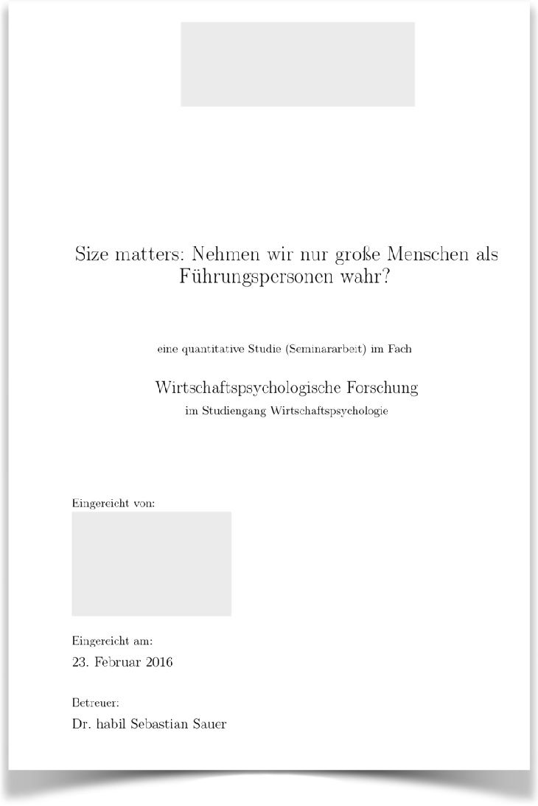{#fig-titelseite}

:::

::: {.column width="10%"}
<!-- empty column to create gap -->
:::

::: {.column width="45%"}
Die Titelseite beinhaltet ...


- den Titel der Arbeit
- den Namen der Hochschule und des Studiengangs
- bei einer Seminararbeit den Namen des Dozenten und der Lehrveranstaltung
- bei einer Abschlussarbeit den Namen des Erstgutachters
- Name, 
- die Matrikelnummer 
- die Anzahl der Wörter des Hauptteils 
- das Datum der Abgabe
:::

::::


Der Titel ist das Wichtigste; stellen Sie ihn in den Fokus: 
groß, zentral platziert mit Platz außen herum; das Zweitwichtigste ist Ihr Name. 
Stellen Sie alles andere in den Hintergrund.
@fig-titelseite-pos-neg gibt ein Beispiel für eine gute und eine schlecht(er) formatierte Titelseite.


:::{#fig-titelseite-pos-neg layout-ncol=2}

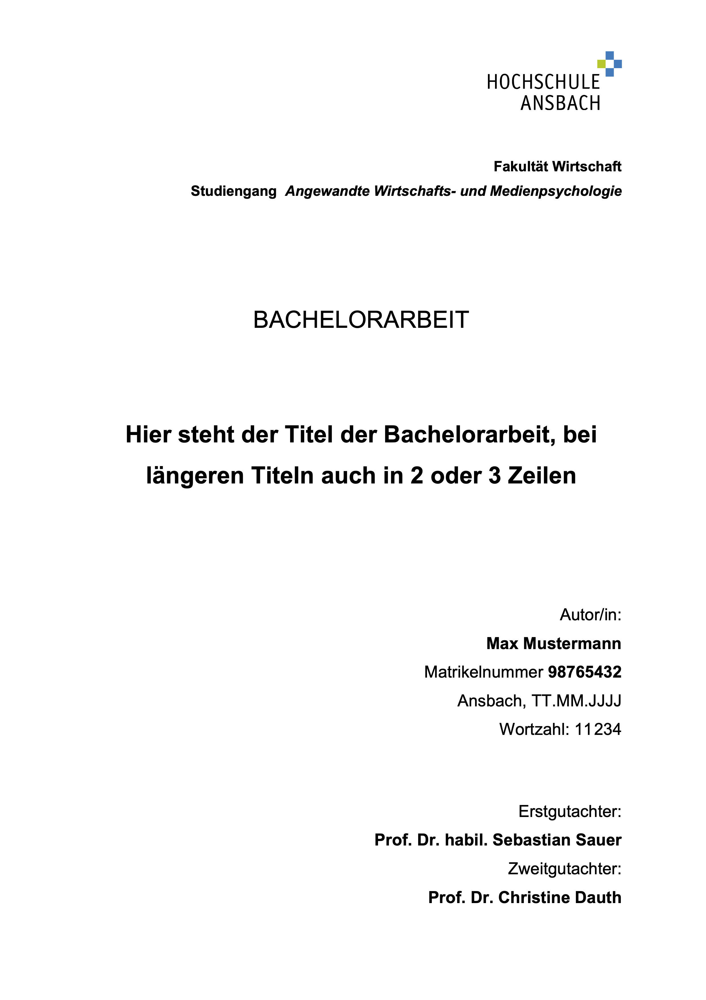{#fig-deckblatt-pos}

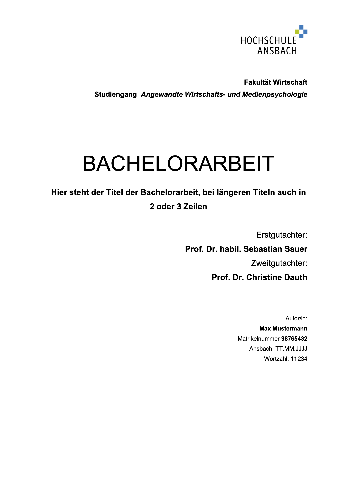{#fig-deckblatt-neg}

Beispiel für eine gut bzw. schlecht formatierte Titelseite
:::


### Abstract


Ihr Arbeit soll einen Abstract aufweisen.
Der Abstract ist eine stark verkürzte, prägnante und wertfreie Darstellung der wissenschaftlichen Arbeit.
Der Umfang beträgt ca. 150 bis 250 Wörter.
Der Abstract steht zu Beginn der Arbeit (nach dem Deckblatt).
Der Abstract erscheint nicht in der Gliederung.
die bedeutsamsten Informationen aller Einzelabschnitte werden so knapp wie möglich, 
jedoch klar und verständlich dargestellt:


-︎ Forschungsfag︎e
- Theorie 
- Hypothesen 
- Stichprobe 
- Versuchsaufbau (Design, Messinstrumente) 
- Auswertung/Ergebnisse 
- Diskussion


### Inhaltsverzeichnis


Anhand des Inhaltsverzeichnisses wird bereits viel über den weiteren Verlauf der Arbeit deutlich:  
Es gibt eine Übersicht zum Inhalt der Arbeit und sollte entsprechend logisch aufgebaut sein und den Gedankengang der Arbeit widerspiegeln.
Die Gliederung sollte ausführlich, aber auch nicht zu detailliert sein. 
Dabei hat der Grad der Untergliederung der einzelnen Gliederungspunkte ausgewogen zu sein.
︎ Unterpunkte eines Kapitels dürfen übergeordnete Punkte nicht wiederholen.
Gliederungspunkte dürfen nicht zu 100 % identisch formuliert werden. 
Gemäß dem Grundsatz der Proportionalität sollten die Hauptkapitel 
in etwa den gleichen Seitenumfang aufweisen.︎
Jede Gliederungsstufe muss mindestens zwei Punkte enthalten. 
Wird also ein Kapitel 3.2.1 eingeführt, muss es auch ein Kapitel 3.2.2 geben; 
sollte nach 3.2.1 unmittelbar 3.3 folgen, wird die Logik der Gliederung nicht erfüllt.
 Bei der Formulierung der Gliederungspunkte ist darauf zu achten, entweder keine oder immer Artikel zu verwenden. 
Der optische Aufbau sollte den logischen Aufbau der Gliederung widerspiegeln z. B. durch räumliche Nähe von zusammengehörigen Abschnitten und Platz zwischen unterschiedlichen Themen. Der optische Eindruck sollte Übersichtlichkeit vermitteln.
Nutzen Sie Links im Inhaltsverzeichnis, 
um das Navigieren im (elektronischen) Dokument zu erleichtern.


:::{#exr-gliederung}
### Wie sieht eine gute Gliederung aus?

Betrachten Sie @fig-gliederung! Diskutieren Sie Stärken und Schwächen dieser Gliederung.$\square$

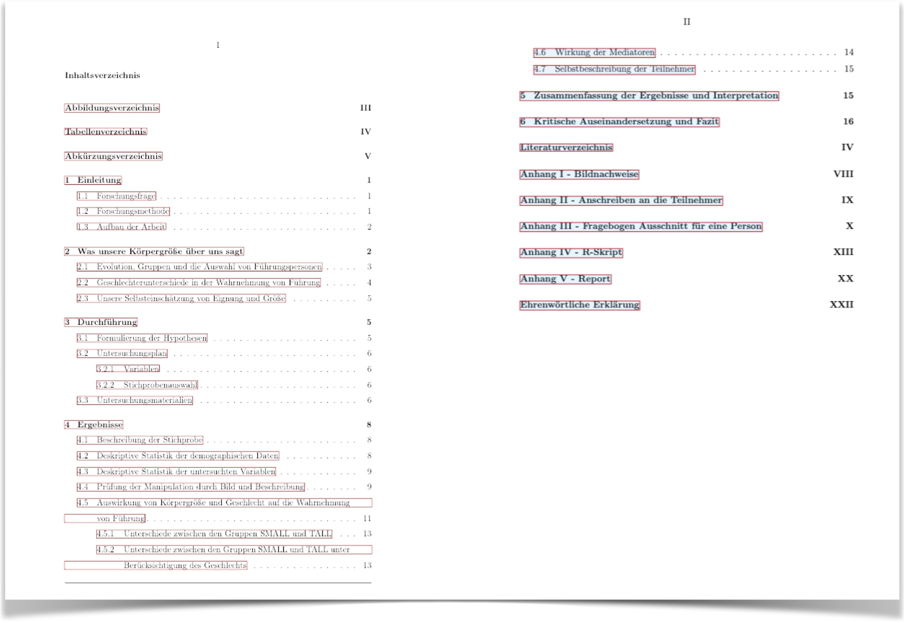{#fig-gliederung}
:::


:::{#exr-glied-link}
### Wie verlinkt man eine Gliederung?

Wie man in @fig-glied-link sieht (links), sind die Kapitel (und offenbar Unterkapitel) verlinkt in der PDF-Datei. Probieren Sie, ob Sie das mit Ihrem Schreibprogramm (z.B. Word) auch hinkriegen.$\square$

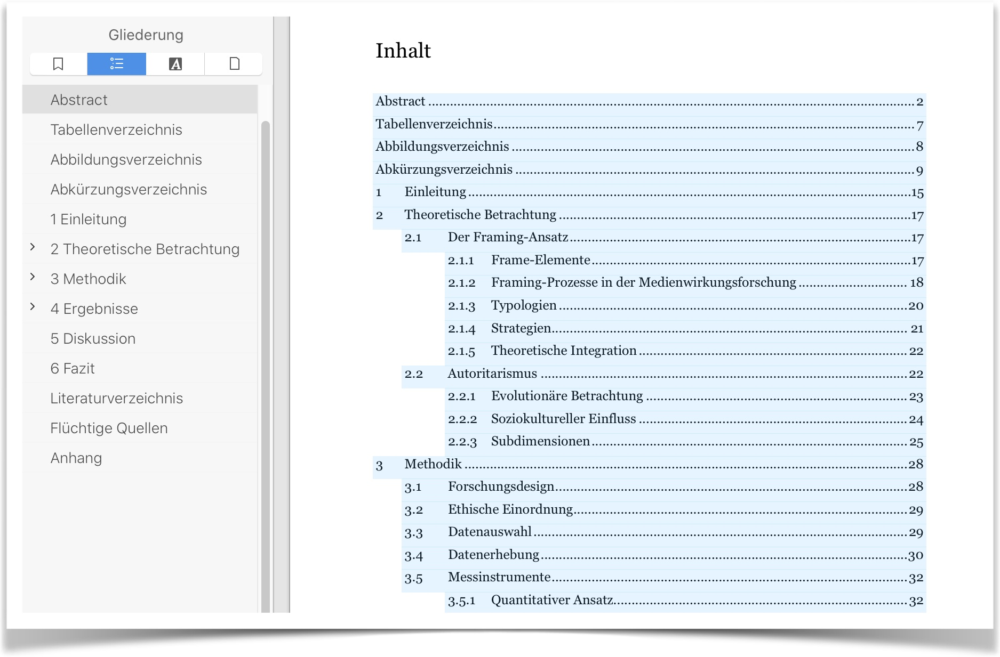{#fig-glied-link}
:::


### Einleitung

Die Einleitung stellt die Forschungsfrage vor und erläutert ihre Relevanz. Sonst  passiert in der Einleitung nichts, s. @fig-einleitung. 
Ausnahme: Es kann ein *Hintergrund* zur Forschungsfrage angeführt werden oder anders zur Forschungsfrage *hingeleitet* werden z. B. durch einen aktuellen Bezug oder persönliches Interesse. 
Spielt Letzteres eine Rolle, so ist es die *einzige Stelle* in der Arbeit, in der ein persönlicher Bezug auftaucht.
Die Forschungsfrage darf noch etwas vage und nicht wohldefiniert sein. Fachbegriffe etc. werden ja erst im Theorieteil eingeführt.

:::{.callout-note}
In der Einleitung schreibt man noch nichts über die theoretischen Grundlagen Ihrer Studie.$\square$
:::


```{mermaid}
%%| label: fig-einleitung
%%| fig-cap: "Die Bestandteile der Einleitung"
flowchart LR
  A[Hintergrund]---B[Forschungsfrage]
  B---C[Relevanz]
```


### Theorieteil

Der Theorieteil stellt alle relevanten theoretischen Bezüge zur Forschungsfrage her.

Im Theorieteil steht alles, was für die Forschungsfrage von Belang ist – *sonst nichts*. 
Insofern kann der Theorieteil als Ausformulierung der Forschungsfrage verstanden werden.

Als „Zuhörer“ sollte ein Fachkollege vorgestellt werden. 
Beispiel: Bei einer Studie zur Frage, ob die individuelle Ausprägung von Impression Management mit höherer Neigung zum Tragen von Luxusuhren einher geht, sollte auf aktuellen Modelle zu diesem Zusammenhang sowie den beiden einzelnen Konstrukten eingegangen werden. Erschöpft sich der Theorieteil auf die Diskussion von „Persönlichkeit“ auf dem Niveau eines Einführungskapitels im Lehrbuch, so wird der Theorieteil seiner Anforderung nicht gerecht.

Die (Sach-)Hypothesen können am Ende des Theorieteils platziert werden.

:::{.callout-caution}
Ein häufiger Fehler ist, dass der Theorieteil über alles mögliche berichtet, aber nicht über die Bestandteile der Forschungsfrage.
Verzichten Sie auf Abschnitte wie "Die Geschichte des Konstrukts X in den letzten 300 Jahren".
Merke: Im Theorieteil wird die Forschungsfrage erläutert (detailliert), sonst nichts.$\square$
:::

Häufig sind Forschungsfragen in der Form "X führt zu Y" aufgebaut, s. @fig-fofra.
In dem Fall besteht Ihre Studie inhaltlich aus folgenden drei Teilen:

1. X
2. Y
3. Zusammenhang von X und Y (häufig kausal)

Entsprechend schreiben Sie also im Theorieteil über diese drei Teile (und über nichts anderes), s. @fig-theorieteil.^[Ablaufdiagramme, DAGs, Schemata oder andere Nicht-Daten-Diagramme kann man z.B. mit einem Zeichenprogramm erstellen.]
Es bieten sich also *drei* Unterkapitel des Theorieteils an.
Allerdings sind auch andere Untergliederungen Ihres Theoreteils möglich.
So fließt der Zusammenhang von X und Y häufig schon in die Erläuterung von X und Y ein.

```{mermaid}
%%| label: fig-theorieteil
%%| fig-cap: "Die Bestandteile des Theorieteils"

flowchart LR
  X-->Y-->Z[Zusammenhang von X und Y]
```


:::{#exm-theorie}
### Beispiel für den Aufbau eines Theorieteils: Statussymbole und Online-Dating

Ihre Forschungsfrage lautet: "Haben Statussymbole einen Einfluss auf den Erfolg beim Online-Dating?". 
Bei dieser Fragestellung sollten Sie drei Aspekte im Theorieteil erörtern:

1. Psychologie des sozialen Status
2. Partnerschaft/Partnersuche
3. Der kausale Zusammenhang von Status und Partnersuche, z. B. aus Sicht der Evolutionspsychologie

Ggf. sind noch Teile wie „Besonderheiten des Online-Datings“ etc. zu ergänzen.$\square$
:::


:::{#exm-theorie2}
### Beispiel für den Aufbau eines Theorieteils: Wirkfaktoren von Achtsamkeit

Ihre Forschungsfrage lautet: "Wirkfaktoren von Achtsamkeit: Wirkt Achtsamkeit durch Verringerung der affektiven Reaktivität?". 
Bei dieser Fragestellung sollten Sie drei Aspekte im Theorieteil erörtern:

1. Achtsamkeit
2. Affektive Reaktivität
3. Der kausale Zusammenhang beider Konstrukte

Eine Gliederung könnte so aussehen:

```
1. Achtsamkeit
  1.1 Historisch-theoretische Entwicklung des Konzepts Achtsamkeit
  1.2 Definitionen
  1.3 Abgrenzungen zu benachbarten Konstrukten
  1.4 Kontexte
  1.5 Diagnostik
2. Wirkforschung
  2.1 Definitionen
  2.2 Entspannungsreaktion
  2.3 Reperceving
  2.4 Desidentifikation
  2.5 Erfahrungsaussetzung
3. Affektive Reaktivität
  3.1 BIS-/BAS-Konzept
  3.2 Buddhistische Psychologie
  3.3 Verwandte Konstrukte
4. Bewertung des Forschungsstands
5. Hypothesen
```

$\square$
:::

Da den Hypothesen eine hohe Bedeutung zukommt, sollten Sie im Text gut auffindbar sein, z.B. in einem eigenen Abschnitt oder optisch vom übrigen Textfluss hervorgehoben.


#### Testen oder Schätzen?

Am Ende des Theorieteils bietet es sich an,
die Hypothesen oder die Forschungsfrage zu spezifizieren.
Sie können sich für eines von beiden entscheiden oder auch beides angehen.

In der bisherigen Literatur (in der Psychologie) werden zumeist Hypothesen getestet,
nach dem Motto "jo, unsere Vermutung scheint zu stimmen!" oder "nein, das Zeugs taugt nix!".
Das Problem ist, dass solches Denken etwas simpel ist, Schwarz-Weiß eben. 
Außerdem sind Nullhypothesen streng genommen immer falsch,
weswegen es eigentlich keinen Sinn macht, sie zu untersuchen.
Aber dafür ist das Schwarz-Weiß-Denken schön einfach.
Eine (aus Sicht verschiedener Statistiker) bessere Methode ist es, "Praktisch-Null-Hypothesen" zu testen.
Dabei testet man nicht, ob der Parameterwert *exakt* Null ist (0,00000000...), sondern *ungefähr* Null, also vielleicht z.B. von -0.1 bis 0.1. Den Bereich von Werten, die praktisch bedeutungslos klein bzw. bedeutungslos sind, bezeichnen wir als "praktisch Null".
Eine technische Umsetzung ist das ROPE-Konzept.

Parameterschätzung fragt nicht *ob*, sondern *wieviel*. 
Nicht viel komplizierter, aber nuancierter.
Außerdem enthält das Parameterschätzen auch das Hypothesentesten:
Ist die Null im Schätz-Intervall nicht enthalten,
so kann man die Null-Hypothese ausschließen.


:::{.callout-tip}
Am besten Sie machen beides: Hypothesen testen und Parameter schätzen. Einfach umsetzen lässt sich das, wenn Sie sich den Schätzbereich plausibler Parameterwerte ausgeben lassen (z.B. das 95%-KI der Posteriori-Verteilung). Liegt der Wert Null außerhalb dieses Intervalls, so können Sie die Nullhypothese offensichtlich ausschließen. Liegt die Null innerhalb des Intervalls, so können Sie sie nicht ausschließen. $\square$
:::


#### Kausal- vs. Korrelationsmodell


Sie wollten weiterhin angeben,
ob Ihre Forschungsfrage ein kausales Modell annimmt oder ein deskriptives (korrelatives).
Bei einem kausalen Modell sollen dann die Pfeile Wirkungsrichtungen, 
also Ursache-Wirkungs-Beziehungen angeben.


Auch wenn ihre Studie nicht die "Kraft" hat,
Kausalbeziehungen (in Gänze) aufzudecken,
ist es trotzdem meistens sinnvoll,
ein Kausalmodell aufzustellen,
da Theorien (und Praxis) meist an Kausalbeziehungen interessiert sind,
und an Korrelationsbeziehungen wenig(er).

Viele wissenschaftliche Studien haben ein kausales Erkenntnisziel,
nicht ein deskriptives.


#### Kausalmodell definieren

Hat Ihr Studie ein *Erklärungsziel*, also ein kausales Erkenntnisziel, 
so bietet sich an, Ihr Kausalmodell mit einem Pfaddiagramm bzw. *DAG* zu visualisieren,
z.B. so, s. @fig-dagmodell1.


```{r out.width = "100%", fig.asp = .5}
#| label: fig-dagmodell1
#| fig-cap: Beispielhafter DAG
#| echo: false
library(dagitty)

mein_dag <- 'dag {
A [pos="-2.200,-1.520"]
B [pos="1.400,-1.460"]
D [outcome,pos="1.400,1.621"]
E [exposure,pos="-2.200,1.597"]
Z [pos="-0.300,-0.082"]
A -> E
A -> Z [pos="-0.791,-1.045"]
B -> D
B -> Z [pos="0.680,-0.496"]
E -> D
}'


mein_modell <- "dag{
lern -> erfolg
mot -> erfolg
mot -> lern
}"

plot(graphLayout(mein_modell))
```


Dabei steht `lern` für "Lernzeit in Stunden",
`mot` für "Motivation" und `lern` für "Lernerfolg".
Die Operationalisierung der Variablen sollten im Methodenteil genauer beschrieben sein.


Außerdem macht es Sinn, 
das Modell formal zu spezifizieren,
etwa so:


$$
\begin{aligned}
\text{erfolg} &\sim N(\mu_i, \sigma) \qquad \text{Likelihood} \\
\mu_i &= \beta_0 + \beta_1 \text{lern} + \beta_2 \text{mot} \qquad \text{lineares Modell} \\
\beta_0 &\sim N(0, 2.5)  \qquad \text{Prior Achsenabschnitt} \\
\beta_1 &\sim N(0, 2.5)  \qquad \text{Prior Regressiongewicht lern} \\
\beta_2 &\sim N(0, 2.5)  \qquad \text{Prior Regressiongewicht mot} \\
\sigma &\sim Exp(1) \qquad \text{Prior Streuung} \\
\end{aligned}
$$


Wenn Sie das Modell mit STAN berechnen, also vermittelt über z.B. `rstanarm`,
dann wählt `stan_glm()` für Sie folgende Priori-Werte:

- $\beta$s: Normalverteilt mit Mittelwert 0 und SD 2.5
- $\sigma$: Exponentialverteilt mit Streckung 1

Die $\beta$s sind am einfachsten als z-Werte zu verstehen:
Grob übersetzt sagt `rstanarm` "Mei, ich geh davon aus, dass der Effekt vermutlich 2.5-SD-Einheiten
um den Mittelwert rum liegt, könnten auch etwas mehr sein, aber mehr als 5-SD-Einheiten sind schon echt unwahrscheinlich".
Das nennt man einen "schwach informativen Prior":
der erlaubt viel, aber den größten Quatsch schließt er aus.

Praktischerweise müssten sie nicht mal ihre Variablen z-tranformieren (aber Sie können ohne Schaden!),
denn `rstanarm` macht das für Sie.


Tipp: Geben Sie an, dass Sie die Standardwerte (Voreinstellung) der von Ihnen verwendeten Software (wie `rstanarm`) verwendet haben.
Zitieren Sie möglichst die Software (in der verwendeten Version) und reichen Sie die Syntax ein.

Mehr zu Prioris bei `rstanarm` findet sich [hier](https://mc-stan.org/rstanarm/articles/priors.html).

Mit `prior_summary(mein_model)` bekommt man einen Überblick über die Prioriwerte,
die im Modell `mein_modell` verwendet wurden.


Es macht Sinn, zu begründen, warum sie das Modell so gewählt haben,
wie sie es gewählt haben.
Wenn Sie eine Normalverteilung für die Priori-Verteilungen wählen,
haben Sie Argumentationslinien: epistemologisch und ontologisch.
Epistemologisch können Sie argumentieren, dass die Normalverteilung die Entropie maximiert,
also die Verteilung mit den wenigsten Vorannahmen ist, wenn man davon ausgeht,
dass die gesuchte Verteilung über eine endliche Varianz und einen endlichen Mittelwert verfügt.
Ontologisch können Sie argumentieren, dass z.B. Körpergröße (innerhalb eines Geschlechts zumindest)
hinreichend normalverteilt ist.

Die Begründung für das lineare Modelle erschließt sich aus der Theorie,
nämlich dass z.B. die gewählten UV den gesuchten Effekt gut beschreiben.


#### Hypothesen testen

Das Testen der Hypothese ist eine Umsetzung der Idee,
eine Behauptung einer empirisch-rationalen Prüfung zu unterziehen.


Es bietet sich an, eine Hypothese zu wählen,
wenn der Stand der Theorie dies erlaubt,
idealerweise mehr als nur eine Null-Effekt-Hypothese, 
etwas $\beta=0$.
Dass nämlich ein Effekt *exakt* Null ist,
erscheint für die meisten Situationen der Sozialwissenschaften reichlich unplausibel.

Sie sollten die Hypothese zuerst als Aussage formulieren,
aber danach möglichst mit mathematischen Symbolen präzisieren ("statistische Hypothesen").

Hier sind Beispiele für statistische Hypothesen:

- $H: \mu > 0$
- $H: \mu = 0$
- $H: \mu \ne 0$
- $H: \beta > 0$
- $H: d > 0$
- $H: R^2 > 0$
- $H: \mu > 42$
- $H: 2.71 < \mu < 3.14$


Dabei meint $\beta$ ein Regressiongewicht,
$d$ eine Differenz (zweier Gruppen) und 
$R^2$ die erklärte Varianz eines Modells.

$R^2$ als Kennzahl einer Hypothese ist interessant,
weil es Ihnen erlaubt, ein ganzes Modell als Hypothese zu formulieren.
Also "Verbundhypothesen" aufzustellen, die mehr als eine oder zwei Variablen umfassen.


Möchten Sie eine Hypothese zu einem Parameter testen,
der einen Nullwert beinhaltet, bietet sich das ROPE-Verfahren an, vgl. @kruschke_rejecting_2018.


#### Parameterschätzung


Bei einer Parameterschätzung formulieren Sie ein Modell,
genau wie beim Hypothesen testen, nur eben ohne Hypothesen.
Es geht Ihnen dann nicht um die Frage, *ob* irgend ein Sachverhalt der Fall ist (das ist Hypothesen prüfen).
Stattdessen interessieren Sie sich für die Frage, *wie sehr* etwas der Fall ist:

- "Wie stark ist der Zusammenhang von Lernzeit und Prüfungserfolg?"
- "Um wie viele Sekunden parken Frauen im Schnitt schneller ein als Männer?"
- "Wie groß ist der statistische Effekt eines Sportwagens auf einem männlichen Profilbild beim Online-Dating?"

Auch hier ist es erlaubt und sinnvoll, eine sprachliche Frage, die oft vage ist,
schon aufgrund der natürlichen Ambuität der Sprache, mit Hilfe mathematischer Notation zu präzisieren:

- "Der Zusammenhang $\beta$ ist definiert als das Regressiongewicht der Variable `lern` im Modell `m1`.
- "Operationalisiert wurde die Einparkgeschwindigkeit als die Dauer der Durchführung in Sekunden nach Instruktion wie im Abschnitt XYZ beschrieben. Unser Modell (`m1`) schätzte den Parameter `s`.
- "Der statistische Effekt ist definiert als das Regressiongewicht der experimentellen Bedingung (binäre Variable `group`) im Modell `m1`.

Geben Sie weiter an, welches Intervall Sie berichten, z.B. "Die Parameterschätzungen werden anhand eines 95%-HDI berichtet".

Auch wenn Sie eine Hypothese testen, sollten Sie Bereichsschätzungen für die Parameter vornehmen,
also Schätzbereiche aus der Posteriori-Verteilung berichten.

In R lässt sich das leicht anhand des Befehls `parameters` umsetzen, s. @sec-modellieren.

### Methodenteil

In diesem Teil beschreiben Sie alle relevanten Verfahrensdetails – man sollte Ihre Studie „nachkochen“ können. 
Ihre Studie sollte also reproduzierbar sein.
Die von ihnen gemachten Angaben müssen ausreichen, 
um die beschriebene Untersuchung exakt zu wiederholen.
Man sollte allgemein bekannte Verfahren (z.B. die Regressionsanalyse) nicht erläutern.

Replizierbarkeit^[Man kann Ihre Analyse nachrechnen und kommt zum gleichen Ergebnis] Reproduzierbarkeit^[Man weiß, wie man Ihre Studie wiederholen könnte] sind wesentlich für die Wissenschaft. 
Im Methodenteil legen Sie die wesentlichen Grundlagen dafür.
Daher ist der Methodenteil wesentlich für Ihre Arbeit.


Folgende Unterkapitel bieten sich an:

#### Stichprobe 

- Soziodemografische Beschreibung (z.B. Alter und Geschlecht) der *Versuchsteilnehmer* (evtl. weitere Merkmale wie Beruf etc.)
- *Rekrutierungsweise* und Hinweise zur Teilnahmemotivation der Versuchsteilnehmer


#### Versuchsmaterial 

- Verwendete *Messinstrumente* (z.B. Fragebogen inkl. zentrale Maße der Güte wie interne Konsistenz der Skala)
- Beschreibung des *Versuchsaufbaus* (Materialanordnung, Sitzanordnung im Labor; Nutzung von Abbildungen ist hierbei hilfreich), ein Flow-Chart zum Versuchsablauf aus Sicht der Versuchsteilnehmer kann hilfreich sein


#### Versuchsaufbau

- Erläuterung des *Versuchsablaufs* von der Instruktion bis zur abschließenden  Aufklärung der  Untersuchungsteilnehmer nach Abschluss der Datenerhebung
- Beschreibung der räumlichen und zeitlichen *Untersuchungsbedingungen*
- *Versuchsplan* (Design): Benennen Sie explizit UV(s) und AV(s) sowie die Designart, z. B. *querschnittliche Beobachtungsstudie* oder *randomsiertes Between-Group-Experiment mit 2 UV und insgesamt 6 Gruppen*.
- Abbildungen, die den Versuchsaufbau erläutern, können diesen Abschnitt bereichern.


#### Analyse

- Skizzierung der *Analyse* in Bezug auf das statistische Vorgehen (wie z.B. Bayes-Methode, ggf. mit ROPE [@kruschke_rejecting_2018] oder Hinweise auf das Signifikanzniveau bei einer frequentistischen Analyse)
- Erklären Sie (kurz), warum Sie sich für Bayes oder ggf. für die Frequentistische Methode entschieden haben^[Eine ehrliche Antwort wäre zwar, "mein Dozent wollte es so, was bleibt mir groß übrig",
aber es gibt (vermutlich?!) auch fachliche Gründe (z.B.: Eine Priori-Annahme zur Wahrscheinlichkeit eines Parameters wird durch Daten zu einer Wahrscheinlichkeit verschoben).
Die sollten sie anführen.]
- Führen Sie (kurz) an, ob Sie an einer Parameterschätzung oder einer Hypothesentestung interessiert sind oder an beidem
- Verwendete Analyse-*Software* (idealerweise mit Versionsnummer) wie R^[RStudio ist nur eine Benutzeroberfläche und daher irrelevant für die Ergebnisse] und (idealerweise) die R-Pakete
- Software, die zur Reproduzierbarkeit nicht von Relevanz ist, braucht nicht angegeben zu werden (z.B. Word oder RStudio)


### Ergebnisteil {#sec-ergebnisteil}

Im Ergebnisteil stehen die Fakten, keine Meinungen.
Erst in der Diskussion wird erörtert, was die Ergebnisse bedeuten, wie stichhaltig sie sind etc. 
Anders gesagt: Im Ergebnisteil spricht man *von* den Ergebnissen. 
In der Diskussion spricht man *über* die (bzw. die Bedeutung der) Ergebnisse. 
Insofern spricht man in der Diskussion über "Meinungen", 
besser gesagt, man interpretiert die Untersuchungsergebnisse, 
man ordnet sie in in die Literatur ein, überlegt ihre Implikationen und inwieweit sie die Forschungsfrage beantworten.
In quantitativen Studien werden primär die Ergebnisse zu den Hypothesen bzw. den Forschungsfragen berichtet (sofern es keine explorative Arbeit ist). 
Hierbei bietet es sich an, zuerst einfache (deskriptive) Ergebnisse zu berichten und danach komplexere (z.B. von multiplen Regressionen). 

Handlungen werden in der 1. Vergangenheit beschrieben („Es fand sich ein Unterschied …“); 
überdauernde Tatsachen hingegen in der Gegenwart („Dieser Wert ist statistisch signifikant“).
Im Ergebnisteil soll man keine Interpretationen oder Bewertungen anführen, 
sondern lediglich so objektiv wie möglich Tatschen (Fakten) berichten.
In quantitativen Arbeiten findet man naturgemäß oft viele Statistiken. 
Wer hätt’s gedacht.
Berichtet man ein Ergebnis mit wenig Zahlenmaterial, 
so gibt man die Zahlen im Text wieder; größere Mengen sind übersichtlicher in Tabellen dargestellt. 
Sehr große Zahlenmengen sind besser im Anhang aufgehoben. 
Häufig kann man quantitative Daten gut in Diagrammen darstellen. 
Man beachte die Vorgaben der APA zur Darstellung von Statistiken.
Fügen Sie keine R-Syntax ein (schon gar nicht als Screenshot); nutzen Sie für Syntax den Anhang.
Technische Details wie das Aufbereiten von Daten (z.B. Umbenennen von Variablen oder ihren Ausprägungen) sollen nicht im Ergebnisteil (en Detail) aufgeführt werden, höchstens kursorisch mit Verweis auf die Syntax (die an geeigneter Stelle dokumentiert ist).


Sie können Ihren Ergebnisteil in folgende Abschnitte gliedern:


1. Falls Sie aufwändige Schritte zur Aufbereitung der Daten unternommen haben, sollten Sie kurz darüber berichten. Sparen Sie sich aber die Details (und den R-Code) für den (elektronischen) Anhang auf.
1. Allgemeine *deskriptive* Ergebnisse (noch nicht auf Hypothesen bezogen): Hier könnten Sie z.B. die Mittelwerte und Streuungen pro Gruppe berichten oder die Korrelationen der Variablen untereinander.
2. Zentrale Ergebnisse pro *Hypothese*/für das Modell: Berichten der verwendeten Verfahren und der Statistiken zu den zentralen Ergebnissen.
3. Ggf. sonstige *explorative* Ergebnisse: Ergebnisse also, die Sie nicht erwartet haben (d.h. nicht in den Hypothesen formuliert waren)


```
4 Ergebnisteil

(4.1 Datenaufbereitung)
4.2 Deskriptive Ergebnisse
4.3 Modellierung und Inferenzstatistik
4.4 Explorative Befunde
``` 


Im Ergebnisteil berichten Sie die Ergebnisse Ihrer empirischer Studie, statistische Kennzahlen in den meisten Fällen.
Es gibt drei Formate, Statistiken zu berichten: im Text, in einer Tabelle, mit einer Abbildung.

#### Formatierung von Tabellen {#sec-formatierung-tabellen}

Eine kleine Menge an Zahlen (z.B. fünf) kann konziser im Text berichtet werden.
Größere Mengen an Zahlen sollten in Tabellen berichtet werden.

Ein Beispiel für eine Tabelle zur Untersuchung von Korrelation, die nach APA (V7) formatiert ist, zeigt @fig-corr1.


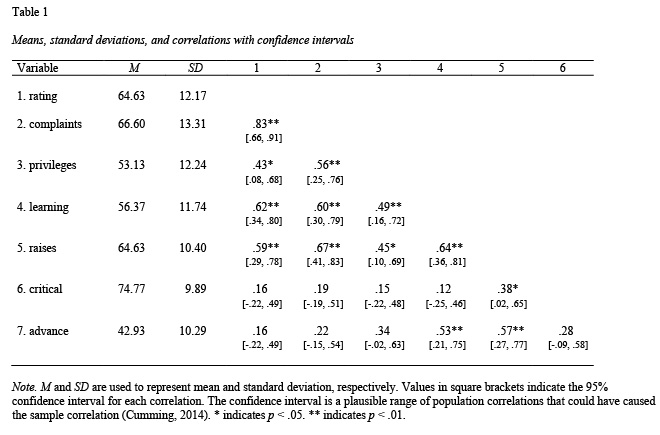{#fig-corr1 width="50%"}

Wenn Sie nach der Bayes-Methode arbeiten, so sind "Sternchen" oder p-Werte nicht nötig. 
Stattdessen sind Konfidenzintervalle ausreichend (die die Information des p-Werts im Übrigen abdecken).

Die APA (v7) empfiehlt, die Einträge der Spalten i.d.R. zu zentrieren;
eine Ausnahme ist die linke Spalte, deren Einträge linksbündig sein sollen.
Außerdem sollten die Tabellen keine "Gitterstäbe" (vertikale Linien) aufweisen und 
auch nur drei horizontale Linienn, s. #fig-corr1 als Beispiel.

Zentral bei der Gestaltung von Tabellen sind drei Prinzipien: 1) Übersichtlichkeit, 2) Konsistenz und 3) Ehrlichkeit.

Man kann solche Tabellen von "Hand" erstellen, oder man nutzt Hilfen wie z.B. das [R-Paket `apaTables`](https://dstanley4.github.io/apaTables/index.html), welche Tabellen im APA-Format erstellt und in Word exportiert.

Betrachten wir ein Beispiel anhand des Datensatzes `mtcars`^[schon in R fest eingebaut, mit dem Befehl `data(mtcars)` können Sie den Datensatz "aktivieren".], wie man mit `apaTables` eine Korrelationstabelle erstellt.

```{r}
#| eval: false
library(apaTables)
data(mtcars)
apa.cor.table(mtcars, filename = "apa_cor_tab_mtcars.doc", table.number = 2)
```


:::{#exr-tab-apa}
### Merkmale eine Tabelle nach APA7

Betrachten Sie [dieses Beispiel](https://apastyle.apa.org/style-grammar-guidelines/tables-figures/sample-tables#correlation) für eine Tabelle! 
Arbeiten Sie die wesentlichen Merkmale der Formatierung heraus.$\square$
:::

Aber was sind die Bestandteile des APA-Formats? 
Schauen Sie sich dazu @fig-tab-apa an,
in der Abbildung sind wesentliche Merkmale des APA-Formats hervorgehoben.

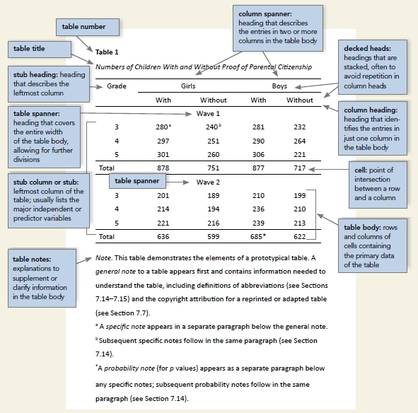{#fig-tab-apa width="50%"}

Ein Beispiel für eine Tabelle mit Regressionsergebnissen finden Sie [hier](https://apastyle.apa.org/style-grammar-guidelines/tables-figures/sample-tables#regression).
Übrigens: Die Ausgabe von `parameters` ist insgesamt APA-konform, vgl. @tbl-m-bringtnixtin2-params.

:::{.callout-tip}
Zur Formatierung von Tabellen und Abbildungen laut APA finden sich online viele Beispiele.$\square$
:::


:::{.callout-caution}
### Häufiger Fehler
Tabellen sollten nie als Screenshot in einen Bericht eingefügt werden.
Häufig leider die optische Qualität (pixelig) und es ist nicht möglich, Werte aus der Tabelle zu kopieren.$\square$
::::


:::{.callout-note}
Formulierungsvorschläge für Ihren Ergebnisteil finden Sie in @sec-statistik-ergebnisteil. $\square$
:::


#### Abbildungen {#sec-abbildungen}

Abbildungen sollten nur verwendet werden, wenn sie einen Mehrwert bieten.^[Bilder von lachenden Modells, die sich die Hände schütteln, haben in der Regel keinen Platz in wissenschaftlichen Berichten. Falls aber doch Photos ergänzt werden sollten, so sind (u.a.) unbedingt die Urheberrechte zu beachten. Hier sind einige Quellen für Bilder/Photos mit (teilweise) permissiven Nutzungsbedinungen: [Pixabay](https://pixabay.com/service/license-summary/), [Unsplash](https://unsplash.com/plus/license), [Flickr](https://www.flickr.com/creativecommons/) oder [Wikimedia](https://commons.wikimedia.org/wiki/Category:Images)]
Für eine einzelne Zahl oder für wenige Zahlen lohnt sich meist eine Abbildung nicht; es reicht, die Zahlen im Text anzuführen.

Nach APA7 steht die Nummer der Abbildung über der Abbildung, z.B. "Abbildung 1"; es folgt kein Punkt.
In der nächsten Zeile steht der Titel der Abbildung, wiederum ohne Punkt am Ende.
Wichtig ist, dass die Abbildung für sich selbst genommen verständlich ist.
Farben können verwendet werden, soweit nützlich, aber sollten idealerweise auch im Schwarz-Weiß-Druck erkennbar sein.
Hilfreich ist es zudem, wenn die Ungewissheit in den Kennzahlen durch Fehlerbalken verdeutlicht ist.
@fig-apa verdeutlicht diese Aspekte der Formatierung einer Abbildung (in englischer Sprache in diesem Fall).

:::{#fig-apa layout-ncol=2}
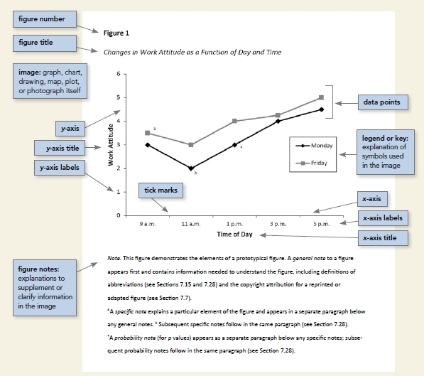{#fig-apa-format}

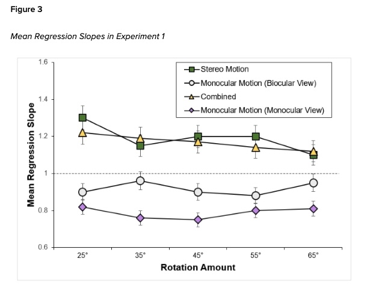{#fig-linegraph-apa width="50%"}

Beispiel-Datendiagramme formatiert nach APA
:::

[Quelle der Abbildung](https://apastyle.apa.org/style-grammar-guidelines/tables-figures/sample-figures#bar), 
[Urspüngliche Quelle der Abbildung](https://psycnet.apa.org/doiLanding?doi=10.1037%2Fxhp0000553)

Eine nützliche Hilfe zur Erstellung von hochwertigen Diagrammen sind die R-Pakete [ggpubr](https://rpkgs.datanovia.com/ggpubr/index.html) und [ggstatsplot](https://indrajeetpatil.github.io/ggstatsplot/), s. @fig-ggpubr-ggstatsplot.


:::{#fig-ggpubr-ggstatsplot layout-ncol=2}
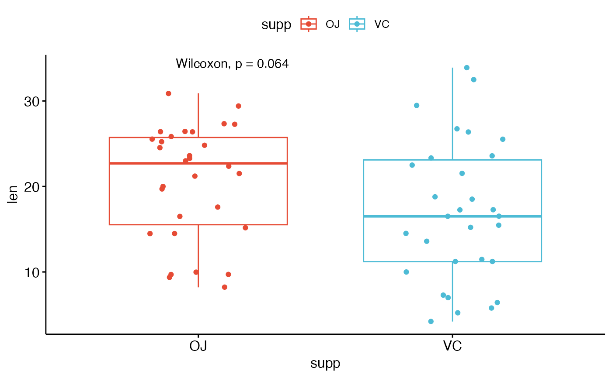{#fig-ggpubr1}

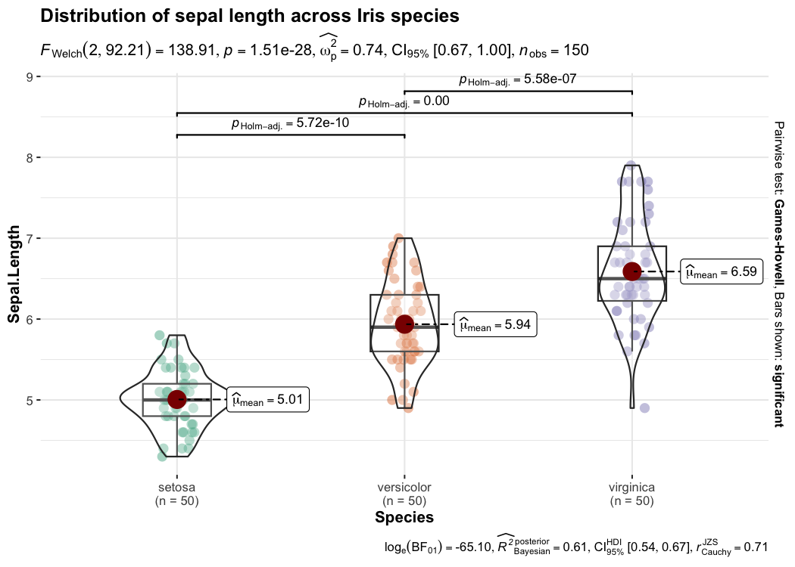{#fig-ggstatsplot1}

R-Pakete zur Erstellung hochwertiger Diagramme
:::

Die Nummer der Abbildung fügen Sie von "Hand" hinzu (z.B. in Word).
Zu beachten ist, dass die Statistiken in @fig-ggstatsplot1 laut APA als Anmerkung unter der Abbildung gestellt werden müssen, vgl. @fig-apa-format. Weitere Hinweise finden Sie [hier](https://apastyle.apa.org/style-grammar-guidelines/tables-figures/figures).


#### Statistik im Text 

Dazu später mehr, s. Kapitel zum Berichten von Ergebnissen, @sec-reportstats.


#### Sonstiges

Übrigens: R-Quellcode sollte *nicht* im Hauptteil eines wissenschaftlichen Berichts stehen,
verbannen Sie ihn in den Anhang (es sei denn, der Quellcode bzw. die Entwicklung von Syntax ist Gegenstand der Arbeit).


### Diskussion

Die Diskussion beinhaltet den Kommentar des Autors (neutral formuliert) zu seinen Ergebnissen im Bezug zum in der Einleitung beschriebenen aktuellen theoretischem und empirischem Wissensstand.
Der besondere wissenschaftliche Beitrag der durchgeführten Untersuchung wird dargestellt.
Zu Beginn der Diskussion sollten eine kritische Zusammenfassung der hypothesenbezogenen Hauptergebnisse gegeben werde und diese Befunde mit anderen Untersuchungsergebnissen verglichen werden.
Ein psychologisch (theoretisch) sinnvoller Erklärungsansatz für die Hauptbefunde sollte dargestellt werden und die Ergebnisse auch im Hinblick auf andere Erklärungsversuche diskutiert werden.
Ggf. müssen (mögliche) Gründe angegeben werden, warum die Ergebnisse die Hypothesen nicht bestätigen bzw. nur tendenziell.
Wichtig ist die Diskussion der Schwächen (Limitationen) der vorliegenden Studie; widmen Sie diesem Punkt einen eigenen Absatz.
Als Abschluss der Diskussion sollten Verbesserungsvorschläge für eine nochmalige Durchführung der Untersuchung beschrieben werden sowie Vorschläge für weitere Untersuchungsansätze gegeben werden.
Erörtern Sie Ihre Ergebnisse auch vor den Hintergrund anderer Studien/der Literatur, d. h. Die Ergebnisse sollten in die Literatur rückbezogen werden. 


### Literaturverzeichnis

Im Literaturverzeichnis einer wissenschaftlichen Arbeit (einer Seminararbeit/ Thesis/ eines Exposés) steht genau die zitierte Literatur – nicht mehr, nicht weniger.
Das Literaturverzeichnis ist nach den Regeln des verwendeten Zitierstils zu gestalten (empfehlenswert: DGPs in neuester Version).
Das Literaturverzeichnis sollte linksbündig formatiert sein.
Bei mehrzeiligen Einträgen wird ab der 2. Zeile eingerückt (5-7 Leerzeichen).
Die Qualität der Quellen ist eine wichtige Beurteilungsgrundlage des Literaturverzeichnisses:
Bücher wie @Dobelli2011 sind nicht hohes Niveau (aber gut geeignet, um ins Thema einzufinden und sich zu inspirieren).
kahneman2012schnelles ist hingegen ein akzeptabler (guter) Vertreter eines Buchs aus dem Genre des Popscience.
Hochwertige Literaturstellen sind zumeist/hauptsächlich Fachartikel oder Review-Artikel.
Da die meiste (95%?) der relevanten Literatur in Englisch verfasst wird, ist davon auszugehen, dass ein rein deutschsprachiges Literaturverzeichnis den Forschungsstand schlecht (in nicht akzeptabler Weise) abbildet. Daher sollten englischsprachige Artikel reichhaltig verwendet werden.


:::{.callout-note}
Fachartikel sind *die* Literaturart der Forschung. 
Nutzen Sie sie reichlich.$\square$
:::


### Anhang

Im Anhang stehen Details zu Ihrer Studie.
Die einzelnen Teile des Anhangs werden durchnummeriert.
Alle Inhalte des Anhangs müssen im Haupttext referenziert werden („Der Interviewleitfaden findet sich im Anhang B“.) und vice versa.
Typische Inhalte des Anhangs sind: 

- Details zu Messinstrumenten, 
- Interviewleitfäden oder Stimuli, 
- weiterführende Statistiken, 
- Syntax oder Probandeninformationen.
- Daten.

Es ist vollkommen in Ordnung, im Anhang auf eine Datei zu verweisen.
Sofern verfügbar, können Sie anstelle z.B. Ihres Fragebogens die URL zu Ihrem Fragebogen einfügen.
In ähnlicher Manier sollten Sie Ihre Daten keinesfalls (schon gar nicht per Screenshot) in den Anhang einfügen.
Verweisen Sie stattdessen im Anhang auf die entsprechende Datei (achten Sie auf prägnante Dateinamen und zugängliche Formate wie CSV).
Die ehrenwörtliche Erklärung steht ebenfalls im Anhang.

Eine Funktion des Anhangs ist es, die Informationen, die zur Reproduktion der Studie nötig sind, im Detail vorzuhalten.
Auch wenn Sie im Anhang "nur" auf Dateien verweisen, sollte im Anhang aufgeführt sein, welche weiterführenden Informationen dem Haupttext beigefügt sind.


### Fazit

Der Aufbau einer wissenschaftlichen Arbeit ist relativ stark vorbestimmt;
das macht Ihnen die Arbeit leichter, wenn Sie diesen Aufbau kennen.

:::{#exr-aufbau-peerteaching}
### Diskutieren Sie mit Ihren Mitstudis den Aufbau einer Forschungsarbeit!

In dieser Übung erarbeitet je eine von mehreren Gruppen einen der in @sec-abschnitte dargestellten Abschnitt einer Forschungsarbeit und *diskutiert* ihn dann den anderen Gruppen. Dabei soll *nicht* präsentiert werden. Stattdessen sind nur *Dialoge* in Form von Frage-Antwort-Sequenzen erlaubt.

- Schritt 1: Die Studentis finden sich in 10 Gruppen zusammen, s. @fig-peer1.
- Schritt 2: Gruppe 1 & 2 gehen zu einem Team zusammen, 3 & 4 genauso, etc.
- Schritt 3: Während der *Lernphase* (15 Min.) arbeitet jedes Team die beiden zugewiesenen Abschnitte.
- Schritt 4: Danach folgt die *gerade Wanderphase*, s. @fig-peer2a. Dafür "wandern" alle Gruppen mit *geraden* Nummern zur Gruppe mit der nächst höheren (also ungeraden) Nummer. Die gastgebende Gruppe erläutert - im Frage-Antwort-Dialog - das Thema ihrer Gruppe. Dann wandert die gerade Gruppe wieder weiter. Das Wandern wiederholt sich, bis die wanderne Gruppe alle (vier) gastgebenden Gruppen besucht hat und wieder beim eigenen Team ankommt.
- Schritt 5: Nun folgt die *Wanderphase für die UNgeraden Gruppen*, s. @fig-peer2b. Dafür "wandern" alle Gruppen mit *UNgeraden* Nummern zur Gruppe mit der nächst niedrigeren (also geraden) Nummer. Die gastgebende Gruppe erläutert - im Frage-Antwort-Dialog - das Thema ihrer Gruppe. Dann wandert die wandernde Gruppe wieder weiter. Das Wandern wiederholt sich, bis die wanderne Gruppe alle (vier) gastgebenden Gruppen besucht hat und wieder beim eigenen Team ankommt. 
- Schritt 5: Puh, fertig! $\square$
:::


```{mermaid}
%%| label: fig-peer1
%%| echo: false
%%| fig-cap: "Ausgangssituation während der Lernphase: 10 Gruppen in 5 Teams"
flowchart LR
  T12((1,2))
  T34((3,4))
  T56((5,6))
  T78((7,8))
  T910((9,10))
  
  T12 --- T34
  T34 --- T56
  T56 --- T78
  T78 --- T910
  T910 --- T12
```


```{mermaid}
%%| label: fig-peer2a
%%| echo: false
%%| fig-cap: "Wanderphase 1: Die Gruppen mit *geraden* Nummern wandern eine Gruppe 'vor'"
flowchart LR
  G1((Gruppe 1))

  G3((Gruppe 3))

  G5((Gruppe 5))

  G7((Gruppe 7))

  G9((Gruppe 9))

  G1-- Gruppe 2 -->G3-- Gruppe 4 -->G5-- Gruppe 6 -->G7-- Gruppe 8 -->G9-- Gruppe 10-->G1
```


```{mermaid}
%%| label: fig-peer2b
%%| echo: false
%%| fig-cap: "Wanderphase 1: Die Gruppen mit *UNgeraden* Nummern wandern eine Gruppe 'zurück'"
flowchart LR

  G2((Gruppe 2))

  G4((Gruppe 4))

  G6((Gruppe 6))

  G8((Gruppe 8))

  G10((Gruppe 10))
  G2-- Gruppe 1 -->G10-- Gruppe 9 -->G8-- Gruppe 7 -->G6-- Gruppe 5 -->G4-- Gruppe 3-->G2
```


## Schreibstil

### Wissenschaftlicher Schreibstil

#### Behauptungen vs. Bewertungen

Zwei Hauptarten von wissenschaftlichen Aussagen lassen sich unterscheiden: *Behauptungen* und *Bewertungen.*

:::{#exm-behauptung}
### Behauptungen

- Deutschland hat ca. 80 Millionen Einwohner.
- Die Hauptstadt der Schweiz ist Bern.
- Die Stichprobe der Studie von Müller (2023) ist klein.
:::

Eine *Behauptung* ist ein Satz, der eine (vermeintliche) Tatsache angibt.


:::{#exm-bewertung}
### Bewertung

- Deutschland ist übervölkert.
- Die Qualität der Studie von Müller (2023) ist fragwürdig.
- Die Qualität der Quellen im Literaturverzeichnis von Müller (2023) ist gering.
:::

Eine *Bewertung* stellt eine Behauptung in eine Kontiuum eines Erstrebenswert.
Anders gesagt: Eine Bewertung verortet eine Behauptung zwischen den Polen "gut" und "schlecht".


Bewertungen sollten aus belegten Behauptungen resultieren.

Wissenschaftlicher Schreibstil verlangt dreierlei:

1. Sie sind sich wohl bewusst, ob Sie behaupten oder bewerten.
2. Sie belegen Ihre Behauptungen.
3. Ihre Aussagen (sowohl Behauptungen und Bewertungen) sind fundiert und präzise.

Ein *Beleg* liefert Gründe für eine Behauptung.


:::{#exm-beleg}
### Beleg

- Die Entwicklung der Bevölkerungszahlen von Deutschland sind bei Schmidt (2023)  nachzulesen.
- Wie in Tabelle 1 zu sehen ist, sind die von Meier (2022) aufgestellten Qualitätskriterien mehrheitlich nicht erfüllt in der Studie von Müller (2023).
- Die Qualität der Quellen ist gering; es wurden nur nur nichtwissenschaftliche Quellen zitiert.
:::

Eine gängige Art, einen Beleg zu präsentieren ist der Verweis auf eine geeignete Literaturquelle, die den Beleg untermauert.
Alternativ liefert man ein Argument, das die eigene Behauptung stützt.


*Fundiert*: Man sollte sich stets bemühen, einen Sachstand korrekt, also nicht verzerrt, darzustellen.

*Präzise*: Auf der anderen Seite ist die Zeit der Leser begrenzt; Kürze in Form von präzisen Aussagen ist geboten.

:::{.callout-note}
Wissenschaftlicher Schreibstil ist essenziell für einen wissenschaftlichen Bericht: wohl belegte Behauptungen, präzise Sprache und gut überlegte Bewertungen.
Behauptungen sollten nie eines Beleges entbehren.
:::


#### Präzision: Do not Schwafel

Schopenhauer ist der Spruch zugeschrieben "Man gebrauche gewöhnliche Worte und sage ungewöhnliche Dinge". Das Gegenteil davon ist *Schwafeln* (Geschwurbel). Das Gegenteil von Schwafeln ist Präzision (im Formulieren).

:::{#def-schwafel}
### Schwafel (Geschwurbel)
Schwafeln ist eine wortreiche und/oder wenig präzise Darstellung mit wenig Information. $\square$
:::

:::{#exm-schwafel}
### Beispiele für Schwafel aus studentischer Feder^[Das heißt nicht, das Profs nicht auch Schwafeln würden -- vermutlich sogar mehr!]


1. Beispiel
  - Schwafel: "Beispielsweise ist XYZ als Phänomen ein Konstrukt, das noch nicht lange untersucht wird und dementsprechend noch keine große Menge an tiefgründiger Literatur vorzuweisen hat."
  - Besser: "Bislang liegen wenig Erkenntnisse zu XYZ vor."
  
2. Beispiel
  - Schwafel: "Die Herausforderung besteht ebenfalls darin, einen fundierten Überblick über das Thema zu bieten, der Aspekte aus Soziologie, Rechtswissenschaft und Psychologie vereint, ohne jedoch in die Falle der Generalisierung zu geraten."
  - Besser: "Ein Überblick zu XYZ muss Befunde aus X, Y und Z vereinen."
  
3. Beispiel
  - Schwafel: "Zu Beginn ist es wichtig festzuhalten, dass XYZ äußerst komplex ist."
  - Besser: Satz streichen.
  
4. Beispiel
  - Schwafel: "Um XYZ zu beschreiben und nachvollziehen zu können, wie sie sich entwickelten, bietet es sich an, einen Blick auf die metaphorischen Wurzeln zu werfen und sich zunächst mit folgender Frage zu beschäftigen: ...".
  - Besser: Satz streichen.
  
5. Beispiel
  - Schwafel: "XYZ folgt einem gewissen Schema."
  - Besser: Satz streichen.
  
6. Beispiel
  - Schwafel: "Es ist wichtig zu erwähnen, dass ..."
  - Besser: Satzteil streichen.
  
7. Beispiel:
  - Schwafel: "Die präzise Definition des Begriffs XYZ und die Abgrenzung zu A, B, und C ist zudem von entscheidender Bedeutung, da sie die Grundlage für eine differenzierte Analyse darstellt und dabei die Unterscheidungsmerkmale im Diskurs hervorhebt."
  - Besser: Satz streichen.
  
8. Beispiel:
  - Schwafel: "Im Weiteren werden diverse potenzielle Schwächen dieser Studie aufgezeigt, die zum einen ..."
  - Besser: Schwächen der Studie aufzählen

  
9. Beispiel
  - Schwafel: "Die Diskussion beleuchtet Implikationen für die Praxis, Limitationen und Empfehlungen für die weitere Erforschung dieses Phänomens im digitalen Umfeld."
  - Besser: Limitationen nennen.
  
:::


### Titel

Der Titel Ihrer Arbeit präzise sein, d.h. konkret genug und passend gewählt sein muss, dass die damit von Ihnen angekündigte Fragestellung auch beantwortet werden kann
Andererseits sollte ein Titel auch interessant sein, also Lust machen, die Arbeit zu lesen.
Häufig ist es sinnvoll, Ihrer Forschungsfrage (zugespitzt) zu formulieren und Hinweise zur Art der empirischen Studie zu geben (z.B. querschnittliche Beobachtungsstudie).


:::{#exm-titel}
### Beispiele für gute Titel von Forschungsarbeiten

1. Der Einfluss von Autonomie am Arbeitsplatz auf Arbeitsmotivation – eine Moderatoranalyse unter besonderer Berücksichtigung des Bedürfnisses nach Autonomie
2. Der Zusammenhang von flexibler Arbeit, selbstbestimmte Arbeitsmotivation und Wohlbefinden – eine quantitative empirische Untersuchung 
3. Selbstbestimmte Arbeitsmotivation und Work Engagement als Prädiktoren für das habituelle Wohlbefinden – eine randomisiertes Feldexperiment$\square$ 
:::


### Grundregeln wissenschaftlichen Formulierens

- Klare, verständliche Sprache 
- Kurze Sätze 
- Nicht wertend 
- Bevorzugt in der dritten Person 
- "Ich"/"Wir" sparsam verwenden. Oft kann man in neutrale Formulierungen umschreiben:
  - „Die Überprüfung der Hypothesen erfolgte mittels Regressionsanalyse.“ 
  - „Gemäß der Annahmen …“, 
  - „Ausgehend von den bisherigen Forschungsbefunden ist zu vermuten …“ 
  - „Als theoretisches Fundament dient die Theorie von …“.

- Eher Aktiv statt passiv:
  - „In der vorliegenden Studie werden Effekte des … untersucht“. „Die zentrale Hypothese ist …“   - „Die Analyse von Blickbewegungsdaten offenbart …“.
  - „Die Analyse von Blickbewegungen offenbart, dass …“.


:::{.callout-note}
Merke:
Geschickte Formulierung umgeht die Aktiv-Passiv-Ich-Wir-Frage.
Verben statt Nomen verwenden (gut: überprüfen; weniger gut: Überprüfung)
:::


### Tempus


*Präsens* als Zeitform zum Beschreiben des Vorhabens und zur Ergebnisdarstellung, deren Erkenntnisse andauern:

- „Die Ergebnisse zeigen…“.
-  „Menschen streben nach Freiheit, so Müller (2019) …“. 
- „Ein Schwachpunkt dieser Theorie ist …“.

*Vergangenheitsform* als Zeitform zum Berichten von Befunden anderer Autoren und zur Beschreibung des methodischen Vorgehens

- „Voss, Rothermund, und Brandstätter (2008) untersuchten mit einer Farbfeldaufgabe den Einfluss von Motiven auf die Bewertung von Farbanteilen…“.
- „Der Anker wurde variiert indem…“.
- „Frauen parkten im Mittel schneller aus als Männer“.


### Formulierungshilfen


- Nach Meinung/Auffassung von Müller ist ...
- Meier vertritt dabei die Position ...
- So akzentuiert der Autor^[Damit sind nicht Sie gemeint, als Autor:in einer studentischen Arbeit, sondern der Mann, der den Text geschrieben hat, den Sie gerade zitieren], dass …
-..., so der Autor, ...
- Dieser Umstand sei …
- Der Autor betont nach hier vertretener Auffassung zu Recht die Perspektive, dass ..., denn … - - Ohne dies zu begründen, stellt der Autor die These auf, dass ...
- Allerdings verzichtet der Autor darauf, zu explizieren, dass ...
- Implizit bringt Smith hiermit seine eigene Ansicht zum Ausdruck, dass ...
- Anhand dieser Kernaussage wird deutlich, dass ihre Einstellung zu …


### Fremdwörter


:::{.callout-note}
tldr: Fremdwörter beugen sich der deutschen Rechtschreibung [Quelle](https://www.duden.de/sprachwissen/rechtschreibregeln/fremdwoerter).$\square$
:::


Wörter und Wortgruppen, die als Zitate aus einer fremden Sprache angesehen werden, bleiben in der Schreibung meist völlig unverändert (Duden D39): cum grano salis, ad nauseam, Open Science Framework, standard deviation, null hypothesis.

Solche „Zitatwörter“ sind in der ersten Aufführung im Text mit Kursivdruck zu kennzeichnen, es sei denn, sie können als allgemein bekannt vorausgesetzt werden.

Englische Begriffe im Fließtext sollten i. A. nicht als Zitate gesetzt sein, sondern den Regeln der deutschen Rechtschreibung unterworfen werden.

Bei mehrteiligen Substantiven und substantivischen Aneinanderreihungen werden das erste Wort und die substantivischen Bestandteile großgeschrieben (Duden D40): Der Status quo, der Duty-free-Shop, die Multiple-Choice-Aufgabe, das Small-N-large-pProblem, Browser, Download, Mindmap, Meeting, Fastfood, Mountainbike, Deadline.

Zusammengesetzte Fremdwörter werden zusammengeschrieben (Duden D41). Besteht die Zusammensetzung aus Substantiven, kann zur besseren Lesbarkeit ein Bindestrich gesetzt werden: Desktop-Publishing, Business-Case, Turnaround, E-Mail, AssessmentCenter, Human-Resources-Manager, Burn-out-Syndrom, Chill-out-Room, Changemanagement.

ABER 1: Ist der erste Bestandteil ein Adjektiv, so gilt in Anlehnung an die Herkunftssprache Getrenntschreibung: Hot Spot, Top Ten, Electronic Banking, Digital Rights, Human Resources, Private Equity, New Economy, Happy Hour, Open Air, Social Media, Open Source.

ABER 2: Namen aus mehreren Teilen werden auseinander geschrieben: Hells Angels, New York.

Bei Substantivierungen aus dem Englischen, die auf eine Verbindung aus Verb und Partikel (Adverb) zurückgehen, setzt man gewöhnlich einen Bindestrich; daneben ist auch Zusammenschreibung möglich: Black-out, Count-Down, Kick-off, Check-in, Makeup.

Aneinanderreihungen und Zusammensetzungen mit Wortgruppen schreibt man mit Bindestrich (Duden D42): R-Syntax, Knew-it-allalong-Effekt, Due-Dilligence-Prüfung.


### Gendern

Sie können selber entscheiden, ob und welche Form des Genderns Sie verwenden.
Wichtig ist, dass Sie dann konsequent bei einer gewählten Form bleiben.
Beim Verwenden des generischen Maskulinums bietet es sich an,
bei der ersten Verwendung eine entsprechende Fußnote anzufügen.


## Formatierung {#sec-formatierung}

Beachten Sie auch die Hinweise im [Hinweisbuch, Kapitel zu Formatierung](https://hinweisbuch.netlify.app/060-hinweise-pruefung-projektarbeit-frame#formatierung).


Sie können Ihre Arbeit als *paginiertes* oder *nicht-paginiertes* Dokument einreichen. Paginiert bedeutet  "mit Seiten", also, die auf einem Blatt Papier gedruckt werden soll.
Typische paginierte Dokumenttypen sind Word- oder PDF-Dokumente.
Nicht-paginierte Dokumente, wie HTML-Dokumente, sind dagegen in aller Regel nicht paginiert,
also nicht auf physikalische (Papier-)Blätter eines festen Formats zugeschnitten.
Das typische elektronische Format für Text sind Webseiten (HTML-Dokumente).
Will man einen Text nicht primär in Papierform lesen, so bieten sich elektronische Dokumente an,
da diese komfortabler auf Bildschirmen zu lesen sind.
Z.B. kann man die Schriftgröße auf die Größe des Displays einstellen.
Das ist praktisch, da Displaygrößen enorm schwanken.
Mit paginierten Dokumenten kann man das Layout hingegen nicht auf ein Display anpassen.^[Es gibt ein paar Versuche, wie Adobes "Liquid Mode", paginierte Formate auf nicht-paginierte umzuwandeln.]


### Seitenränder und Satzspiegel

Seitenränder, Satzspiegel und andere typografische Elemente sind zumeist nur für paginierte Dokumenten relevant.


:::{#def-typografie}
### Typografie
Die Typografie ist die Lehre der ästhetischen und funktionalen Gestaltung der Gestaltung von Schriftwerken z.B. des Satzspiegels, der Buchstaben, Satzzeichen und Schriften [@gulbins_mut_2000].$\square$
:::

:::{#def-satzspiegel}
### Satzspiegel
Der Satzspiegel definiert die Nutzfläche einer Seite (im Gegensatz zum Gesamtplatz und leerem Platz).$\square$
:::

Ein Satzspiegel wird v.a. dann als ästhetisch empfunden, wenn sich (selbst-)ähnliche Proportionen wiederfinden.
Die Länge einer Zeile sollte sich nach der optimalen Lesbarkeit ausrichten, für die ca. 65 Zeichen angenommen werden.
Papierseiten nach Din-Normen haben ein Seitenverhältnis von ca. 1:1.4. Ein Satzspiegel im gleichen Verhältnis ist ästhetisch.
Ein weiterer klassischer Satzspiegel ist nach dem Goldenen Schnitt aufgebaut.


@fig-seitenrand stellt die Namen der "Seitenränder", der sog. *Stege* vor.


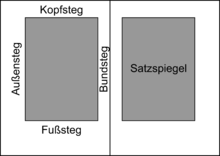{#fig-seitenrand}


Eine mögliche (und optisch ansprechende) Aufteilung der Seite ist die *Rasterteilung*, s. @fig-raster.
Üblich sind 9 x 9 Felder, die sog. *Neunerteilung*.
Diese Aufteilung liefert fast die gleichen Maßstäbe wie eine Aufteilung nach dem Goldenen Schnitt.
Eine A4-Seite hat folgende Maße: 210mm x 297mm (21cm x 29,7cm).
Bei der Neuneraufteilung hat ein Feld also folgend Größe: 23mm x 33mm (2,33cm x 3,3cm).


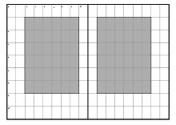{#fig-raster}

```{r}
#| echo: false
#| tbl-cap: Satzspiegel mit der Neunerteilung bei einer Doppelseite im A4-Format
#| label: tbl-neunerteilung

d <- tribble(
  ~Formataspekt, ~"Maße in mm",
  "Bundsteg", "23",
  "Kopfsteg", "33",
  "Außensteg", "47",
  "Fußsteg", "66",
  "Textbreite", "140",
  "Texthöhe", "198"
)

kable(d)
```

### Die 10 Gebote der Textformatierung

Die zehn Gebote der Textformatierung:

1. Du sollst nicht auseinanderreißen die Worte, die zusammengehören.
2. Du sollst den guten Abstand wahren (ein kurzes Leerzeichen) zwischen Kürzeln wie z.&thinsp;B., u.&thinsp;a., etc. oder vor X&thinsp;% (falsch: z. B., richtig: z.&thinsp;B.).
3. Du sollst den Unterschied zwischen Bindestrich (-) und Gedankenstrich (–) in Ehren halten. Meide den amerikanischen Geviert-Strich (–).
4. Du sollst der deutschen Rechtschreibung keine Gewalt antun, indem du das Apostroph falsch einsetzt (falsch: Sebastian’s Bar, falsch: Geht`s gut?).
5. Ein Ästhet verstehe sich mit den Ligaturen.
6. Du sollst eines Absatzes letzte Zeile nicht auf der Folgeseite vereinsamen lassen; du sollst die erste Zeile eines Absatzes nicht als letzte Zeile unten auf der Seite beginnen lassen.
7. Du sollst eine Seite nicht aufschreien lassen in der Agonie vollgequetschten Textes. Lass ihr Luft zum Atmen auf dass sie sich ihres Daseins erfreue.
8. Teile und herrsche durch räumliche Nähe; lass zusammen die Gedanken, die zusammen gehören (Absätze) und teile die, die nicht eines Fleisches sind (verschiedene Gedanken). Ein Absatz weise ca. 5-15 Zeilen auf.
9. Der gute Hirt eines Textes gliedere den Satzspiegel wohl; den goldenen Schnitt habe er stets im Hinterkopf.
10. Meister der Kunst wissen um die Nähe einzelner Buchstaben und sorgen für das rechte Maße an Nähe und Ferne (vgl. Unterschneidung, engl. kerning).


[Hier](https://www.slideshare.net/zeichenschatz/11-tdliche-typosnden) findet sich mehr zum Thema Typographie.


### Nicht-paginierte Formate

Sofern Sie in einem nicht-paginierten Format schreiben,
nutzen Sie die von der Lehrkraft bereitgestellte Vorlage.
Alternative können Sie der Lehrkraft Ihre eigene Vorlage vorstellen.


### Urheberrecht


Prüfen Sie die Nutzungsrechte bzw. die Nutzungslizenzen eines Werkes, 
bevor Sie es übernehmen. Urheberrechtlich geschützten Werken (wie Abbildungen) dürfen Sie nicht ohne schriftliche Genehmigung des Inhabers des Urheberrechts einer Abbildung übernehmen – auch nicht in leicht abgeänderter Form.

Bei permissiven Nutzungslizenzen wie CC-BY ist die Nutzung hingegen erlaubt.
Es empfiehlt sich für wissenschaftliche Zwecke, Werke mit permissiven Nutzungsrechten zu nutzen.
Es gibt zwar ein Zitatrecht für Bilder (§51 UrhG), doch ist es im Einzelfall nicht einfach, korrekt anzuwenden:︎
Zulässig ist die Vervielfältigung, Verbreitung und öffentliche Wiedergabe eines veröffentlichten Werkes zum Zweck des Zitats, sofern die Nutzung in ihrem Umfang durch den besonderen Zweck gerechtfertigt ist. 
Zulässig ist dies insbesondere, 
wenn einzelne Werke nach der Veröffentlichung in ein selbständiges wissenschaftliches Werk zur Erläuterung des Inhalts aufgenommen werden Letzter Absatz lässt sich so interpretieren,
dass der Text ohne Bild verständlich sein muss.
Hey, das hier ist keine Rechtsberatung 🤓🤪 Für Zwecke der Lehre gelten laxere Regeln (§ 60 UrhG).


### Plagiate


>   Psychologinnen und Psychologen präsentieren keine Arbeiten oder Daten anderer als ihre eigenen, auch nicht, wenn diese Quelle zitiert wird.[@bdp_und_dpgs_berufsethische_2016]


### Schreibprogramme

Der Klassiker für Software zur Erstellung von Texten ist vermutlich MS Word.
Es gibt aber Alternativen, die sich für kollaboratives Schreiben besser eignen,
etwa Google Docs. Google Docs unterstützt auch ein Zotero-Plugin,
was für wissenschaftliche Dokumente ein Muss ist.
Technikfreunde mit Zukunftsblick schreiben vielleicht Ihr Dokument mit [Markdown](https://de.wikipedia.org/wiki/Markdown). 
Die neueste Variante von Markdown ist [Quarto](https://quarto.org/docs/tools/rstudio.html).


:::{.exr-word}
### Word-Checkas

Erläutern und demonstrieren Sie folgende Word-Formatierungsfunktionen:

- Verzeichnisse verlinken
- Gliederungsstruktur im PDF erstellen
- Formeln und griechische Buchstaben einfügen
- „Gitterstäbe“ (vertikale Trennlinien) aus Tabellen entfernen
- Abbildungsverzeichnis erstellen
- Inhaltsverzeichnis verlinken
- Wechselnde Kopfzeilen (z.B. für Kapitelüberschriften)
- Geschützte Leerzeichen und schmales (geschütztes) Leerzeichen abdrucken
- Zitationen verlinken
- Silbentrennung aktivieren
- „Schusterjungen“ und „Witwen“ vermeiden
- Formatvorlagen definieren
- Ligaturen verwenden
- Unterschneidung aktivieren
- Pixelige Bilder vermeiden
- Sonstiges ???$\square$
:::


## IT-Tools

Neben Old-School-Word-Software wie MS *Word* oder Libre Office kann ein Online-Tool* Google Docs* eine sinnvolle Alternative sein, um ihre Arbeit zu verschriftlichen.
Google Docs bietet ein Zotero-Plugin, was ein Killer-Feature ist.
Außerdem bieten solche Online-Dienste gute Kolloborationsmöglichkeiten (man kann also gut gemeinsam an einem Paper arbeiten).

Die Cool Kids schreiben Ihre Thesis in Plain Text, d.h. *Markdown.*
Git(hub) übernimmt dann die Vesionierung und das Backup.

Denken Sie an die IT-Sicherheit: Erstellen Sie regelmäßige Backups von verschiedenen Versionen (Stand gestern, Stand heute, ...) Ihrer Arbeit.
Markieren Sie die Versionen mit einer fortlaufenden Nummer (`Thesis_v_042`) oder mit Datum/Uhrzeit (`Thesis_2026-06-11_11:08`).
[Meiden Sie `Thesis_final`](https://phdcomics.com/comics/archive.php?comicid=1531), das klappt sowieso nicht 😂.


## Formalia


Wie viele Seiten soll ich schreiben? Welche Schriftgröße ist am besten, welche Schriftart die schönste? 
-- Das sind typische Fragen, wenn man einen wissenschaftlichen Bericht (in der Uni) schreibt. 
Einige Antworten, fachlich begründet, finden sich in diesem Kapitel (s. @sec-formatierung). Weitere Hinweise finden Sie im [Hinweisbuch](https://hinweisbuch.netlify.app/060-hinweise-pruefung-projektarbeit-frame).
Schauen Sie z.B. [im Kapitel "Mengengerüst"](https://hinweisbuch.netlify.app/060-hinweise-pruefung-projektarbeit-frame#sec-mengengeruest), 
um z.B. Antworten auf die Frage nach dem Umfang an Seiten zu finden. 


