# Beschreiben


## Lernsteuerung


### tl;dr

In diesem Kapitel geht es um Studien mit dem Erkenntnisziel, eine Grundgesamtheit (Population) statistisch zu beschreiben:
Es geht um *Populationsbeschreibung*.
Ein Beispielstudie könnte das mittlere zur Verfügung stehende Finanzbudget von Studentis (pro Monat) untersuchen.

>   Wie hoch ist wohl das das monatliche Budget von Studentis an der Hochschule Ansbach?


### Standort im Lernpfad

@fig-ueberblick zeigt den Standort dieses Kapitels im Lernpfad und gibt damit einen Überblick über das Thema dieses Kapitels im Kontext aller Kapitel.
Behalten Sie Ihren Fortschritt im Projektplan im Blick, s. @fig-projektplan.


```{r}
#| echo: false
library(tidyverse)
ggplot2::theme_set(theme_minimal())
```


### Lernziele


- Sie können das Ziel einer Populationsbeschreibung von einer Explikation (kausale Erklärung) begrifflich trennen.
- Sie können erläutern, inwiefern die Inferenzstatistik benötigt wird, um die Ungewissheit einer Schätzung eines Populationsparamters zu quantifizieren.
- Sie können den benötigten Stichprobenumfang für gängige Situationen berechnen.


## Was ist Populationsbeschreibung?


### Definition

:::{#def-popdeskript}
### Populationsbeschreibung
Populationsbeschreibung als Ziel einer wissenschaftlichen Studie ist eine Umsetzung von Beschreibung als epistemologisches Ziel, vgl. @fig-ziele.
Studien dieser Art können eine, zwei oder mehr Variablen enthalten.$\square$
:::


:::{#exm-popdeskript}
### Beispiele für populationsbeschreibende Fragen
- Wie viel Geld hat ei Studenti in Deutschland aktuell (typischerweise) zur Verfügung im Monat?
- Haben weibliche Studentinnen mehr Geld zur Verfügung als männliche Studentis?
- Wie unterscheidet sich das Budget der Studentis nach Bundesland und nach Studienrichtung?$\square$
:::


:::{#exm-pop1v}
### 1 Variable
- Wie viel Geld hat ein Studenti in Deutschland aktuell (typischerweise) zur Verfügung im Monat?
- Wie viele Parties besucht ei Studenti im Schnitt pro Semester (in Deutschland, aktuell, in einem wirtschaftlichen Studiengang)?
- Wie groß ist der Anteil an Arbeitnehmern, die im Home-Office arbeiten (mind. 1 Tag pro Woche, aktuell, in De)?
- Wie groß ist der Anteil an Studentis, die heimlich nachts Statistik-Bücher lesen (mind. 30 Minuten, mind. 3 Nächte pro Woche, aktuell, in Deutschland ...)?$\square$
:::


:::{#exm-pop2v}
### 2 oder mehr Variablen
- Haben  Studentinnen mehr Geld zur Verfügung als (männliche) Studenten?
- Wie unterscheidet sich das Budget der Studentis nach Bundesland und nach Studienrichtung?$\square$
:::


### Notation

Forschungsfragen *mit 1 Variable* zur Populationsbeschreibung werden so notiert:

$$y \sim 1$$
Forschungsfragen *mit 2 Variablen* (1 AV, 1 UV) zur Populationsbeschreibung werden so notiert:


$$y \sim x$$


Forschungsfragen *mit 3 oder mehr Variablen* (1 AV, 2 oder mehr UV) zur Populationsbeschreibung werden so notiert:


$$y \sim x_1 + x_2 + \ldots$$


### Deskription ≠ Explikation


Vielleicht stammt die Weisheit von Chuck Norris, dass man in einer Studie mit dem Anspruch der *(Populations-)Beschreibung* keine Kausalinterpretationen treffen darf, s. @fig-norris-causal.


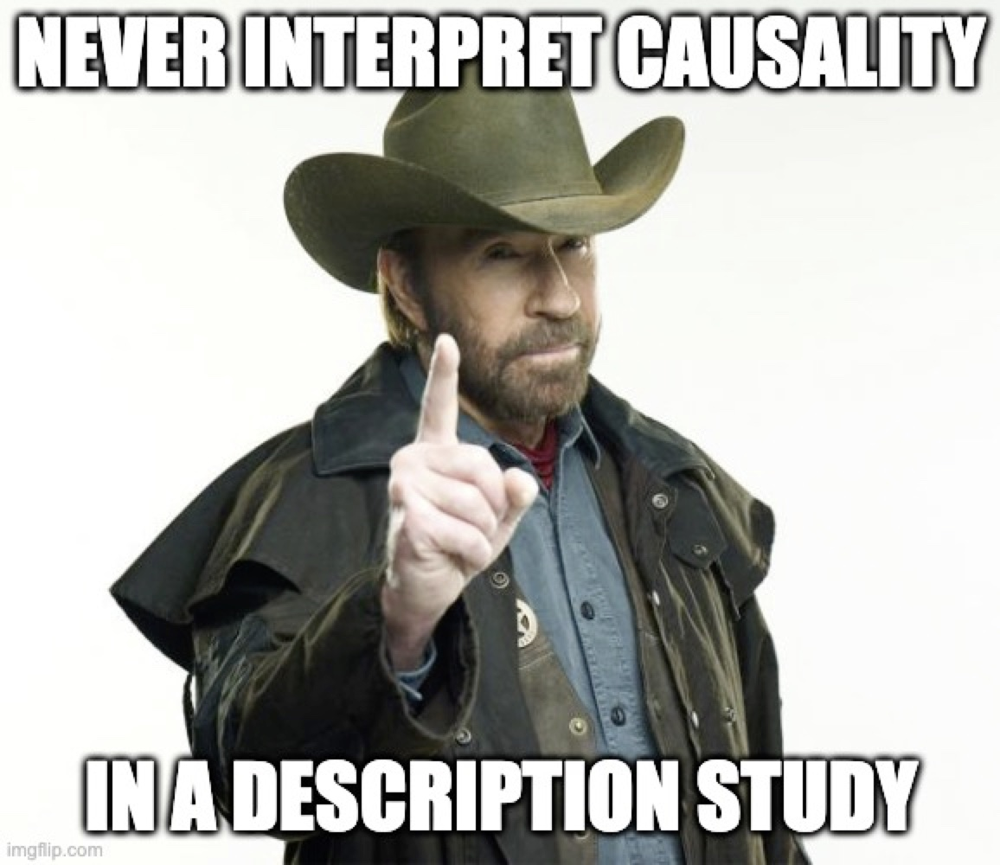{#fig-norris-causal width="50%"}


[Quelle: Imgflip](https://imgflip.com/i/6ad8h3)


:::{#exm-driving}
### Handynutzung beim Autofahren
@brown_rash_2021 untersuchen den Einfluss von Persönlichkeitsfaktoren beim Autofahren:


>   Young drivers exhibit high levels of risky driving behaviour, including texting while driving (TWD). The aim of this study was to examine the influence of personality (rash impulsivity, reward seeking), fear of missing out (FOMO) and mobile phone involvement (MPI) on frequency of TWD. Six hundred and twelve young drivers aged 17 to 24 years completed an online survey including these measures, and frequency of sending and reading TWD in the prior week. Rash impulsivity and reward seeking, as well as MPI, predicted both modes of TWD, while FOMO only predicted sending. In addition, rash impulsivity, reward seeking and FOMO all had significant indirect effects on sending and reading TWD via MPI. Findings highlight the importance of considering indirect relationships of personality via MPI on phone use while driving.

In ihrer Studie führen die Autoren Zusammenhänge zwischen verschiedenen Persönlichkeitsfaktoren und risikoreichem Fahrverhalten an, vermeiden es aber, kausale Schlussfolgerungen zu ziehen:

>   ... a person higher on rash impulsivity may be more likely to both read and send a TWD (texting while driving).

"More likely" ist keine kausale Aussage, sondern ist eine Wahrscheinlichkeitsaussge, das hat nichts mit Kausalität zu tun.

An anderer Stelle schreiben die Autoren:

>    Rash impulsivity ... will positively predict TWD.


"Will positively predict", das hört sich zwar nach einer Prognose-Hypothese an, aber die Autoren berichten keine Statistiken der Prognose, sondern der Zusammenfassung, also ist es eine Deskriptions-Hypothesen.^[Leider nicht sehr präzise formuliert von den Autoren.]

:::


:::{.callout-caution}
### Kausalhypothese getarnt als Deskriptionshypothese
Das Berichten von Zusammenhängen ohne explizites Erwähnen Kausalhypothese einer Kausalhypothese heißt noch nicht, 
dass es sich um eine reine Deskriptionsstudie handelt. 
In vielen Fällen wird man an einer Kausalaussage interessiert sein: Hey, pack dein Handy weg, wenn du fährst, das ist super gefährlich.
Implizit wird eine Kausalhypothese angestellt, da sich diese den Lesis aufdrängt.
Faktisch haben viele Studien, die sich als Deskription ausgeben, eine Kausalhypothese.$\square$
:::


>    🧑‍🎓 Darf ich eine Kausalhypothese aufstellen, auch wenn ich diese nicht richtig belegen kann? Oder muss ich dann eine Deskriptions-Hypothese aufstellen?

>    👨‍🏫 Man kann ohne Probleme eine Kausalhypothese aufstellen, auch wenn man diese nicht abschließend belegen kann. Kann sowieso keine (oder kaum eine) Studie. Man schreibt dann einfach, dass die vorliegende Studie keine abschließende Belege vorbringt, und dass alternative Schlüsse auch möglich sind.


## Schätzen von Populationsparametern


### Ungewissheit

Das Kreuz von fast allen Arten empirischer Studien: Wir wollen die *Grundgesamtheit* (Population) beschreiben, haben aber nur Daten über einen Teil der Population, also eine *Stichprobe*, s. @fig-stipro-pop.
*Ungewissheit* ist der Makel der empirischen Forschung.


:::{#def-popschaetz}
### Ungewissheit in Populationsschätzungen
Eine Populationsschätzung nimmt eine Stichprobe als Grundlage, um einen Parameter (Kennwert) einer Population zu beschreiben. Daher sind Schätzungen mit Ungewissheit und somit Unsicherheit in den Parametern verbunden.$\square$
:::

:::{#fig-stipro-pop layout-ncol=2}

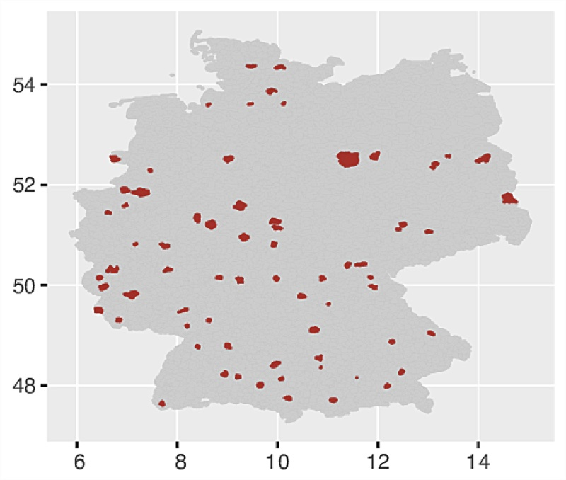{#fig-stipro}

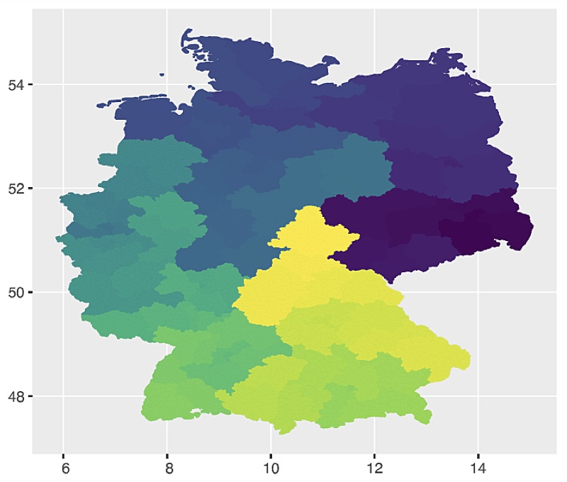{#fig-pop}

Stichprobe vs. Grundgesamtheit (Population)

:::


### Deskriptiv- vs. Inferenzstatistik


Die Deskriptivstatistik fasst eine Wertereihe zu einer Kennzahl (Statistik) zusammen;
die Inferenzstatistik schließt von einer Statistik auf die entsprechende Kennzahl (Parameter) einer Population, s. @fig-desk-inf.

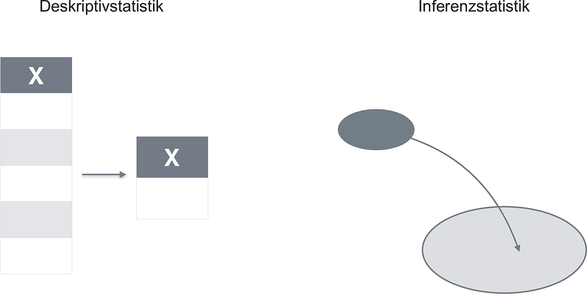{#fig-desk-inf width="75%"}


:::{#exm-desk-inf}
### Anteil der heimlichen Statistik-Fans?
@fig-desk-inf illustriert an einem Beispiel den Unterschied zwischen Deskriptiv- und Inferenzstatsistik.
Deskriptivstatistik errechnet eine Statistik: Den Anteil der heimlichen Statistikfans in der vorliegenden Stichprobe. Es gibt hier keine Ungewissheit: Wir haben alle Studis befragt und ihre Antwort aufgeschrieben.^[Unter der Annahme, die Messung ist fehlerfrei; insbesondere unter der Annahme, alle Studis haben ehrlich geantwortet. Es ist zu hoffen, dass niemand muss seine Liebe geheimhalten muss.]
Die Inferenzstatistik schließt auf der Basis des Kennwerts und der Stichprobengröße auf die Population: Wie genau gibt die Statistik wohl den Anteil in der Grundgesamtheit wieder?$\square$
:::


Der *Schätzbereich* ist das vielleicht wichtigste Werkzeug der Inferenzstatistik.


:::{#def-schätzbereich}
Ein Schätzbereich^[Es gibt viele Synonyme oder ähnliche, nicht immer scharf definierte Begriffe: Schätzbereich, Vertrauensintervall, Konfidenzintervall...] gibt einen Bereich plausibler Werte für einen Parameter an. In der Bayes-Statistik sind Aussagen erlaubt, die eine Wahrscheinlichkeit mit einem Wertebereich verbinden; in der Frequentistischen Statistik nicht.$\square$
:::

:::{#exm-schaetz}
Auf Basis unseres fiktiven Beispiels mit den heimlichen Statistikfans resümieren wir in unserer Inferenzanalyse, dass der 95%-Schätzbereich des Anteils von 0.32 bis 0.52 reicht.$\square$
:::

Es gibt mehrere Varianten einens Schätzbereichs; in der Bayes-Statistik sind [Perzentilintervalle](https://start-bayes.netlify.app/post#visualisierung-der-intervalle) ([PI; auch als Equal-Tail-Intervall, ETI bezeichnet]) und [Intervalle höchster Dichte](https://start-bayes.netlify.app/post#intervalle-h%C3%B6chster-dichte)^[Highest Density Inteval, HDI] üblich.


:::{#exm-mtcars}
### Spritverbrauch bei Automatik- vs. manuellem Getriebe


Wie groß ist der Unterschied im Spritverbrauch *im Durchschnitt* bei Automatik- vs. manuellem Getriebe?


```{r}
#| message: false
#| results: hide
library(rstanarm)
library(easystats)
data(mtcars)

m1 <- stan_glm(mpg ~ am, seed = 42, data = mtcars)
```


Mit `parameters()` kann man sich die Schätzintervalle ausgeben lassen:

```{r}
parameters(m1)
```

Wie man erstreckt sich der 95%-PI-Schätzbereich^[Wie man der Hilfeseite des Befehls entnehmen kann, wird im Standard per Voreinstellung ein PI bzw. ETI ausgegeben.] von ca. 4 bis 11 Meilen pro Gallone Sprit. 
Dieses Ergebnis kann man so interpretieren:

>   Der Unterschied im Spritverbrauch in der Population wird auf [3.72, 10.70] (95%-ETI) geschätzt.


Oder, anschaulicher, man kann sich den Schätzbereich auch visualisieren lassen, s. @fig-mtcars1.

```{r}
#| label: fig-mtcars1
#| fig-cap: "Schätzbereich des Parameters 'am'. Wie man sieht, ist Null nicht im Schätzintervall enthalten."
plot(parameters(m1))
```

:::


### Eine gute Stichprobe anstelle einer Vollerhebung


Eine gute Stichprobe ist wie ein Löffelchen Suppe aus einem gut gerührten Topf, s. @fig-suppe.
Um die Suppe abzuschmecken, reicht ein Löffelchen - eine kleine Stichprobe also.

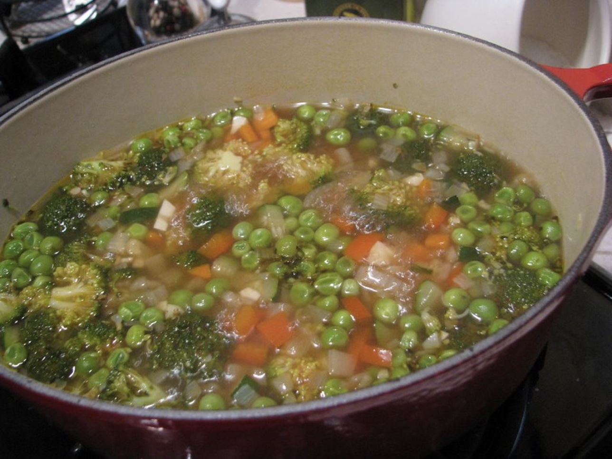{#fig-suppe width="50%"}


### Nomenklatur

@tbl-griech stellt diese Buchstaben zusammen mit ihrer Aussprache und Bedeutung vor.


| Population      | Aussprache | Stichprobe | Bedeutung in der Statistik |
|--------------|------------|-----------|---------------------------:|
| $\beta$      |  beta      |         b |      Regressionskoeffizent |
| $\mu$        |  mü        |         m |                 Mittelwert |
| $\sigma$     | sigma      |         s |             Standardabweichung       |
| $\sigma^2$     | sigma-Quadrat      |         s |             Varianz       |
| $\Sigma$     | Sigma      |         S | Summenzeichen   |
| $\rho$       | rho        |         r | Korrelation (nach Pearson) |
| $\sigma$     | sigma      |         s |             Streuung       |
| $\pi$        | pi         |         p  | Anteil |

: Griechische Buchstaben, die in diesem Buch verwendet werden. {#tbl-griech}


Mehr griechische Buchstaben finden sich [hier](https://de.wikipedia.org/wiki/Griechisches_Alphabet).


### Repräsentativität


:::{#exm-reprae1}
### Gelegenheitsstichproben und Musikgeschmack

Schorsch erhebt seine Umfrage zu Musikpräferenzen Samstag Nacht um 23.50h vor der Nürnberger Disko *Hirsch*. Deva erhebt ihre Daten ihre Daten zur gleichen Zeit vor dem Nürnberger Opernhaus.
Beide möchten den Musikgeschmack in der Nürnberer Population bestimmen. Ob ihre Stichproben wohl repräsentativ sind?^[Nein.]$\square$
:::

:::{#def-adhoc-stipro}
### Gelegenheitsstichprobe
Eine Gelegenheits- oder Ad-hoc-Stichprobe ist das Resultat des Ziehens einer Stichprobe nach Praktikabilitätsgesichtpunkten. Anders gesagt: Man nimmt die erstbesten Personen in die Stichprobe auf - oder diejenigen, die einem am besten in den Kram passen.$\square$
:::

Um mit Hilfe einer Stichprobenerhebung gültige Aussagen über ein Merkmal $X$ in der avisierten Population treffen zu können, muss die Stichprobe repräsentativ sein.

*Repräsentativ* kann zweierlei bedeuten:

1. Die Stichprobe ähnelt der avisierten Grundgesamtheit stark im zu messenden Merkmal
2. Die Präzision der Schätzung ist messbar

:::{.callout-note}
Ein geeigneter Weg für eine repräsentative Stichprobe ist das Ziehen einer Zufallsstichprobe.
Leider ist das oft nicht so einfach. 
Nur eine Zufallsstichprobe erlaubt es, die Präzision einer Stichprobe anhand statistischer Verfahren zu bestimmen. Allerdings gibt es auch Situationen, in denen eine Adhoc-Stichprobe einer Zufallsstichprobe ähnlich (genug) ist.$\square$
:::


:::{#exm-adhoc}
### Warum keine Adhoc-Stichprobe?
>   Forschungsfrage: Wie viel Zeit verbringt ein deutscher Bürger (m/w/d) am Tag im Schnitt am Handy?

Nennen wir diese Variable, *mittlere Zeit pro Stunden am Tag an einem Mobilgerät*, $X$.

Wir befragen dazu die nächstbesten 100 Menschen am Hauptbahnhof, Samstagabend, 23h. 


Ob wir mit einer Adhoc-Stichprobe (am Hauptbahnhof) die Population für X repräsentativ erfassen? 
Vermutlich nicht, denn

- Junge Menschen oder Nicht-Berufstätige sind womöglich überrepräsentiert in dieser Stichprobe, und ihr Handykonsum unterscheidet sich vielleicht deutlich von der Gesamtbevölkerung 
- Hiesige Menschen sind vermutlich am hiesigen Hauptbahnhof überrepräsentiert, und ihr Handykonsum unterscheidet sich vielleicht von den Auswärtigen
- ...

-  Vermutlich gibt es weitere Verzerrungen (Konfundierungen, Kollisionsvariablen) die uns nicht bekannt sind, aber eine Rolle spielen$\square$
:::


## Fallbeispiel: World Happiness Report

Der *World Happiness Report* berichtet und diskutiert die Lebenszufriedenheit der Menschen in vielen Ländern.
Es handelt sich um eine Studie mit dem Anspruch der *Populationsbeschreibung*.

@fig-whr-fig21 zeigt die mittlere Lebenszufriedenheit in den 25 zufriedensten Ländern.
Neben dem Mittelwert, der als Balken dargestellt ist^[eine Praxis, von der man nur abraten kann, s. [Friends Don't Let Friends Make Bar Plots for Means Separation](https://github.com/cxli233/FriendsDontLetFriends#1-friends-dont-let-friends-make-bar-plots-for-means-separation)], ist das Konfidenzintervall (95%) dargestellt.
Man erkennt es an dem kleinen grauen Kästchen am rechten Ende des jeweiligen Balkens.
Diese Konfidenzintervalle sind Angaben zur Schätzgenauigkeit des Modells, d.h. des jeweiligen Mittelwerts.
Man kann das Konfidenzintervall so interpretieren, dass es einen Bereich plausibler Werte für den Modellparameter (hier: mittlere Zufriedenheit) angibt.
Da die Genauigkeit einer Schätzung abhängig ist von der Stichprobengröße und die Stichprobengröße (aufgrund des Zusammenwerfens der Daten mehrerer Jahre) relativ groß ist, sind die Konfidenzintervalle relativ klein, die Schätzung also recht präzise.
Zumindest mutet das Diagramm so an.
Allerdings ist auch angegeben, dass die Schätzinteralle überlappen.
So sieht man, dass sich die Bereiche plausibler Werte für die Plätze 2-4 (Dänemark, Island, Israel) überlappen. 
Man kann also argumentieren, dass die Rangfolge z.B. dieser drei Länder nicht sicher ist.


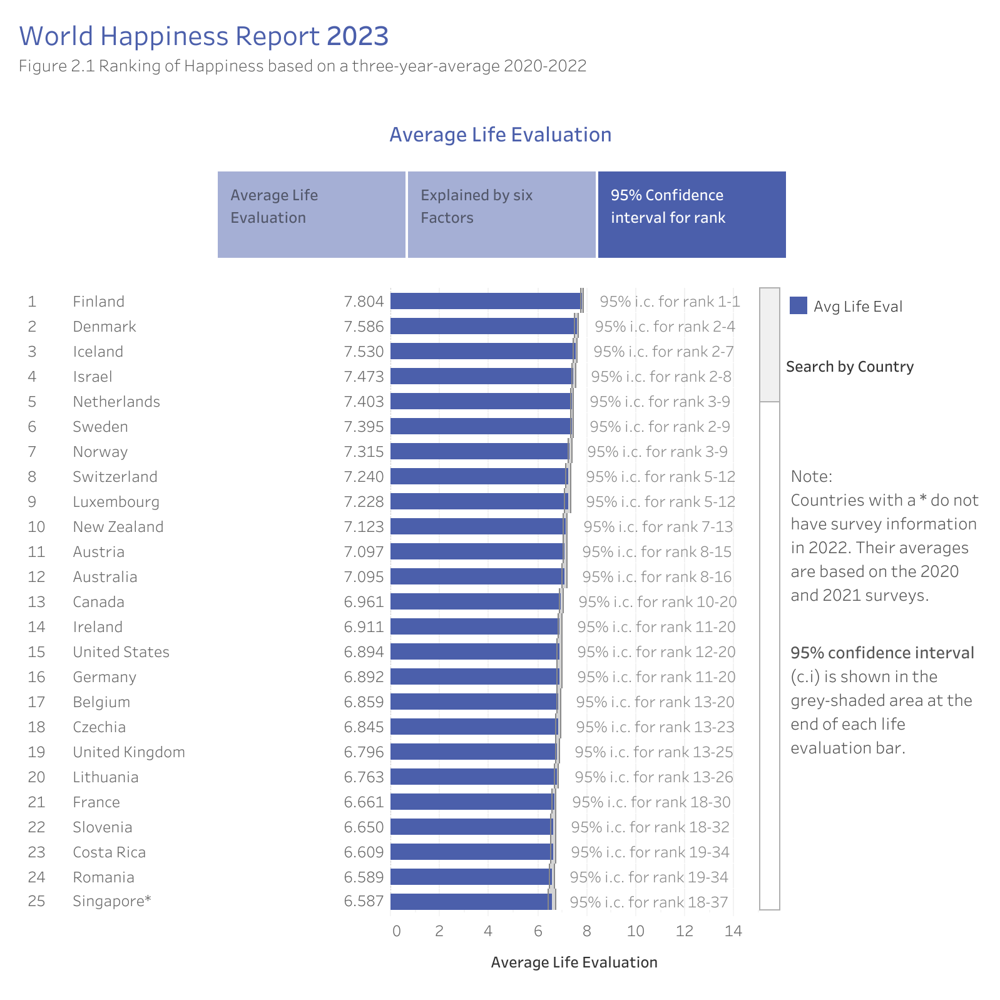{#fig-whr-fig21 width="75%"}

[Quelle: WHR](https://worldhappiness.report/ed/2023/world-happiness-trust-and-social-connections-in-times-of-crisis/)


## Typische Forschungsdesigns

Da Studien mit Ziel der Populationsbeschreibung per Definition keine Treatment-Wirkungen untersuchen, sind die entsprechenden Studien nur auf Beobachtung (Informationsaufnahme) und nicht Intervention abgestellt.
Beobachtungsstudien sind häufig einfacher strukturiert als Studien mit Treatment.
Der Versuchsaufbau einer querschnittliche Studie mit Ziel der Populationsbeschreibung ist simpel:
Sie messen pro Beobachtungseinheit alle relevanten Variablen.


:::{#exm-design1}
### Einkommen von Studentis
Sie interessiert die Forschungsfrage, wie viel Geld Studentis im Monat als Einkommen zur Verfügung haben.
Dazu befragen Sie $n=300$ Studentis. Um eine möglichst zufällige oder zumindest repräsentative Studie zu gewinnen, haben Sie eine Nachricht im Forum des Studiengangs gepostet: Wer bei Ihrer Befragung mitmacht, den laden Sie zur nächtsen Party ein. Außerdem verlosen Sie ein Abendessen mit Ihnen. Sicherlich wird der Andrang groß sein.$\square$
:::


:::{#def-forschungsdesign}
### Forschungsdesign
Unter dem Forschungsdesign (synonym: Versuchsplan) versteht man den Aufbau einer Studie.
Speziell meint man damit den Aufbau insoweit er die Variablen betrifft, die in der Forschungsfrage oder den Forschungsfragen vorkommen.$\square$
:::

### Univariate Forschungsfragen

Univariate (nur eine Variable) Forschungsfragen untersuchen nur eine einzelne Variable.

:::{#exm-univariat}
#### Mittlere Körpergröße deutscher Männer
Fragt eine Studie nach der mittleren Körpergröße deutscher Männer, so liegt eine univariate Studie mit dem Ziel der Populationsbeschreibung vor.$\square$
:::

Entsprechend einfach sind die Studiendesigns solcher Forschungsfragen, s. @fig-univariat.


```{mermaid}
%%| label: fig-univariat
%%| fig-cap: Studiendesign

flowchart LR
  A[Begrüßung und Aufklärung</br>der Probanden] --> B[Messung der Körpergröße]
  B --> C[Messung soziodemografischer</br>Variablen]
  C-->D[Verabschiedung]

```


### Gruppenvergleich

Viele Studien mit Gruppenvergleich haben ein explikatives Ziel;
es gibt aber Gruppenvergleich-Studien mit dem Ziel der Populationsbeschreibung.

:::{#exm-gruppenvgl}
#### Verfügbares Budget von Studentis im Vergleich von Studiengängen
Fragt eine Studie nach dem verfügbaren Finanzbudget von Studentis in Abhängigkeit des Studiengangs - vergleicht die Studie also das Budget zwischen den Studiengängen - so liegt eine Deskriptionsstudie mit Gruppenvergleich vor, s. fig-gruppenvergleich.$\square$
:::


```{mermaid}
%%| label: fig-gruppenvergleich
%%| fig-cap: Studiendesign

flowchart LR
  A[Begrüßung und Aufklärung</br>der Probanden] --> B[Abfrage des Budgets]
  B --> B2[Abfrage des Studiengangs]
  B2 --> C[Messung soziodemografischer</br>Variablen]
  C-->D[Verabschiedung]
```


Die Studie zum World Happiness Report ist ebenfalls ein Beispiel für einen Gruppenvergleich.


## Effektstärke

Was ist ein "großer" Effekt, was ein "kleiner" (oder "mittlerer"?)

Definieren wir als "groß" den Unterschied in mittlerer Körpergröße zwischen einem 6 Jahre alten und einem 7 Jahre alten Mädchen. 
Beziehen wir uns auf die [typische Körpergrößen von Mädchen dieses Alters](https://cdn.who.int/media/docs/default-source/child-growth/growth-reference-5-19-years/height-for-age-(5-19-years)/sft-hfa-girls-perc-5-19years.pdf?sfvrsn=59b013d8_4).

Mittlere Körpergröße:

- 6.0 Jahre: 115 cm
- 7.0 Jahre: 121 cm


Die SD liegt bei ca. 5.5 cm.

Demnach beträgt der Größenunterschied 6 cm, oder ca. 1 SD-Einheit.

Aus der oben zitierten Größentabelle können wir ablesen:

- 6 Jahre, 6 Monate: 118 cm

Das ist ein Unterschied von 3 cm, oder ca. 1/2 SD-Einheit.
Nennen wir das einen "mittleren" Effekt.


## Planung der Stichprobengröße


### Schätzung eines normalverteilten Parameters 


Sagen wir, wir möchten einen normalverteilten Parameter $X$ mit "hinreichender Genauigkeit", $e$ schätzen.
Dazu müssen Sie Annahmen treffen zur Verteilungsform und zur Streuung von $X$.


:::{#exm-schaetz1}
### Mittlere Daddelzeit
Sagen wir, um es konkret zu machen, uns interessiert die Zeit, die mittelfränkische junge Erwachsene pro Tag am Handy verbringen ("mittlere Daddelzeit"). Um uns Tipperei zu sparen, geben wir dieser Variablen den Namen 
$X$.

Aus einer Vor-Untersuchung schätzen wir für die Population eine Streuung $\sigma$ der Daddelzeit von 20 (Minuten).
Außerdem gehen wir davon aus, dass $X$ normalverteilt ist.

*Gesucht*. Wir möchten gerne wissen, wie groß die Stichprobe sein muss, um $X$ mit einem 95%-KI der Breite von $b=8$ Minuten zu schätzen.
:::


Der Radius^[Der "Radius" eines Konfidenzintervalls ist die Hälfte der Breite des Konfidenzintervalls.] $r=b/2$ eines Konfidenzintervalls (KI) hier so berechnet werden:


$$r = \frac{z \cdot \sigma} {\sqrt{n}}$$

Für ein [95%-KI ist der zugehörige z-Wert in der Normalverteilung 1.96](https://en.wikipedia.org/wiki/Normal_distribution#/media/File:Standard_deviation_diagram_micro.svg).

In unserem Fall ist ein Radius (auch Fehler $e$ genannt) von $r=e= b/2=4$ gesucht; das Konfidenzintervall soll einen Radius von kleiner oder gleich diesem Wert aufweisen:


$$\frac{z \cdot \sigma} {\sqrt{n}} \le e  \Rightarrow  \frac{z^2\sigma^2}{e^2} \le n $$

Die Stichproben muss also diese Mindestgröße $n_{min}$ aufweisen:

$$n_{min} = \frac{z^2\sigma^2}{e^2}$$


Lassen wir R die schnöde Rechenarbeit erledigen:

```{r}
z <- 1.96  # z-Wert für 95%-KI
s <- 20  # Streuung, Sigma
e <- 4 # Radius von 4 Minuten

n <- (z^2*s^2) / e^2
n
```


Unsere Stichprobe sollte also (mindestens) `r ceiling(n)` Beobachtungseinheiten umfassen,
um den Parameter mit der angegebenen Genauigkeit zu messen.
Voraussetzung ist natürlich eine Zufallsstichprobe.

Damit man nicht selber ausrechnen muss, kann man auch eine Tabelle bemühen,
etwa die von @Bortz2006, s. @fig-bortz-tab26.

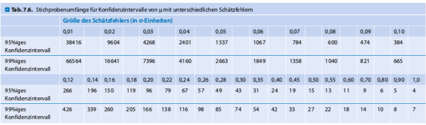{#fig-bortz-tab26}

In @fig-bortz-tab26 ist $e$ als Anteil der Streuung von $\sigma$ dargestellt.


:::{#exm-schaetz1}
### Mittlere Daddelzeit 2
Bei einem Fehler von 8 Minuten und einer Streuung von 20 Minuten ergäbe sich ein *relativer Schätzfehler* von 8/20 = 2/5 = .4 (unter der Annahme einer Normalverteilung und einer Zufallsstichprobe.)$\square$
:::


Manchmal kennt man die Streuung nicht, aber der Range, $R$, (max-min) ist bekannt.
In diesem Fall schlagen @Bortz2006 folgende Formel vor, um die Streuung $\sigma$ zu schätzen:

$$\sigma = \frac{R}{5.15}$$


:::{.callout-tip}
Wenn Sie die Streuung des Merkmals $X$ nicht aus der Literatur ableiten können,
können Sie sich behelfen, in dem Sie die Ausprägung von $X$ bei $n=20$ Versuchspersonen messen. Dann messen Sie wieder 20 Versuchspersonen.
Sind beide Streuungen ähnlich, so haben Sie einen Schätzwert für die Streuung in der Population.
Sind sie unähnlich, so erheben Sie weitere 20 Personen [@Bortz2006].$\square
:::


### Schätzung für Korrelationen


@Schonbrodt2013a untersuchten mittels einer Simulationsstudie, ab welcher Stichprobengröße Korrelationswerte $\rho_0$ stabil werden. "Stabil" soll heißen, dass wiederholte Ziehungen einer Stichprobe aus einer Population mit Korrelation $\rho_0$ die Stichprobenwerte der Korrelation "nicht mehr so viel variieren", z.B. weniger als 0.1 Korrelationseinheiten.
Ihre allgemeine Schlussfolgerung war, dass $n=250$ einen guter Grenzwert darstellt, s. @fig-corr-stab [@Schonbrodt2013a].


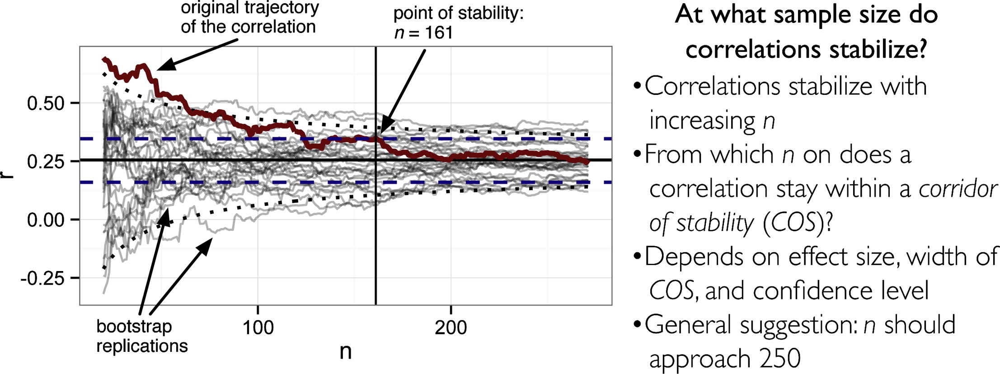{#fig-corr-stab}

Ausführlichere Empfehlungen sind @fig-schoenbrodt2 zu entnehmen [@Schonbrodt2013a].
Dort sind die Mindest-Fallzahlen $(\text{COS}_{\text{crit}})$ in Abhängigkeit des Konfidenz-Niveaus (80%, 90%, 95%) und der wahren Korrelation $\rho$ in der Population zu entnehmen.


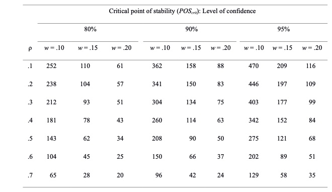{#fig-schoenbrodt2}


### Schätzung für typische statistische Tests


Der Einfachheit halber begnügen wir uns mit der Analyse von @cohen_power_1992.
Der Autor errechnet (die Untergrenze von) Stichprobenumfänge, um mit einer Wahrscheinlichkeit von 80% einen Effekt zu finden.
Dabei hängt diese Wahrscheinlichkeit von der Größe des Effekts ab, s. @fig-cohen1.

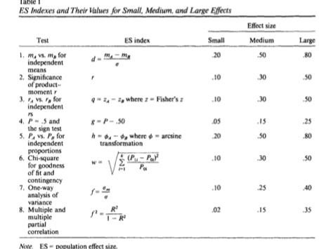{#fig-cohen1}


Auf dieser Basis leiten der Autor folgende (Mindest-)Stichprobenanforderungen ab, s. @fig-cohen2.


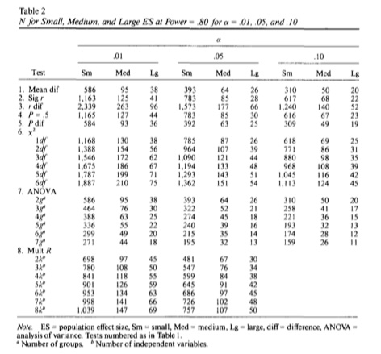{#fig-cohen2}

Die hier angegebenen Stichprobengrößen beziehen sich auf das Ziel, mit 80% Wahrscheinlichkeit einen Effekt (von angegebener Größe: klein, mittel, groß) zu entdecken.
Damit ist noch nichts über die Präzision der Parameterschätzung gesagt.
Die Stichprobengrößen sind also nur gedacht für das bescheidene Ziel der Schätzung, ob ein Effekt ungleich 0 ist.
Möchte man die wissen, wie viele Versuchspersonen man benötigt, um einen Effekt mit einer bestimmten Genauigkeit zu schätzen,
würde man mehr Versuchspersonenen benötigen.


## Literatur


