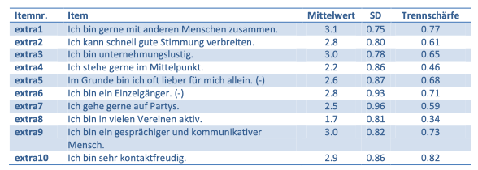
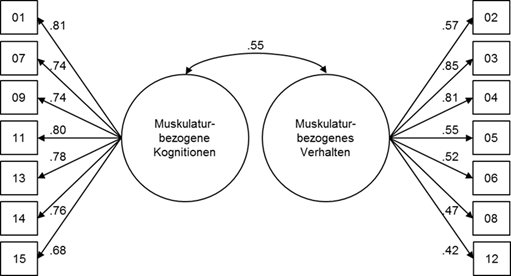
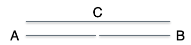
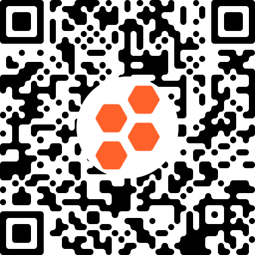
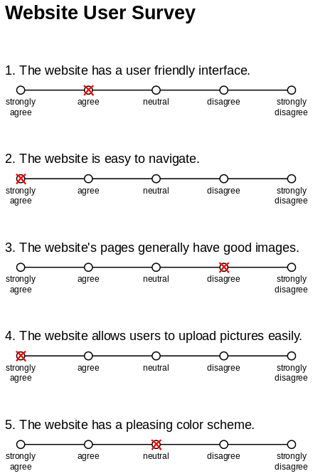
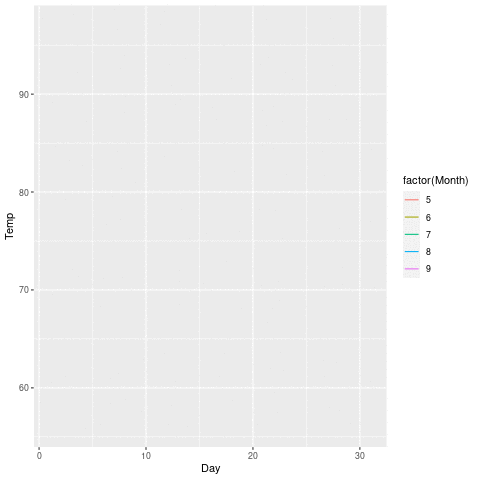

# Messen


```{r}
#| include: false
library(tidyverse)
```


```{r}
#| echo: false
library(ggplot2)
theme_set(theme_minimal())
```

## Lernsteuerung


### Lernziele


- Sie können den Begriff "Messen" definieren.
- Sie können den Begriff "Fragebogen" definieren und anhand von Beispielen erläutern.
- Sie können die Messgüte eines bestimmten Fragebogens einschätzen.
- Sie können Beispiele nennen für implizites Messen in der Psychologie.


### Position im Lernpfad

Sie befinden sich im Abschnitt "Messinstrumente" in @fig-ueberblick.
Behalten Sie Ihren Fortschritt im Projektplan im Blick, s. @fig-projektplan.


### Benötigte R-Pakete und Daten

```{r}
#| messagen: false
library(tidyverse)
library(gganimate)  # Animation, optional
library(plotly)  # Animation, optional
library(dygraphs)  # Animation, optional
library(robservable)  # Animation, optional
library(palmerpenguins)  # Animation, optional
```


```{r}
data("airquality")  # Animination, optional
data("gapminder", package = "gapminder")  # Animation, optional
data("penguins", package = "palmerpenguins")   # Animation, optional
```

Vergessen Sie nicht, dass Sie ggf. die Pakete zuerst (einmalig) installieren müssen.

## Was ist Messen?


### Operationalisierung


:::{#def-operat}
### Operationalisierung
Operationalisierung ist der Vorgang des genauen Beschreibens, anhand welcher Operationen ein Konstrukt beobachtbar (im weiteren Sinne) und damit messbar gemacht wird. 
Da in der Pschologie die Variablen zumeist (per Definition) nicht direkt der Beobachtung 
zugänglich sind, kommt der Operationalisierung eine wichtige Rolle im Forschungsprozess zu.$\square$
:::


Psychologische Variablen, auch als *Konstrukte* bezeichnet, sind nicht (direkt) messbar,
mann muss sie *operationalisieren*, dann kann sie erst messen, s. @fig-operat.

```{mermaid}
%%| label: fig-operat
%%| fig-cap: Vom Kontrukt zum Messmodell
flowchart LR
  subgraph Konstrukt
     direction LR
    theoretisch
    latent
    nicht-beobachtbar
  end
  
  subgraph Messmodell
    direction LR
    empirisch
    manifest
    beobachtbar
  end
  
  Konstrukt --> Messmodell

```


:::{#exm-messmodell}
### Extraversion bei den "Big Five"
@satow_b5t_2020 operationalisiert in seinem Instrument *B5T* die Persönlichkeitsvariable *Extraversion* anhand von 10 Items, s. @fig-extra.
Persönlichkeitsvariable sind Eigenschaften, die zeitlich stabil sind und sich situationsunabhängig auf eine bestimmte Weise im menschlichen Erleben und Verhalten manifestieren.
Extraversion beschreibt das Ausmaß, in dem eine Person hohe Aktivität in sozialen Interaktionen und anstrebt.
Hoch extravertierte Menschen sind dominant, gesellig, enthusiastisch und abenteuerlustig.$\square$
:::


{#fig-extra}


:::{#def-skala}
### Psychometrische Skala
Eine (psychometrische) Skala ist eine Operationalisierung eines Konstrukts anhand eines psychometrisch geprüften Messmodells.
Sie besteht aus mehreren zusammengehörigen Items, vgl. @fig-extra.
Den Antworten der Versuchspersonen auf die Items werden Zahlen zugeordnet und über die Items aufsummiert.
Häufig werden die Werte einer Skala als intervallskaliert angenommen ([Quelle](https://lehrbuch-psychologie.springer.com/glossar/psychometrische-skala)].
Im häufigen Fall eines sog. *reflektiven* Messmodells geht man davon aus,
dass die latente Variable die (einzige) Ursache der Werte (Streuung) in den Items ist.$\square$
:::


:::{#exm-messmodell}
### Deutschsprachige Drive for Muscularity Scale (DMS)
Die DMS [@waldorf_deutschsprachige_2016] sich als Maß für Muskulösitätsstreben etabliert.
Das Instrument besteht aus zwei (korrelierten) Skalen: 
Muskulatur-bezogene Kognition und Muskulatur-bezogenes Verhalten; der Volltext und weitere Informationen findet sich [hier](https://zis.gesis.org/skala/Waldorf-Cordes-Vocks-McCreary-Deutschsprachige-Drive-for-Muscularity-Scale-(DMS)).
Jedem der beiden Sckalen sind mehrere Items zugeordnet, s. @fig-dms.
Die Zuordnung der Items zur jeweiligen Skala und ihre psychometrischen (statistischen) Eigenschaften definieren das jeweilige Messmodell.$\square$
:::


{#fig-dms width="50%"}


### Messen


:::{#def-messen}
Messen ist das Zuordnen eines empirischen Zusammenhangs in einen Zusammenhang, der in Zahlen ausgedrückt wird und zwar nach "vernünftigen Regeln", d.h. so, dass sich die empirischen Beziehungen in den numerischen Beziehungen widerspiegeln.$\square$
:::

>    👨‍🏫 Messen ist das Fundament einer empirischen Wissenschaft.

>    🧑‍🎓 Wer viel misst, misst auch viel Mist!


Eine ausführlichere Darstellung des Messens findet sich z.B. bei @Eid2013.


Ein Beispiel für diese "vernünftigen Regeln" ist:

- Misst man zwei Stöcke A und C, wobei C länger ist als A ($C \succ A$), so muss die Zahl, die C zugeordnet wird ($Z(C)$) größer sein, als die Zahl, die Stock C zugeordnet wird ($Z(C)$): $C \succ A \Leftrightarrow Z(C) > Z(A)$, s. @fig-stoecke.

{#fig-stoecke width="50%"}


Wenn Stöcke A und B gleich lang sind und zusammen so lang wie Stock C sind, s. @fig-stoecke, dann muss für die den Stöcken zugeordneten Zahlen $Z(A), Z(B), Z(C)$ gelten: 

- Bedingung der Nominalskala: Gleichheit - $Z(A) = Z(B)$
- Bedingung der Nominalskala:  Ungleichheit - $Z(A) \ne Z(C)$
- Bedingung der Ordinalskala: Rangfolge - $Z(A) < Z(C), Z(B) < Z(C)$
- Bedingung der metrischen Skala: Additivität - $Z(A) + Z(B) = Z(C)\square$


Das Skalenniveau einer Variable kann nicht vorausgesetzt werden, sondern muss überprüft werden.


:::{#exm-messen1}
### Messen auf der Nominalskala
Messen auf der Nominalskala kann bedeuten, dass man Frauen die Zahl `1` zuordnet und Männern die Zahl `0`, vgl. @fig-messen1.$\square$
:::


```{mermaid}
%%| label: fig-messen1
%%| fig-cap: "Messen: Die Zuordnung von Beziehungen in einem empirischen System (Kontext) zu Beziehungen in einem Zahlensystem."

flowchart TD
  subgraph ES[Empirisches System]
    M1[Mann 1]
    M2[Mann 2]
    F1[Frau 1]
    F2[Frau 2]
    F3[Frau 3]
  end
  
  subgraph NS[Numerisches System]
    Z1[1]
    Z0[0]
  end
  
  M1 --> Z0
  M2 --> Z0
  F1 --> Z1
  F2 --> Z1
  F3 --> Z1

```


### Quiz


[Quiz zum Skalenniveau](https://api.socrative.com/rc/KWVTiT)


{width=25%}


Wie "gut" eine Operationalisierung ist, kann man empirisch prüfen.
Dafür gibt es einige Kennzahlen, s. @sec-messguete.


### Metrisches Niveau psychologischer Variablen

Ob psychologische Variablen überhaupt metrisches Nivea aufweisen, insbesondere die Additivität der Ausprägungen, war (und ist) Gegenstand (angeregter) Debatte [@Michell1997, @Michell2003, Michell2005d].
Ein Lichtblick ist vielleicht @Labovitz1970, der zeigte, dass eine ordinale Skala mit einer metrischen sehr hoch, $r>.95$ korreliert ist unter einem breiten Feld von Ausgangsbedingungen.
Es scheint also, dass man optimistisch sein darf, dass psychologische Variablen sich (oft) so verhalten *als ob* sie metrisch wären.


## Fragebogen

### Beispiele


[Big-Five-Test "B5T" ausprobieren](https://www.psychomeda.de/online-tests/persoenlichkeitstest.html)


### Definition


Einen inhaltlich psychologisch und methodisch psychologisch ("psychometrisch") fundierten Fragebogen bezeichnet man auch als *(psychologischen) Test*^[Das ist etwas verwirrend, weil der Begriff Test für alle möglichen Dinge verwendet wird. Zumeist lässt sich aus dem Kontext erschließen, was mit "Test" gemeint ist.]

:::{#def-psytest}
### Psychologischer Test
Ein Test ist ein wissenschaftliches Routineverfahren zur Untersuchung eines oder mehrerer empirisch abgrenzbarer Persönlichkeitsmerkmale mit dem Ziel einer möglichst quantitativen Aussage über den relativen Grad der individuellen Merkmalsausprägung [@lienert_testaufbau_1998].$\square$
:::


### Elemente

Ein (psychologischer) Test besteht aus folgenden Elementen:

- *Item*: Eine Frage, auf die der Proband antworten soll bzw. die er lösen sollen. Ein Item operationalisiert einen Teilaspekt eines Konstrukts.
- *Subtest*: Untertest aus mehreren Items eines Tests, die jeweils zu einem gemeinsamen Punktwert zusammengezogen werden.
- *Itemantwort*: Antwortmöglichkeiten eines Items.
- *Skala*: Andere Bezeichnung für einen Subtest oder Bezeichnung für einen Gesamttest, wenn dieser nur aus einem einzelnen Punktwert besteht.
- *Score*: Punktwert eines Probanden aus einem Subtest oder einem Test.


:::{#exm-item}
Item 1 aus der Extraversionskala des B5T [@satow_b5t_2020]
"Ich bin gerne mit anderen Menschen zusammen."$\square$
:::


:::{#exm-antwort1}
Beispielitem: „Ich bin ein ängstlicher Typ“ [@satow_b5t_2020].

Dieses Item hat folgende Itemantwort:

1) trifft gar nicht zu (1 Punkt)

2) trifft eher nicht zu (2 Punkte)

3) trifft eher zu (3 Punkte)

4) trifft genau zu (4 Punkte)
:::


### Antwortformate

Eine Skala hat (fast) immer ein homogenes Itemantformat, d.h. alle Items einer Skala haben i.d.R. das gleiche Antwortformat.

Es gibt viele verschiedene Antwortformate [vgl. @Buhner2011]; eine gängige Variante sind *Ratingskalen*.


:::{#def-ratingskala}
### Ratingskala und Likertskala
Eine Rating- oder Beurteilungsskala präsentiert der Versuchsperson  Items mit einem Antwortformat,
bei dem derjenige Punkte bzw. diejenige Antwortoption gewählt werden soll, die der Beurteilung der Versuchsperson am besten entspricht, vgl. @fig-likert.
Eine gängige Variante von Ratingskalen sind Likert-Skalen.
Items von Likert-Skalen sind Aussagen bei denen die Versuchspersonen den Grad Ihrer Zustimmung bzw. Ablehnung ausdrücken, in einem bipolarem Format also^[in diskreten Stufen; bei stufenlos wählbaren Stufen spricht man von einer *visuellen Analogskala*. Visuelle Analogskalen sind entweder gleichwertig zu Likert-Skalen oder denen überlegen, wie einige Forschung konstatiert [@grant_comparison_1999]]. Generell gilt, dass höhere Zustimmung zu einem Item der Likert-Skala auf einen höheren Wert im zugrundeliegenden Konstrukt geschlossen werden kann.$\square$
:::


{#fig-likert}

[Quelle: Nicholas Smith, CC BY-SA 3.0](https://en.wikipedia.org/wiki/Likert_scale#/media/File:Example_Likert_Scale.svg)

Gängige Antwortformate in Ratingskalen sind:


1. Häufigkeit: z.B. nie -- selten -- gelegentlich -- oft -- immer
2. Intensität: z.B. gar nicht -- wenig -- mittelmäßig -- überwiegend -- völlig
3. Bewertung z.B. trifft gar nicht zu -- trifft eher nicht zu -- trifft eher zu -- trifft völlig zu 


Man kann Antwortformate dahingehend unterscheiden, ob sie *uni- oder bipolar* aufgebaut sind:

1. unipolar: z.B. nie -- selten -- gelegentlich -- oft -- immer
2. bipolar: z.B. trifft überhaupt nicht zu (-2) -- (-1) -- (0) -- (+1) -- (+2) trifft voll und ganz zu


## Bezugsquellen von Messinstrumenten


>   🧑‍🎓 Wo finde ich Tests? Welche darf ich wie benutzen?

>   👨‍🏫 Vielleicht ist die beste Strategie, die Papers zur eigenen Forschungsfrage zu lesen. Dann orientiert man sich (eng) an dem Vorgehen dieser Autoren. Die nächstbeste Lösung ist, nach Instrumenten zu suchen; hier sind einige Bezugsorte.


### Reichhaltige Fundorte

- [Gesis-ZIS](https://zis.gesis.org/): Hier finden sich eine Anzahl an wissenschaftlich untersuchten Fragebögen, z. B. der BFI-10, ein Kurz-Fragebogen zu den Big Five mit nur 10 Items

- Der [Psyndex](https://www.psyndex.de/) ist ein Verzeichnis der auf Deutsch publizierten Tests (ca. 7000), davon sind einige zum freien [Download](https://www.testarchiv.eu/) bei Psyndex enthalten. Andere müssen - genaue wie alle übrige Fachliteratur - über einschlägige Quellen bezogen werden.

- Die [Hogrefe-Testzentrale](https://www.testzentrale.de/) ist der bekannteste kommerzielle Anbieter für psychologische Tests in Deutschland.

- Viele (deutschsprachige) Tests sind in (deutschsprachigen) Fachzeitschriften (z. B. [Diagnostica](https://www.hogrefe.com/de/zeitschrift/diagnostica/#2+1)) publiziert. 

- [Psytoolkit](https://www.psytoolkit.org/survey-library/#scales) stellt eine Auswahl an über 100 frei nutzbaren psychologischen Skalen bereit (in englischer Sprache).


- [PsychologyTools](https://www.psychologytools.com/download-scales-and-measures/) stellt eine Auswahl an Skalen, in englischer Sprache, bereit.

- @fisher_developing_2016-1 untersuchen Single-Item-Skalen (also einzelne Items) und präsentieren eine Auswahl an geeigneten Items in Tabelle 9. Die Skalen sind zumeist orientiert an Fragen der Gesundheitspsychologie.

- [Arabpsychology](https://scales.arabpsychology.com/) stellt eine breite Auswahl psychologischer Skalen bereit.

- Im [Open Test Archive: Repositorium für Open-Access-Tests](https://www.testarchiv.eu/) findet sich eine Aufstellung von 230 Open-Access-Testverfahren in deutscher Sprache.

- [Creativity and Arts Tasks and Scales: Free for Public Use](https://osf.io/4s9p6/) ist ein Repo bei [OSF](https://osf.io/), das freie psychologische Skalen aus dem Bereich Kreativität bereitstellt.

- [Social-Personality Psychology Questionnaire Instrument Compendium (QIC)](http://www.webpages.ttu.edu/areifman/qic.htm) ist eine Sammlung freier Skalen eines US-Professors.

- Im [Handbook of Management Scales](https://en.wikibooks.org/wiki/Handbook_of_Management_Scales) findet sich eine umfangreiche Sammlung an Skalen aus dem Bereich Management-Forschung.

- Das [Handbook of Marketing Scales: Multi-Item Measures for Marketing and Consumer Behavior Research](https://books.google.de/books/about/Handbook_of_Marketing_Scales.html?id=AFB2AwAAQBAJ&redir_esc=y) [@netemeyer_handbook_2011] stellt eine große Auswahl an Skalen für Marketing-Forschung bereit; ein Teil ist (via Google Books) einsehbar.

- Bei [Researchgate](https://www.researchgate.net/) (Facebook für Wissenschaftler), [OSF](https://osf.io/) und auf anderen Preprint-Servern sind viele (Preprint-) Paper hochgeladen und kostenlos abrufbar (ggf. Email-Adresse von Hochschule nötig).

- [Testkuratorium der Deutschen Gesellschaft für Psychologie](https://www.bdp-verband.de/publikationen/testrezensionen)

- Die [University of Texas at Arlington UTA](https://libraries.uta.edu/tmdb/) stellt eine große Auswahl an Testverfahren bereit.

- Die Webseite [Psychology Tools](https://psychology-tools.com/) stellt eine Auswahl an englischsprachigen Instrumenten zusammen, darunter eine Empathie-Skala und eine Internetsucht-Skala.

- Mitunter hilft es, die Autoren anzuschreiben.

- @sec-bsp-skalen stellt eine Zotero-Gruppe mit einer Auswahl an Skalen (v.a. aus dem Bereich Usability) bereit.


Wer in den für die Forschungsfrage einschlägigen Papers stöbert, findet über kurz (oder lang) Ansatzpunkte bzw. Messinstrumente, die sich in anderen Studien bewährt haben.
So ist ein Beispiel für Messinstrumente um emotionale Reaktionen von Versuchspersonen auf Werbung in @escalas_sympathy_2003 zu finden.


### Fallbeispiel Psyndex

>   PSYNDEX - die Datenbank des ZPID für Publikationsnachweise (...) inklusive redaktionell beschriebener Testinstrumente und Interventionsprogramme.^[<https://psyndex.de/> , 2023-05-14]


So lieferte ein Suche bei Psyndex mit dem Suchterm *Usability* zu 683 Treffern.[Datum: 2023-05-14]

Die ersten fünf Treffer waren folgende Fachbeiträgen:

1. [The influence of design aesthetics in usability testing: Effects on user performance and perceived usability](https://www.sciencedirect.com/science/article/abs/pii/S0003687009001148?via%3Dihub)^[Der Einfluss von ästhetischem Design beim Usability-Testing: Auswirkungen auf Benutzerverhalten und wahrgenommene Usability]
2. [Perceived software usability and usability-related stress in German craft enterprises](https://doi.org/10.3233/WOR-211257)^[Wahrgenommene Software-Usability und Usability-bezogener Stress in deutschen Handwerksbetrieben]
3. [Qualitätssicherung im Usability-Testing - zur Reliabilität eines Klassifikationssystems für Nutzungsprobleme](https://dl.gi.de/handle/20.500.12116/6847)
4. Usability von Online-Trainings
5. [Usability in online shops: scale construction, validation and the influence on the buyers' intention and decision](https://www.tandfonline.com/doi/abs/10.1080/0144929031000107072)^[Usability beim Internet-Shopping: Skalenkonstruktion, Validierung und der Einfluss von Kaufabsicht und Entscheidung]


Insgesamt lieferte diese kurze Recherche bereits einen vielversprechenden Einstieg in deutschsprachige Instrumente zur Messung von Usability.


### Rechte und Pflichten


>   🧑‍🎓 Welche Tests darf ich wie benutzen?

:::{.callout-important}
Kommerzielle Tests müssen von Ihnen käuflich erworben werden oder eine schriftliche Nutzungsgenehmigung durch den Verlag vorliegen, sonst ist die Nutzung nicht erlaubt. Andere, nicht-kommerzielle Tests (z. B. von Gesis) dürfen Sie ohne Rückfrage und ohne Gebühr verwenden. Die Zitationspflicht bleibt davon unberührt.$\square
:::


### Make or buy?

>    🧑‍🎓 Wieso der ganze Stress? Ich denk mir ein paar Fragen aus, und fertig ist der Lack!

>    👩‍🏫 Bei nicht-psychologischen Variablen, die einfach zu beboachten sind, so wie z.B. Schuhgröße, ist das vollkommen ok. Bei psychologischen Variablen sollte man besser auf geprüfte Qualität zurückgreifen.

:::{.callout-note}
Selbst gestrickte (psychologische) Fragebögen sind meist problematisch, man sollte besser auf Instrumente mit geprüfter Qualität zurückgreifen.$\square$
:::


Verwenden Sie möglichst keine selbst gestrickten Fragebögen/Items für psychologische Persönlichkeitskonstrukte: Gütekriterien eines Tests aus selbst gestrickten Items sind unbekannt oder fragwürdig.
Verwendet man eigene Messinstrumente (z. B. Fragebögen) so ist man für den Nachweise der Güte selber verantwortlich. Bei publizierten Verfahren kann man sich einfacher auf die Ergebnisse des publizierten Berichts berufen.
Es ist z. B. fraglich, ob es sinnvoll/„erlaubt“ ist, einen Mittelwert von selbst gestrickten Items zu bilden: Item 1: „Meine Füße fühlen sich groß an“; Item 2: „Die letzten 10 Filme waren echt cool und die nächsten 10 Songs werden halb-cool sein oder spitze“. Was sagt der Mittelwert dieser beiden Items aus? Schwer zu sagen (nichts?!).

Das Item „Ich glaube, ich habe zwei Arme“ wird sehr „leicht“ sein (d.h. hoher Mittelwert); daher wird die Streuung des Items gering sein. Daher wird die Korrelation mit einer anderen Skala gering sein. Das Item hat also kaum Informationswert und ist damit von geringem Wert.

Insgesamt ist die Erstellung eines Fragebogens für ein psychologisches Konstrukt ein aufwändiges Unterfangen. In der Regel ist man besser beraten, ein existierendes Verfahren zu suchen/zu verwenden.

Nicht-psychologische Variablen bzw. beobachtbare Dinge sind viel einfacher zu verwenden; hier sind selbst gestrickte Verfahren id.R. kein Problem (z. B. „Welche Automarke fahren Sie?“, „Wie viele Facebook-Freunde haben Sie?“, „Wie viele Kinder haben Sie?“)


### Neue Messinstrumente selber entwickeln

Hier sind Beispiele für Variablen, die *einfach zu messen* sind, und daher für die Messung keiner besonderen Entwicklung oder Überprüfung bedürfen: Manifeste Variablen wie Körpergröße, Gewicht, Alter, Geschlecht, Herkunftsland.

Wissenstests sind ebenfalls häufig gut selber entwickelbar.


Die Qualität eines neuen, selbstentwickelten Messinstrument ist zu prüfen.
Beispielhaft für einen Wissenstest seien folgende naheliegende Fragen genannt,
die die Qualität eines Messverfahrens betreffen:

- “Waren die Fragen auch nicht zu schwer? Vielleicht konnte ja niemand, in keiner Gruppe, die Fragen beantworten?"
-  “Waren die Fragen auch nicht zu leicht? Vielleicht haben ja alle Versuchspersonen alle Fragen korrekt beantwortet?”
- “Wenn alle Fragen auf ein und dasselbe Wissensgebiet abzielen, so sollten die Fragenantworten korrelieren. Tun sie das? Alle? Wie sehr?”

Letztlich sind an Wissenstest die gleichen Qualitätsanforderungen zu stellen wie an andere Messinstrumentwe auch, s. @sec-messguete.


### Bestehende Messung übernehmen

*Latente* Variablen, die also nicht direkt beobachtbar sind, sind schwer zu messen. 
Psychologische Variablen gehören in der Regel dazu. 
Daher sollten Sie solche Variablen nicht mit eigenen, selbst entwickelten Instrumenten erheben. 
Das Problem ist, dass es unklar ist, ob Ihr "Messgerät" funktioniert.
Viel besser ist in diesem Fall, auf bestehende Messgeräte zurückzugreifen.
Persönlichkeitsvariablen sind typische Beispiele für Variablen, die Sie lieber mit existierenden Messinstrumenten messen.


*Wissenstests* hingegen kann man so verstehen, dass sie keine latenten Konstrukte messen, sondern "nur" den Inhalt der abgefragten Wissens-Items. 
Zumindest ist das eine Möglichkeit, sich dem Thema zu nähern.
In diesem Fall ist es möglich (d.h. vertretbar), selber einen Wissenstest zu gestalten,
und diesen ohne weitere Validierung in der eigenen Studie zu verwenden.


### ... or translate?

Ein Mittelweg zwischen "Make" (Selber ein neues Instrument entwickeln) und "Buy" (ein existierendes Instrument verwenden) ist "Translate", 
also ein Instrument in eine andere Sprache zu übersetzen bzw. für diese neue Sprache anzupassen.
Bei @gudmundsson_guidelines_2009-1 finden sich Hinweise, 
zum Übersetzen mit hohen Qualitätsstandards eines Instruments in eine andere Sprache übersetzt.

:::{#callout-note}
Für die Zwecke einer Seminararbeit ist es ausreichend, Items (z.B. aus dem Englischen) zu übersetzen (z.B. ins Deutsche) und anhang einer Rückübersetzung die Qualität der Übersetzung zu überprüfen.$\square$
:::

### Einzelne Items einer Skala entnehmen

Entnimmt man beispielsweise aus einem Extraversionstest ein einzelnen Item, etwa "Ich bin ein Team-Player", lässt man dabei wesentliche Facetten des Konstrukts außen vor.
Denn die weiteren Facetten von Extraversion würden etwa mit den 10 Items wie "Ich kann schnell gute Stimmung verbreiten" oder " Wenn nichts los ist, langweile ich mich schnell" [@satow_b5t_2011].^[Quelle: <https://www.testarchiv.eu/de/test/9006357>]
Daher ist es problematisch, aus einer Skala nur einen Teil der Items zu entnehmen, um das Konstrukt, auf das die komplette Skala abzielt, zu messen.
Entnimmt man nur einen Teil der Items,
so ist die Messgüte dieser Adhoc- oder Teilskala unbekannt.

Ein (Behelfs-)Ausweg kann darin bestehen,
Studien zu zitieren, die diese Adhoc-Skala verwendet haben, und damit einen Effekt finden konnten.


### Tipps wie man ein Messinstrument findet


Anstelle eines Fazits folgt hier eine kurze Zusammenfassung in Form von Tipps,
wie man ein geeignetes Messinstrument finden kann:


1. Nicht immer sind Messinstrumente für Ihren Zweck eigenständig publiziert. Stattdessen sind sie Teil einer Studie. Lesen Sie daher *einschlägige Fachartikel* und übernehmen Sie die Messmethode der Autoren

2. Recherchieren Sie bei einschlägigen wissenschaftlichen *Suchmaschinen* wie Google Scholar, Psyndex oder Elicit nach Instrumenten und Fachartikeln.

3. Überlegen Sie, ob Sie einen Fragebogen durch *Verhaltensbeobachtung* ersetzen: Reaktionszeit bei der Wahl einer Alternative, akzeptabler subjektive Kaufpreis, Wissenstest, implizite Verfahren ... Solche Maße können Sie (für die Zwecke der Seminararbeit) ohne Prüfung der Validität einsetzen.


## Messgüte {#sec-messguete}

Die Güte einer Messung wird in der Psychologie zumeist anhand dreier Kennzahlen festgemacht:

- Reliabilität (Messgenauigkeit)
- Objektivität (Unabhängigkeit vom Kontext)
- Validität (Gültigkeit)


### Reliabilität 

Die Reliabilität von psychologischen (quantitativen) Skalen wird häufig über die sog. *interne Konsistenz* ermittelt.

Es gibt mehrere Formeln zur Schätzung von Konsistenzkoeffizienten Hier sollen nur die am häufigsten verwendete dargestellt werden: Cronbachs Alpha Höhe des Koeffizienten hängt vom Verhältnis der Summe der einzelnen Itemvarianzen ($\sigma_i^2$) zur Gesamtvarianz ($\sigma^2$) des Tests ab.
Zwei denkbare Extrem-Szenarien sind︎
- Itemvarianzen hoch und Itemkovarianzen gering: Cronbach-alpha-Koeffizient *niedrig* ︎
- Itemvarianzen niedrig und die Itemkovarianzen hoch: Cronbach-alpha-Koeffizient *hoch*.


:::{#def-cronbachsalpha}
### Cronbachs Alpha
Cronbachs Alpha ist ein gebräuchliches Maß der Reliabilität einer Skala,
genauer der internen Konsistenz [@Buhner2011].
Der Kennwert hat einen Wertebereich von 0 bis 1, wobei höhere Werte eine hörere Reliabilität anzeigen.
Einfach ausgedrückt kann man den Kennwert als ein Maß der mittleren Korrelation der Items untereinander verstehen.
Werte ab .7 werden mitunter als akzeptabel und ab .8 als gut eingeschätzt [@tavakol_making_2011].$\square$
:::

In der Regel macht es *wenig* Sinn, Cronbachs Alpha in der eigenen Stichprobe zu berechnen.
Der Grund liegt in der kleineren Stichprobe Ihrer Studie im Vergleich zur Validierungsstichprobe des Messintruments.
Würde man diesen (oder jeden beliebigen anderen) Kennwert in einer kleineren anstelle einer größeren Stichprobe berechnen, so erhielte man einen ungenaueren ("verrauschten") Kennwert.

Eine Ausnahme von dieser Regel ist, wenn Ihre Stichprobe groß ist oder wenn Sie ein bisher ungeprüftes Instrument verwenden.

Eine statistisch aussagekräftigere Variante zu Cronbachs alpha ($\alpha$) ist McDonalds Omega ($\omega$) [@hayes_use_2020].

In R bietet etwa das Paket [`psych`](https://rdrr.io/cran/psych/f/inst/doc/intro.pdf) Möglichkeiten, 
entsprechende Koeffizienten zu berechnen (mit dem Befehl `alpha`); s. [hier](https://sebastiansauer.github.io/umfragen-auswerten/itemanalyse.html).


### Objektivität

Für die Objektivität wird meist keine Kennzahl angegeben.
Man geht davon aus, dass die Objektivität hinreichend gegeben ist.
Die Beschreibung des Vorgehens während der Datenerhebung kann dazu weiter Aufschluss geben.


### Validität

Für die Gültigkeit einer Skala wird oft die Korrelation zu anderen Konstrukten berichtet, 
die laut Theorie hoch oder gering oder gar nicht mit dem zu untersuchenden Konstrukt korreliert sein soll. 
Entspricht die beobachtete Korrelation der laut Theorie erwarteten,
so ist dies als Beleg für die Validität des Verfahrens zu sehen.


## Weitere Messverfahren

Neben psychometrisch fundierten Messverfahren, die in der Psychologie häufig verwendet werden, gibt es noch eine Fülle weiterer Arten von Messverfahren.

### Wissenstest

Bei einem Wissenstest wird - wie in einer Klausur in der Schule - die Richtigkeit einer Antwort geprüft.


### Implizites Messen

Zur Messung von sozialpsychologischen oder persönlichkeitspsychologischen Konstrukten wird häufig auf eines von zwei Operationalisierungsarten zurückgegriffen:

1. Selbsteinschätzung via (psychometrisch fundiertem) Fragebogen (explizite Messung)
2. Leistungstests oft in Form von reaktionszeitbasierten Tests (implizite Messung)

:::{#def-implizit}
### Implizite Messung
Eine Messung eines psychologischen Konstrukts, die erhalten wird, während die zu bewertende Person nicht weiß, dass die Messung stattfindet, die häufig zur Bewertung von Einstellungen, Stereotypen und Emotionen in der sozialen Kognitionsforschung verwendet wird. Typischerweise wird ein implizites Maß als Antwortergebnis eines experimentellen Verfahrens bewertet, bei dem der Teilnehmer mit einer kognitiven Aufgabe beschäftigt ist. Beispielsweise könnte eine Wortstamm-Vervollständigungsaufgabe verwendet werden, um Emotionen implizit zu bewerten, so dass "jo_" vervollständigt werden könnte, um ein positives emotionales Wort (z. B. Joy) oder ein neutrales Wort (z. B. Joggen) zu bilden.^[Quelle: <https://dictionary.apa.org/implicit-measure>, 2023-05-04]$\square$
:::

#### Der Implizite Assoziationstest

Der *Implizite Assoziationstest* (IAT) [@Greenwald1995] ist ein Verfahren zur Messung unbewusster Assoziation zwischen mentalen Repräsentationen von Objekten.
Typische Anwendung ist die Messung von Vorurteilen.


[IAT ausprobieren](https://implicit.harvard.edu/implicit/takeatest.html)


#### Fundort für implizite Verfahren 


[Psytoolkit](https://www.psytoolkit.org/) erlaubt es, psychologische Experimente inkl. Reaktionszeit-Messungen zu entwickeln, kostenlos. Die Studien können direkt über die Plattform online gestellt werden.

Die Reaktionszeitsmessungen müssen mit einer Skriptsprache geschrieben werden, aber es gibt von viele Beispiele (inkl. deren Skripte), die man einfach kopieren kann. Die Experimente können im Browser durchgeführt werden.


[Hier gibt’s ein Tutorial](https://www.psytoolkit.org/lessons/project.html).


:::{#exr-implizit}
1. Wählen Sie ein Instrument zur Messung Reaktionszeit aus der [Liste von PsyToolkit](https://www.psytoolkit.org/experimentlibrary/#exps).

2. Probieren Sie das Instrument aus.

3. Erstellen Sie eine Kurzbeschreibung des Instruments:

    a. Name
    
    b. Beschreibung/Ablauf
    
    c. Zu messendes Konstrukt
    
    d. Korrelate
    
    e. Forschungstand (z.B. Anzahl und Qualität der Befunde zu(un)gunsten des Instruments)
    
    f. Beispielhafte Hypothese für dieses Instrument
    
    g. Hinweis auf einen passenden Originalartikel
:::


## Stimuli

:::{#def-stimulus}
### Stimulus
Ein Stimulus (Plural: Stimuli) ist ein Objekt oder ein Ereignis für das die Reaktion (einer Versuchsperson) gemessen wird.$\square$
:::

Stimuli werden nicht gemessen, sind aber (u.U.) auch  *Operationalisierungen* eines Konstrukts (das ist die Verbindung zu Messungen).

:::{#exm-stimulus}
Im Rahmen einer Studis soll positive Stimmung (in den Versuchspersonen) induziert werden. Dazu werden die Versuchspersonen instruiert, 6 Erlebnisse aufzuschreiben, in denen ihnen etwas gut gelungen ist.$\square$
:::

In @exm-stimulus dient die Instruktion als Operationalisierung für das Konstrukt "positive Stimmung".


Beispiele für Stimuli sind Bilder, Töne oder Instruktionen. 

### Bilder und Töne

Eine in der experimentellen Psychologie häufig eingesetzte Sammlung an Bildern ist der *International affective picture system (IAPS)*  [@Lang1997] oder, neuer, die *Open Affective Standardized Image Set (OASIS)*  [@kurdi_introducing_2017].
[Hier](https://psychology.stackexchange.com/questions/7736/is-there-any-good-alternative-to-the-international-affective-picture-system-iap) werden Alternativen zum IAPS vorgestellt.

Für Töne gibt es ähnliche Sammlungen [@redondo_affective_2008, @yang_affective_2018];
eine breite Sammlung an Audio-Daten nützlich für psychologische Studien, u.a. mit emotionalem Gehalt, findet sich z.B. [hier](https://towardsdatascience.com/40-open-source-audio-datasets-for-ml-59dc39d48f06).


### Videos

Videos können eine komfortable Möglichkeit darstellen, 
um Versuchspersonen zu einem Stimulus zu exponieren.


:::{#exr-furhat}
### Empathischer Furhat


Der soziale Roboter [Furhat](https://furhatrobotics.com/) ist gut geeignet, um die Reaktionen von Menschen gegenüber sozialen Robotern zu untersuchen.
In einer studentischen Studie haben die Autorinnen, Jana Kahr und Tanja Beck, dies untersucht:

>   Diese Studie befasst sich mit der Frage, ob ein virtueller sozialer Roboter durch verbal empathisches Verhalten das Erinnerungsvermögen und somit das Lernergebnis der Probanden positiv beeinflussen kann und ob diesen den sozialen Roboter auch als empathisch wahrnehmen.

Leider fand sich kein klarer Effekt:


>   Die Studie umfasst n=56 Probanden. Diesen wurde in zwei Gruppen ein Video, eines empathischen oder neutralen sozialen Roboters, welcher Informationen über künstliche Intelligenz vortrug, gezeigt. Die Abhängigen Variablen wurden durch einen Wissenstest und Items zur empfundenen Empathie gemessen. Entgegen der Erwartungen konnten die Ergebnisse jedoch keinen aussagekräftigen Effekt, weder auf das Erinnerungsvermögen noch auf die empfundene Empathie, aufweisen.

:::


:::: {.columns}

::: {.column  width="40%"}

[*Neutraler Furhat*](img/Furhat_neutral.mp4)



Quelle: Jana Kahr und Tanja Beck

:::

::: {.column width="10%"}


:::


::: {.column  width="40%"}

[*Empathischer Furhat*](img/Furhat_empatisch.mp4)



Quelle: Jana Kahr und Tanja Beck

:::

::::
### Animationen

Für einige Forschungszwecke eignen sich Anminationen, etwa von Datenvisualisierung.
Online finden sich viele Beispiele für animierte Diagramme, sowohl in Form von GIF-Bildern oder Web-Diagrammen^[zumeist auf Basis von JavaScript], die im Browser dynamisch bzw. animiert laufen.^[Das ist praktisch, weil es keine zusätzliche Software erfordert.] 

Zeitverläufe eignen sich vergleichsweise gut für Animationen.

Man kann sich aber selber Animationen erstellen.

#### gganimate

Visualisieren wir den Verlauf der Temperatur in New York (Datensatz `airquality`).

Das R-Paket `gganimate` erstellt eine große Zahl von `ggplot`-Diagrammen, von denen jeweils eines als Bild im "Film" einer Animation gezeigt wird. Man kann die Bildern dann als GIF-Bild speichern.


Zuerst die statische Variante des Diagramms, das wir mit `ggplot` erstellen:


```{r}
diagram1 <- airquality %>% 
  ggplot(aes(x = Day, 
             y = Temp, 
             frame = Day, 
             color = factor(Month))) +
  geom_line()

diagram1
```


Und hier die animierte Variante, s. @fig-anim1.

```{r}
#| eval: false
diagram1 + transition_reveal(Day)
```

{#fig-anim1}

Hilfe für `gganimate` findet sich z.B. auf der [Homepage des Pakets](https://gganimate.com/).

[`transition_reveal()`](https://gganimate.com/reference/transition_reveal.html) lässt die Werte (die Daten) nach und nach erscheinen.


Speichern als GIF:

```{r}
#| eval: false
anim_save("airquality.gif")
```

Gibt man kein Objekt an, wird die letzte Animation gespeichert;
Mehr Optionen kann man auf der [Hilfe-Seite der Funktion](https://gganimate.com/reference/anim_save.html) nachlesen.


#### Plotly

Das R-Paket [Plotly](https://plotly.com/r/) ist eine Browser-basierte Methode, die das Bild dynamisch im Browser erzeugt (und nur dort).
Damit ist die Methode vor allem für Web-basierte Formate geeignet.


Nehmen wir hier als Beispiel die Daten von `gapminder`.^[Das hat auch den Hintergrund, dass Liniendiagramme umständlich(er) mit Plotly zu erstellen sind.]


Zunächst erstellen wir wieder ein statisches Diagramm,
das die Veränderung im Zeitverlauf der Lebenserwartung in Abhängigkeit des Bruttosozialprodukts für viele Länder zeigt, s. @fig-plotly1.


```{r}
#| label: fig-plotly1
#| fig-cap: ggplot-Diagramm als Grundlage für Plotly
diagram2 <- 
  gapminder %>% 
  ggplot(aes(x = gdpPercap, 
             y = lifeExp, 
             frame = year,  # Bild 
             color = continent,
             size = continent)) +
  geom_point(alpha = .5)  # Punkte etwas durchsichtig

diagram2
```

Für jeden Wert von `frame` wird ein eigenes Bild - ähnlich zu einem Video - erstellt.


Das ggplot-Objekt können wir jetzt einfach in ein Plotly-Objekt übersetzen lassen, s. @ fig-plotly2.

```{r}
#| label: fig-plotly2
#| fig-cap: Animation mit Plotly, auf Basis eines ggplot-Diagramms
ggplotly(diagram2)
```

Oder wir schreiben Plotly-Code,
was auch nicht so schwierig ist, s. @fig-plotly3.

```{r}
#| label: fig-plotly3
#| fig-cap: Plotly-Diagramm mit Ploty-Syntax, ohne Ggplot
gapminder %>%
  plot_ly(
    x = ~gdpPercap, 
    y = ~lifeExp, 
    size = ~pop, 
    color = ~continent, 
    frame = ~year, 
    text = ~country, 
    hoverinfo = "text",
    type = 'scatter',
    mode = 'markers'
  )
```

[Online](https://statisticsglobe.com/animate-interactive-plotly-graph-r) finden sich viele Beispiele für den Einsatz von Plotly.

### Weitere Animationen

Einfache Beispiele für Animationen mit `gganimate` und `plotly` finden sich [unter dem Tag animation im 'Datenwerk'](https://datenwerk.netlify.app/#category=animation) und an ganz vielen weiteren Stellen.


Alternative animierte Visualisierungen von Daten bieten z.B. die Diagramme des [R-Pakets 'htmlwidgets'](https://www.htmlwidgets.org/showcase_leaflet.html).

So bietet das R-Paket `dygraphs` interaktive - aber nicht animierte - Diagramme, s. @fig-dygraph.

```{r}
#| label: fig-dygraph
#| fig-cap: Animation mit dygraph
airquality %>% 
  select(Day, Temp, Month) %>% 
  pivot_wider(values_from = Temp, names_from = Month) %>% 
  dygraph() %>% 
  dyRangeSelector()
```


Neu dabei ist [Observable](https://observablehq.com/@slopp/observable-for-r-users), womit auch browserbasierte Diagramme erstellt werden können. Eigentlich ist es ein JavaScript-Tool, aber es gibt eine R-Anbindung, [RObservalbe](https://cran.r-project.org/web/packages/robservable/vignettes/introduction.html), s. @fig-robs.

```{r}
#| label: fig-robs
#| fig-cap: Animation mit robservable
data(penguins)
df <- data.frame(table(penguins$species))
# change column names to match the names used in the observable notebook
names(df) <- c("Species", "Freq")

series <- lapply(unique(gapminder$country), function(country) {
  values <- gapminder[gapminder$country == country, "lifeExp", drop = TRUE]
  list(name = country, values = values)
})
dates <- sort(unique(gapminder$year))
dates <- as.Date(as.character(dates), format = "%Y")

df <- list(
  y = "Life expectancy",
  series = series,
  dates = to_js_date(dates)
)

robservable(
  "@juba/multi-line-chart",
  include = "chart",
  input = list(data = df)
)
```


## Beispiele für Messinstrumente {#sec-bsp-skalen}

Wer in den für die Forschungsfrage einschlägigen Papers stöbert, findet über kurz (oder lang) Ansatzpunkte bzw. Messinstrumente, die sich in anderen Studien bewährt haben.


Eine Auswahl an psychometrisch fundierten Skalen findet sich in dieser [Online-Zotero-Gruppe](https://www.zotero.org/groups/5127475/psychometric-scales).

Eine statische Version dieser Quellen kann hier heruntergeladen werden.




:::{#exr-skalensammlung}
### Kollaborative Skalensammlung
Sehen Sie sich die [Online-Zotero-Gruppe für psychometrisch fundierte Skalen an](https://www.zotero.org/groups/5127475/psychometric-scales). 
Prüfen Sie, ob Skalen für Sie nützlich sind (und nutzen Sie sie). 
Diese Liste an Skalen ist ein *kollaboratives Projekt*: 
Sie können Sie kostenlos nutzen, aber es funktioniert nur, wenn auch Skalen beigetragen  (hochgeladen) werden.
Tragen Sie also Ihrerseits weitere psychmetrische Skalen in diese Zotero-Grupp ein.
:::


### Konsumentenforschung


So ist ein Beispiel für Messinstrumente um emotionale Reaktionen von Versuchspersonen auf Werbung in @escalas_sympathy_2003 zu finden.
Skalen für Kundenzufriedenheit und Kaufabsicht finden sich etwa bei @maxham_longitudinal_2002 oder bei @grewal_effects_1998.
@graf_measuring_2018 messen *cognitive fluency*, das sie als ein "subjective feeling of easy or difficulty associated with any type of mental processing" definieren (S. 394).
So könnte etwa die "kognitive Leichtigkeit" mit der ein (Werbe-)Diagramm mental verarbeitet wird,
mit der Subskala *Perceptual Fluency* messen, die als semantisches Differenzial mit 5 Items aufgebaut ist (vgl. S. 400).


### Usability

Die Evaluation technischer Geräte beleuchtet in der psychologischen Forschung häufig Aspekte der Nutzerfreundlichkeit (*Usability*) oder *User Experience*.


Ein verbreitetes Verfahren, um die Usability von technischen Geräten oder Systemen zu quantifizieren,
ist die *System Usability Scale* (SUS) [@bangor_empirical_2008; lewis_system_2018].
Die SUS ist technologieunabhängig und daher breit einsetzbar.

Eine Version der SUS-Items lauten:


1. Ich kann mir sehr gut vorstellen, das System regelmäßig zu nutzen.
1. Ich empfinde das System als unnötig komplex.*
1. Ich empfinde das System als einfach zu nutzen.
1. Ich denke, dass ich technischen Support brauchen würde, um das System zu nutzen.*
1. Ich finde, dass die verschiedenen Funktionen des Systems gut integriert sind.
1. Ich finde, dass es im System zu viele Inkonsistenzen gibt.*
1. Ich kann mir vorstellen, dass die meisten Leute das System schnell zu beherrschen lernen.
1. Ich empfinde die Bedienung als sehr umständlich.*
1. Ich habe mich bei der Nutzung des Systems sehr sicher gefühlt.
1. Ich musste eine Menge Dinge lernen, bevor ich mit dem System arbeiten konnte.*

*: Negativ gepoltes Item.

Ein verwendetes Antwortformat ist eine fünfstufige Likertskala mit den Polen "stimme überhaupt nicht zu" und "stimme voll und ganz zu" [@lewis_factor_2009].
Weitere Hinweise zur psychometrischen Qualität, Normierung und Faktorstruktur findet man bei @lewis_factor_2009.


Um die Items für ein bestimmtes System anzupassen, sind (geringfügige) Änderungen sinnvoll - und im Rahmen einer Seminararbeit auch ohne weitere Validierungsstudien erlaubt.


@ferreira-barbosa_mediating_2023 präsentieren mehrere Skalen zur Messung der Usability und Nutzungsbereitschaft einer App, neben anderen Skalen wie Kundenzufriedenheit und Skalen des "e-Lifestyle".


### Wissenstest bei Instruktionssystemen


Präsentiert man den Versuchspersonen ein System, das Ihnen helfen soll, etwas zu lernen,
so sind Wissenstest eine einfache und sinnvolle Art, die AV zu operationalisieren.


### Interaktion mit Robotern


Um Messinstrumente für eine eigene Studie zu finden, ist es häufig nützlich,
ähnliche, bereits veröffentlichte Studien zu begutachten, und die Messverfahren, 
die sich in diesen Studien bewährt haben, zu verwenden.
So berichten @song_uncanny_2022 in [Abschnitt 4.5, Messinstrumente](https://www.tandfonline.com/doi/full/10.1080/10447318.2022.2121038?src=) 
über folgende Instrumente zur Messung der AV:


Um die "*Unheimlichkeit*" (eeriness) des Umgangs mit dem Roboter zu messen,
wurden das entsprechende Semantische Differenzial aus der Studie von @ho_revisiting_2010 übernommen.
In letzter Studie finden sich weitere Messinstrumente [vgl. Volltext hier](http://macdorman.com/kfm/writings/pubs/Ho2010UncannyValleyIndices.pdf):
*perceived humanness*, *warmth*, *eeriness* und *attractiveness.*

Zweitens wurde das *Vertrauen* in den Robotern mittels vier Items (Likert-Skala mit  7 Stufen) gemessen.
Ein Beispiel-Item lautet: "I find the chatbot to be benevolent" mit den Polen 1 = completely disagree  und 7 = completely agree.
Die Skala stammt wiederum aus der Studie von @al-natour_adoption_2011 [Volltext hier](https://www.researchgate.net/profile/Sameh-Al-Natour/publication/220580434_The_Adoption_of_Online_Shopping_Assistants_Perceived_Similarity_as_an_Antecedent_to_Evaluative_Beliefs/links/0deec521a214ec8489000000/The-Adoption-of-Online-Shopping-Assistants-Perceived-Similarity-as-an-Antecedent-to-Evaluative-Beliefs.pdf?_sg%5B0%5D=started_experiment_milestone&origin=journalDetail&_rtd=e30%3D).
Auch in dem Paper finden sich noch einige nützliche weiterführende Hinweise.

Drittens wurde die *Bereitschaft, den Roboter weiter zu verwenden* mit einem Single-Item-Ansatz gemessen:
"I would be willing to use the virtual assistant again" (7 Stufen von "stimme überhaupt nicht zu" bis "stimme voll und ganz zu", auf Englisch).

Die Autoren berichten, dass sie die Instrumente vorab auf psychometrische Qualität hin untersucht haben und bereichten akzeptable Ergebnisse.


### Einstellung gegenüber KI

@sindermann_assessing_2021 präsentieren ein Messinstrument (auf Deutsch, Englisch und Chinesisch), um die Einstellung gegenüber künstlicher Intelligenz zu messen.
Die Autoren resümieren, dass es sich um ein ökonomisches, reliables und valides Instrument handle.

Die Items sind in [Tabelle 1 des Papers](https://link.springer.com/article/10.1007/s13218-020-00689-0/tables/1) dargestellt:

01. Ich habe Angst vor künstlicher Intelligenz.
02. Ich vertraue künstlicher Intelligenz.
03. Künstliche Intelligenz wird die Menschheit zerstören.
04. Künstliche Intelligenz wird eine Bereicherung für die Menschheit sein.
05. Künstliche Intelligenz wird für viel Arbeitslosigkeit sorgen.


@schepman_general_2022 stellen die Skala "The General Attitudes towards Artificial Intelligence Scale (GAAIS)" vor.^[Die Skala ist der erste Treffer, wenn man bei [Psyndex](https://psyndex.de/) "attitude towards artificial intelligence" eingibt (2023-05-25)]
Insgesamt sehen die Autoren in ihrem Instrument einen nützlichen Ansatz, um Einstellung gegenüber künstlicher Intelligenz zu messen.
Das Instrument teilt sich in zwei Subskalen auf; eine misst positiv konnotierte Einstellung, eine negativ konnotierte.
Die Items sind in [Tabelle 1 des Papers](https://www.tandfonline.com/doi/full/10.1080/10447318.2022.2085400) dargestellt.


Sucht man bei [elicit](elicit.org) nach Artikeln mit dem Prompt *how to measure to attitude of people towards artificial intelligence?* so findet man eine [nützliche Auswahl an Papers](https://elicit.org/search?q=how+to+measure+to+attitude+of+people+towards+artificial+intelligence%3F&token=01H1AD687NN72CS75C1QHMWBZW).

@suh_development_2022 listen etwa eine Reihe von Instrumten auf ([Tabelle 1](https://journals.sagepub.com/doi/10.1177/21582440221100463)), die die Einstellung gegenüber KI messen.
Im Anhang des Papers listen Sie die Items, geordnet nach Subskalen, auf.


@venkatesh_technology_2008 stellen eine überarbeitete Version des *Technology Acceptance Models* bereit (inkl. items im [Anhang](https://zenodo.org/record/895412)).


Eine weitere Möglichkeit stellt der *Computer Attitude Questionnaire (CAQ)* dar, 
die die Einstellung von Schülern zu Computern, inkl. Computerängstlichkeit, misst.^[<https://iittl.unt.edu/content/computer-attitude-questionnaire-caq>]

### Persönlichkeitstests


```{r}
#| echo: false
tests_tab <-
  tibble::tribble(
    ~Nr,   ~Kürzel,                                                        ~Name,           ~Bezugsquelle,                                                                            ~Beschreibung,
     1L,    "MAAS",                  "Mindfulness Attention and Awareness Skala", "zpid, online, Journal",                                          "Fragebogen zu „mindlessness“ bzw. Achtsamkeit",
     2L, "BIS/BAS",                "Behavioral Inhibition/ Activition System FB",         "zpid, Journal",                                                "Ein alternatives Persönlichkeits-System",
     3L,      "AQ",                            "Deutscher Aggressionsfragebogen",                 "gesis",                                                                 "Messung von Aggresison",
     4L,     "B5T",                                              "Big Five Test",                  "zpid",                                       "Das am besten untersuchte Persönlichkeits-System",
     5L,   "BDI-S",                      "Becks Depressions-Inventar-Simplified",    "zpid, ResearchGate",                      "Einer der bekanntesten Depressions-Tests in vereinfachter Version",
     6L,    "DISG",                           "Psycholog-Persönlichkeits-System",            "Buchhandel", "Einer in der dt. Wirtschaft am häufigsten eingesetzten Verfahren; Qualität zweifelhaft",
     7L,     "EI4",                      "Emotionale Intelligenz in 4 Bereichen",                "Online",                                                "Das „Mode-Thema“ Emotionale Intelligenz",
     8L,      "I8",                            "Impulsives Verhalten in 8 Items",                 "gesis",                 "Impulskontrolle etc. sind zentrale Forschungsthemen im Moment (immer?)",
     9L,     "Pos",                                         "Positivitäts-Skala",                "Online",                                         "Metakonstrukt zu Wohlbefinden, Optimismus etc.",
    10L,     "SES",                                           "Selbstwertkskala",          "Researchgate",                                                       "Zentrale Persönlichkeitsvariable",
    11L,     "SWE",                        "Selbstwirksamkeits-Erwartungs-Skala",                  "zpid",                                                       "Zentrale Persönlichkeitsvariable",
    12L,  "AISS-d", "Deutsche Version des Arnett Inventory of Sensation Seeking",                 "gesis",                                                        "Warum suchen manche den „Kick“?",
    13L,     "NFA",                                            "Need for Affect",                "online",                                                                       "Some like it hot",
    14L,     "KSA",                                   "Kurzskala Autoritarismus",                 "gesis",                      "Nach einer Hypothese liegt hier die Emfänglichkeit für Faschismus"
    )

tests_tab
```


### State-Tests

Tests, die Zustände, also kurzzeitige Befindlichkeiten, messen bezeichnet man als Tests für *States*.

Beispiele für solche Tests sind:

- [Emotionale Befindlichkeit](https://www.fdz-bildung.de/skala.php?skala_id=1359&erhebung_id=0)
- [PANAS: Positive and Negative Affect Schedule](https://link.springer.com/referenceworkentry/10.1007/978-1-4419-1005-9_978)
- [The General Attitudes towards Artificial Intelligence Scale (GAAIS)](https://www.tandfonline.com/doi/full/10.1080/10447318.2022.2085400); die Skala besteht aus zwei Subskalen, wie in Tabelle 1 des Papers erläutert


## Fazit


>    🧑‍🎓 Puh, irgendwie habe ich das Gefühl, ich spring ins kalte Wasser!


[Du bist nicht allein!](https://pbs.twimg.com/media/CmupYniUEAEy8tp.jpg:large)


## Weiterführende Literatur


@moosbrugger_testtheorie_2012 bieten einen für Einsteiger geeigneten, dennoch breiten Überblick in die Testtheorie und Fragebogenkonstruktion; ähnliches gilt für @Amelang2012.


