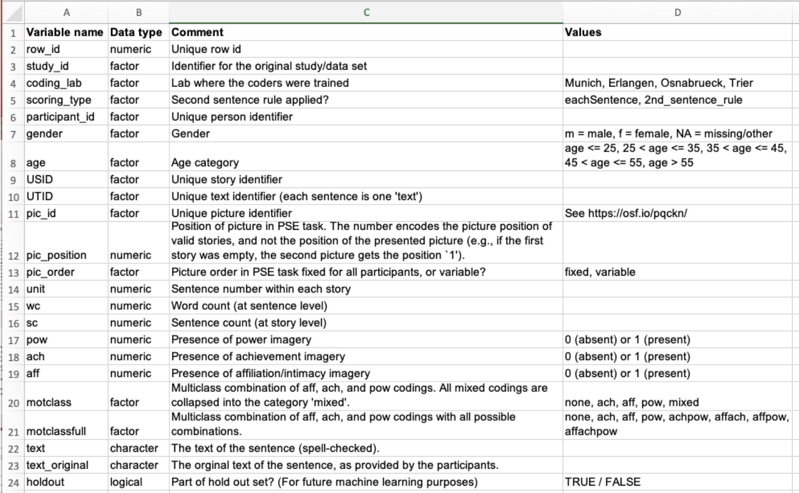
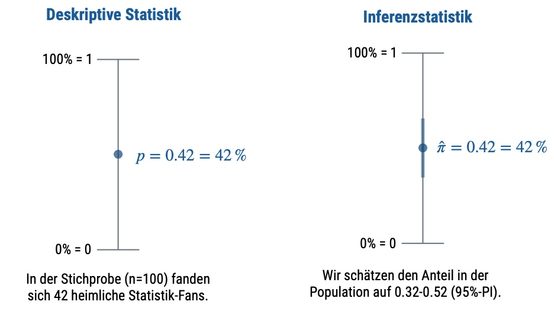

# Auswerten: Grundlagen


```{r}
#| include: false
library(tidyverse)
```


```{r}
#| echo: false
library(ggplot2)
theme_set(theme_minimal())
```

## Lernsteuerung


### Lernziele

- Sie können die typischen Schritte einer Datenanalyse (von Forschungsdaten z.B. aus der Psychologie) benennen.
- Sie können den Unterschied zwischen Deskriptiv- und Inferenzstatistik benennen.
- Sie können die Relevanz von Reproduzierbarkeit erläutern.


### Position im Lernpfad

Sie befinden sich im Abschnitt "Auswertung" in @fig-ueberblick.
Behalten Sie Ihren Fortschritt im Projektplan im Blick, s. @fig-projektplan.


### Benötigte R-Pakete und Daten {#sec-dataneeded}

In diesem Kapitel benötigen Sie die folgenden R-Pakete:

```{r}
#| messagen: false
library(tidyverse)
library(easystats)
library(ggpubr)  # Visualisierung
```


Wir arbeiten mit dem Datensatz `extra`, aus dem Paket [pradadata](https://sebastiansauer.github.io/pradadata/). in dem Datensatz werden Korrelate zum Persönlichkeitsmerkmal Extraversion untersucht.
Ein Codebook findet sich [hier](https://sebastiansauer.github.io/pradadata/reference/extra.html).

 
```{r load-extra-web, eval = TRUE}
data_url <- "https://raw.githubusercontent.com/sebastiansauer/modar/master/datasets/extra.csv"
extra <- data_read(data_url)  # aus `{easystats}`
```


Anstelle der Funktion `data_read` könnten Sie auch `read_csv` (Tidyverse) oder `read.csv` (Standard-R) verwenden.


## Überblick zur Datenanalyse


Mühsam haben Sie Ihre Studie geplant, minutiös den Versuchsplan ausgeheckt, pedantisch die Messinstrumente bestimmt.
Dann! Die Datenerhebung! Versuchspersonen, manche nervig, manche freundlich.
Ist Forschung denn so anstrengend?
Endlich! Geschafft -- die Daten sind im Sack, sozusagen.
Die Datenerhebung ist abgeschlossen.
Was jetzt?


### Wozu ist das gut?

Würden Sie einem Medikament trauen, von dem es heißt, das Forschungsteam hatten keinen Bock, Statistik ist zu stressig, aber die Typen aus dem Forschungsteam hätten da so ein Gefühl, könnte schon was bringen, die Pille, immer rein damit.
Was?! Sie zögern sich das Medikament einzuwerfen?
Sie wüssten es lieber genauer, sicherer, belastbarer? Es ginge schließlich um ihre Gesundheit?

Also gut, Sie haben es so gewollt: Gehen Sie geradeaus weiter zur Statistik.


### Über sieben Brücken musst du gehen: Die sieben Schritte der Datenanalyse


@fig-sieben-bruecken stellt die typischen Schritte ("Brücken") der Datenanalyse dar.

:::{#fig-sieben-bruecken fig-align="center"}

 
```{mermaid}
flowchart TD
  A[Einlesen und Aufbereiten] --> Z[Zusammenfassen]
  Z --> V[Visualisieren]
  V --> M[Modellieren]
  M --> I[Inferieren]
  I --> K[Diskutieren]
  K --> Ü[Amüsieren]
  Ü --> A
```

Die sieben ~~Siegel~~ Brücken der Datenanalyse

:::


In etwas mehr Detail sieht der Fortgang Ihrer Datenanalyse so aus:


1. *Einlesen und Aufbereiten*: Nachdem Sie die Daten in R importiert haben, bereiten Sie sie auf. Das klingt läppisch, langweilig fast und nicht so cool wie Modellieren. Schon richtig. Fakt ist aber, dass dieser Teil der Analyse häufig ein Großteil  der Zeit benötigt. Wahr ist: Das Daten aufbereiten ist enorm wichtig. Typische Beispiele für solche Tätigkeiten sind das Behandeln fehlender Werte, das Umformen von Tabellen und das Zähmen von Extremwerten

2. *Zusammenfassen*: Nachdem Sie die in Ordnung gebracht haben, fassen Sie sie zusammen, um zentrale Trends zu verstehen. Praktisch gesprochen berechnen Sie Maße der Lage, der Streuung und des Zusammenhangs.

3. *Visualisieren*: Der Mensch ist halt ein Augentier. So ein schönes Diagramm macht einfach was her und besticht auch den strengsten Gutachter.

3. *Modellieren*: Ah, hier kommt der Teil, in dem der Connaisseur seine Muskeln spielen lassen kann: Bayes-Inferenz, multiple Regression, Moderation, Mediation, Kausalanalyse... Ich weiß, Sie können Ihre Freude kaum noch zügeln, aber geduldigen Sie sich noch einen kleinen Augenblick.


4. *Inferieren*: Jetzt kommt die Inferenzstatistik ins Spiel (entweder in der Variante "Bayes" oder in der Variante "Frequentismus"). Ein Hauptzweck der Inferenzstatistik ist es, Schätzbereiche für die untersuchten Größen ("Parameter") anzugeben.

4. *Diskutieren*: So ein Modell bzw. die entsprechende Funktion in R spuckt einige Zahlen aus. Aber was sagt uns das jetzt? Das würden Sie auch gerne wissen? Prima! Finden wir es zusammen raus: Diskutieren wir die Ergebnisse. Das beinhaltet auch, die Ergebnisse auf ihre Stichhaltigkeit hin abzuklopfen. Wie sicher kann man sich sein, dass die Ergebnisse der Analyse mit der Hypothese/Forschungsfrage bzw. mit der Realität konform sind? Jede Studie hat Schwächen.
Niemand hat bislang den goldenen Gral gefunden. Okay, aber bisher haben Sie sich auch noch nicht an der Sache versucht! Jedenfalls bricht niemanden (auch nicht mir oder Ihnen) ein Zacken aus der Krone, wenn man aufzeigt, wo noch Forschungslücken sind, auch nach der eigenen Studie. Oder sogar, welche Schwächen die eigene Studie bzw. Analyse hat und was man beim nächsten Mal noch besser machen könnte.

6. *Amüsieren*: So, irgendwann ist auch gut. Jetzt belohnen Sie sich mal für die ganze harte Arbeit des Studierens.


## Reproduzierbarkeit


:::{.callout-important}
Transparenz (vgl. @def-repro) ist ein zentrales oder das zentrale Gütemaße der Wissenschaft.
Darum sollten Sie alles dran setzen, dass Ihre Studie bzw. die Analyse Ihrer Daten nachvollziehbar ist. $\square$
:::

Wesentliche Faktoren für Reproduzierbarkeit sind:

- Sie reichen Ihre *Rohdaten* ein (inkl. Codebook)
- Sie reichen Ihr *Analyseskript* ein
- Sie reichen Ihre *Stimuli* ein (sofern nicht öffentlich verfügbar)
- Sie reichen Ihre *Messinstrumente* ein (sofern nicht öffentlich verfügbar)
- Sie dokumentieren Ihr *Vorgehen* und reichen es ein


## Codebook

Ein Teil der Dokumentation ist ein Codebook (auch Data-Dictionary genannt). Ein Codebook erläutert die Namen der Variablen in Ihrer (Roh-)Datentabelle, s. @fig-codebook.

{#fig-codebook}

[Quelle](https://www.psycharchives.org/en/item/8b13c82b-1c31-481a-b4be-0d5779d87033)


## Wir brauchen brave Daten

Wie muss eine Tabelle aufgebaut sein,
damit man sie gut in R importieren kann, bzw. gut damit weiterarbeiten kann?


Im Überblick sollten Sie auf Folgendes achten:

- Wenn Sie händisch Daten eintragen, hacken Sie das einfach in Excel o.Ä. sein.
- CSV-Dateien bieten sich als Datenformat an.
- Alternativ kann man auch Excel-Dateien in R importieren.
- Es muss genau *eine* Kopfzeile geben.
- Es darf keine Lücken geben (leere Zeilen oder Spalten oder Zellen).
- Vermeiden Sie Umlaute und Leerzeichen in den Variablennamen.
- Die Daten sollten dem Prinzip von "tidy data" folgen.


:::{.callout-important}
### Tidy Data
Beachten Sie das Prinzip von "tidy data":

- In jeder Zeile steht *eine Beobachtung*.
- In jeder Spalte steht *eine Variable*.
- In jeder Zelle steht *eine Wert*. $\square$
:::


[Hier ist eine gute Quelle](https://www.tandfonline.com/doi/full/10.1080/00031305.2017.1375989) für weitere Erläuterung zu diesem Thema.


## Ich brauche Hilfe bei der Datenanalyse! {#sec-help-me-analyze}

Sie  benötigen Hilfe für Ihre Datenanalyse? Hier sind einige Hilfestellungen.


### Tipps zum Start

1. Setzen Sie die Analysen wie in @sec-modellieren dargestellt um (vgl. QM2), falls Sie das noch nicht gemacht haben. 
2. Gehen Sie die Checkliste zur Datenanalyse durch, s. @sec-checkdaten. 
3. Schauen Sie sich die Videos auf meinem [YouTube-Kanal](https://www.youtube.com/@sebastiansauerstatistics) an, besonders die Playlists aus @sec-bayesmod. 
4. Prüfen Sie, ob Ihre (Regressions-)Modelle zu Ihren Hypothesen bzw. Forschungsfragen passen. 
5. Schauen Sie sich die als empfehlenswert ausgestellten Arbeiten an (s. Moodle) oder @sec-beispiele-projektarbeiten.


### Checkliste zur Datenanalyse {#sec-checkdaten}

Hier sehen Sie im Überblick die Schritte, die in vielen Fällen sinnvoll sind, um Daten auf einem guten Niveau auszuwerten.


1. *Vorverarbeitung*
    1. Importieren
    2. Aufbereiten (Umkodieren, fehlende Wert versorgen, Transformieren, neue Spalten berechnen)
2. *Explorative Analyse*
    1. Daten zusammenfassen (zentrale Tendenz, Streuung, Zusammenhang -- jeweils für alle UV und AV sowie weiterer potenziell relevanter Variablen)
    2. Daten visualisieren (Verteilung der UV, AV, gemeinsame Verteilung von UV und AV)
3. *Modellierung und Inferenzstatistik*
    1. Modell berechnen (AV ~ UV1 + UV2 + ...)
    2. Parameter berichten (Punkt- und Intervallschätzer)
    3. Parameter visualisieren
    4. Nullhypothesen testen (z.B. ROPE)
    5. Modellgüte berichten (z.B. R-Quadrat)


### Rostlöser

Ihre R-Skills sind etwas eingerostet? Flutscht nicht so?
Keine Sorge! Es gibt Rostlöser, der Sie schnell wieder in Schwung bringt.
🧴

#### Grundlagen der Statistik

Das Kursbuch [Statistik1](https://statistik1.netlify.app/) beinhaltet einen Überblick über Datenaufbereitung und -visualierung  sowie Modellierung mit dem linearen Modell, alles mit R.

#### Grundlagen der Inferenzstatistik

Das Kursbuch [Start:Bayes!](https://start-bayes.netlify.app/) stellt einen Einstieg in die Inferenzstatistik mit der Bayes-Statistik bereit.

#### Wie man Umfragedaten auswertet


[Hier](https://sebastiansauer.github.io/umfragen-auswerten/index.html) finden Sie (m)eine Anleitung zur Auswertung von Umfragedaten.


## Überblick zur Statistik {#sec-overview-stats}

### Deskriptiv- vs. Inferenzstatistik

@fig-inf1 und @fig-inf2 geben einen Überblick zum Unterschied von Deskriptiv- und Inferenzstatistik.


{#fig-inf1 width=70% fig-align="center"}


{#fig-inf2 width=70% fig-align="center"}


### Deskriptivstatistik

Berechnen Sie die relevanten Kennwerte der Deskriptivstatistik für alle Variablen Ihrer Hypothesen (bzw. Forschungsfragen).
Das beinhaltet sowohl *univariate* Analysen (d.h. Kennwerte für eine einzelne Variable)
als auch *bivariate* Analysen (d.h. Zusammenhänge von zwei Variablen, also deren "gemeinsame Verteilung").


Typische Kennwerte der Deskriptivstatistik sind:

- Arithmetisches Mittel
- Standardabweichung
- Anteil
- Korrelation
- Regressionskoeffizienten


@fig-scatter-interactive zeigt interaktive Beispiele für einen Kennwert des Deskriptivstatistik: (lineare) Korrelation^[Quelle: <https://observablehq.com/d/bb7ad3ecfb1ac2a6>]. 


:::{#fig-scatter-interactive}

::: {.figure-content}





:::

Interaktives Beispiel für Zusammenhangsdiagramme.

:::


### Inferenzstatistik

@fig-samples-for-inference veranschaulicht die Daaseinsberechtigung der Inferenzstatistik: 
Eine einzelne Stichprobe schätzt den Mittelwert der Population ($\mu$) ungenau (je kleiner die Stichprobe, 
desto ungenauer, ceteris paribus). 
Daher brauchen wir eine Angabe, wie (un)genau unser Mittelwert wohl den "wahren" Mittelwert 
der Population ($\mu$) schätzt. 
Genau das macht die Inferenzstatistik!


```{r}
#| echo: false
#| warning: false
#| label: fig-samples-for-inference 
#| fig-cap: "Inferenzstatistik veranschaulicht: Einzelne Stichproben schätzen den Mittelwert der Populationswert (mu) nur ungenau. Daher brauchen eine Quantifizierung der Schätz(un)genauigkeit des Mittelwerts der Population."
source("img/samples-for-inference.R")
p_infence_with_samples
```


### Modellieren


:::{#def-model}
### Modell
Ein Modell ist ein vereinfachtes Abbild der Wirklichkeit.$\square$
:::

Der Nutzen eines Modells ist, einen (übermäßig) komplexen Sachverhalt zu vereinfachen oder überhaupt erst handhabbar zu machen.
Man versucht zu vereinfachen, ohne Wesentliches wegzulassen. 
Der Speck muss weg, sozusagen. Das Wesentliche bleibt.

Auf die Statistik bezogen heißt das,
dass man einen Datensatz dabei so zusammenfasst,
damit man das Wesentliche erkennt.
Was ist das "Wesentliche"? Oft interessiert man sich für die Ursachen eines Phänomens. 
Etwa: "Wie kommt es bloß, dass ich ohne zu lernen die Klausur so gut bestanden habe?"^[Das ist natürlich nur ein fiktives, komplett unrealistisches Beispiel, das auch unklaren Ursachen den Weg auf diese Seite gefunden hat.]
Noch allgemeiner ist man dabei häufig am Zusammenhang von `X ` und `Y` interessiert, s. @fig-xy, 
die ein Sinnbild von statistischen Modellen widergibt.


:::{#fig-xy fig-align="center"}


```{mermaid}
flowchart LR
X --> Y


X1 --> Y2
X2 --> Y2
```

oben: Sinnbild eines statistischen Modells; unten: Sinnbild eines statistischen Modells, mit zwei Inputvariablen ("Ursachen")


:::


## Skriptbasierte vs. klickbasierte Software zur Datenanalyse


Man kann grob zwei Arten von Software-Programmen für Datenanalyse unterscheiden:

1. *Skriptbasierte*: Man schreibt seine Befehle in einer Programmiersprache (z.B. R oder Python)
2. *Klickbasierte*: Man klickt in einer Gui, um Befehle auszulösen (z.B. Jamovi oder JASP)

Die gängigen Beispiele für skriptbasierte Software für Datenanalyse sind R und Python.


Einige empfehlenswerte(re) Programme für die klickbasierte Datenanalyse sind:


1. [Jamovi](https://www.jamovi.org/)
2. [JASP](https://jasp-stats.org/)
3. [Exploratory](https://exploratory.io/about/)


Im Folgenden sind die Vorteile der oben genannten klickbasierten Software-Programmen den Vorteilen der oben genannten skriptbasierten Software-Programmen gegenüber gestellt

::::{.columns}

:::{.column}
### Vorteile klickbasierter Software

{width=30%} {width=30%} ](img/exploratory-icon.png){width=30%} 


- eher kostenlos (es gibt kostenpflichtige Premium-Versionen wie  Jamovi Cloud)
- aktuell
- flachere Lernkurve
- R-Code integriert

*Beispiele*: [JASP](https://jasp-stats.org/), [Jamovi](https://www.jamovi.org/), [Exploratory](https://exploratory.io/)
:::

:::{.column}
### Vorteile skriptbasierter Software

{width=30%} {width=50%}

- kostenlos
- aktueller
- umfassend (klickbasierte Software kann nicht alles, was man braucht)
- steilere Lernkurve

*Beispiele:* [R](https://www.r-project.org/), [Python](https://www.python.org/)
:::

::::


## Deskriptivstatistik in der Praxis

:::{.callout-important}
Die Deskriptivstatistik fasst eine Datenreihe zu einer Kennzahl zusammen. Der Nutzen liegt im Überblick, den man so gewinnt. 
:::


Wir analysieren den Datensatz `extra`, s. zu Beginn dieses Kapitels, @sec-dataneeded.
Damit es einfach bleibt, begrenzen wir uns im Folgenden auf ein paar Variablen. 

Sagen wir, 
das sind die Variablen, die uns interessieren:

```{r}
extra_corr_names <- 
extra %>% 
  select(n_facebook_friends, n_hangover, age, extra_single_item, n_party, extra_mean) %>% 
  names()

extra_corr_names
```


### Deskriptive Ergebnisse für metrische Variablen 

Sie können deskriptive Ergebnisse (Ihrer relevanten Variablen) für *metrische* Variablen z.B. so darstellen, s. @lst-desk1.


:::{#lst-desk1}


```{r}
#| eval: false
extra %>% 
  select(any_of(extra_corr_names)) %>% 
  describe_distribution()  # aus `easystats`
```

Deskriptive Statistik mit Hilfe des R-Pakets `easystats` 

:::


```{r}
#| echo: false
extra %>% 
  select(any_of(extra_corr_names)) %>% 
  describe_distribution() %>%  # aus `easystats`
  kable(digits = 2)
```


Übersetzen wir @lst-desk1 vom Errischen ins Deutsche:

1. Hey R,
2. nimm die Tabelle `extra` ... und dann
3. wähle jede Variable, die ich im Vektor `extra_corr_names` angegeben habe ... und dann
4. beschreibe die Verteilung (jeweils, also für jede Variable) ... und dann
5. mache aus der drögen Tabelle eine schicke. Fertig!


`kable()` macht aus dem drögen Output in der R-Konsole eine schicke HTML-Tabelle^[funktioniert auch mit Word und PDF als Ausgabeformat], wenn man das Quarto-Dokument rendert.

Statt `select(any_of(extra_corr_names))` könnten Sie natürlich auch schreiben `select(n_facebook_friends, ...)`, wobei Sie für die drei Punkte alle Variablen von Interesse nennen würden.


Praktischerweise kann man `describe_distribution` auch für gruppierte Datensätze nutzen, um so gruppierte Verteilungsmaße zu bekommen:

```{r}
extra |> 
  group_by(sex) |> 
  describe_distribution(extra_mean)
```

### Visualisierung von metrischen Variablen


#### Univariat

Mit dem R-Paket `ggpubr` kann man ansprechende Visualisierungen erzeugen,
und zwar ziemlich einfach.
Mit `help(ggpubr)` bekommen Sie Einblick in die Hilfeseite von [ggpubr](https://rpkgs.datanovia.com/ggpubr/).

```{r}
gghistogram(extra, x = "extra_mean", add = "mean") +
  labs(x = "Extraversion (Mittelwert)",
       y = "Häufigkeit",
       caption = "Die gestrichelte horizontale Linie zeigt den Mittelwert der Verteilung.")
```


#### Gruppenvergleich

Vergleicht man die Verteilung einer Variablen unterteilt auf die Stufen (Gruppen) einer zweiten Variablen, so untersucht man die *gemeinsame Verteilung* dieser beiden Variablen.


Es gibt verschiedene Methoden, Gruppenunterschiede zu verdeutlichen.
Man könnte z.B. pro Gruppe ein Histogramm zeigen, das ist recht informationsreich.

```{r}
extra_no_na <-
  extra |> 
  filter(sex == "Frau" | sex == "Mann")

gghistogram(extra_no_na, x = "extra_mean", add = "mean", facet.by = "sex") +
  labs(x = "Extraversion (Mittelwert)",
       y = "Häufigkeit",
       caption = "Die gestrichelte horizontale Linie zeigt den Mittelwert der Verteilung.")
```

Gerade bei vielen Gruppen kann aber ein Boxplot übersichtlicher sein.

```{r}
extra_no_na |> 
  ggboxplot(y = "extra_mean", x = "sex")
```


### Deskriptive Ergebnisse für nominale Variablen 


#### Univariate Häufigkeiten

Lassen wir uns die Häufigkeiten für `sex` und für `smoker` ausgeben, also für jede Variable separat (univariat).


Mit `tidyverse` kann man das in vertrauter Manier bewerkstelligen:

```{r}
extra |> 
  count(sex)
```

Etwas schicker sieht es aus mit `data_tabulate` aus `easystats`:

```{r}
extra |> 
  select(sex) |> 
  #drop_na() |>  ggf. ohne fehlende Werte
  data_tabulate() |> 
  print_md()  # erstelle eine schicke HTML-Tabelle
```

Zur Visualisierung von Häufigkeiten bieten sich Balkendiagramme an.
Nutzt man `ggpubr` muss man zuerst selber die Anzahl der Werte auszählen (lassen),
das geht z.B. mit `count`.

```{r}
extra_no_na |> 
  count(sex)
```

```{r}
extra_no_na |> 
  count(sex) |> 
  ggbarplot(x = "sex", y = "n")
```


#### Bivariate Häufigkeiten

Wir können uns auch die *bi*variaten Häufigkeiten ausgeben lassen:
Betrachten wir die Geschlechtsverteilung bei Menschen, die (nicht) jünger als 20 Jahre sind:

```{r}
#| eval: false
extra |> 
  drop_na(sex, age) |>  # fehlende Werte entfernt
  group_by(age > 20) |> 
  data_tabulate(sex) |> 
  print_md()  # erstelle eine schicke HTML-Tabelel
```


```{r}
#| echo: false
extra |> 
  drop_na(sex, age) |>  # fehlende Werte entfernt
  group_by(age > 20) |> 
  data_tabulate(sex) |> 
  print_md()
```


```{r}
extra |> 
  drop_na(age, sex) |>  # fehlende Werte entfernen
  count(young = age < 20, sex) |>
  ggbarplot(x = "young", y = "n", fill = "sex")
```

Eicht man die Höhen der Balken auf 100%,
so kann man Zusammenhänge gut visualisieren.

```{r}
extra |> 
  drop_na(age, sex) |>  # fehlende Werte entfernen
  count(young = age < 20, sex) |> 
  ggbarplot(x = "young", y = "n", fill = "sex", 
            position = position_fill()) +
  labs(title = "Deutlicher Zusammenhang zwischen Geschlecht und Alter")
```


```{r}
extra |> 
  drop_na(n_party, sex) |>  # fehlende Werte entfernen
  count(party_tiger = n_party > 5, sex) |> 
  ggbarplot(x = "party_tiger", y = "n", fill = "sex", 
            position = position_fill()) +
  labs(title = "Schwacher Zusammenhang zwischen Geschlecht und 'Party_Tiger'")
```


### Korrelationen darstellen

In einer Umfrage erhebt man häufig mehrere Variablen, ein Teil davon oft *Konstrukte*.
Es bietet sich in einem ersten Schritt an, die Korrelationen dieser Variablen untereinander
darzustellen.


#### Korrelationsmatrix


```{r}
#| echo: false
extra %>% 
  select(any_of(extra_corr_names)) %>%  
  correlation() %>% 
  summary() %>% 
  kable(digits = 2)
```


```{r}
#| eval: false
extra %>% 
  select(any_of(extra_corr_names)) %>%  
  correlation() %>% 
  summary() 
```


Sie möchten das Ergebnis als normalen R-Dataframe? 
Sie haben keine Lust auf dieses Rumgetue, sondern wollen das lieber als selber geradeziehen.
Also gut:


```{r}
cor_results <- 
extra %>% 
  select(any_of(extra_corr_names)) %>%  
  correlation() %>% 
  summary() |> 
  print_md()  # erstelle schicke HTML-Tabelle

cor_results
```


Man kann sich die Korrelationsmatrix auch in der *Bayes-Geschmacksrichtung* ausgeben lassen:


```{r}
extra %>% 
  select(any_of(extra_corr_names)) %>%  
  correlation(bayesian = TRUE) %>% 
  summary() %>% 
  kable(digits = 2)
```


#### Korrelationsmatrizen visualisieren

Viele R-Pakete bieten sich an. Nehmen wir `{easystats}`.


```{r}
extra %>% 
  select(any_of(extra_corr_names)) %>%  
  correlation() %>% 
  summary() %>% 
  plot() +
  labs(title = "Korrelationsmatrix, boa")
```


## Aufgaben


Auf dem [Datenwerk](https://datenwerk.netlify.app/) finden Sie eine Anzahl an Aufgaben zum Thema Datenanalyse.
Schauen Sie sich mal die folgenden Tags an:

- [eda](https://datenwerk.netlify.app/#category=eda)


## Fallstudien

Fallstudien zur explorativen Datenanalyse (EDA; d.h. deskriptive Statistik und Datenvisualisierung) finden Sie z.B. im [Datenwerk](https://datenwerk.netlify.app/):

- [flights-yacsda-eda](https://datenwerk.netlify.app/posts/flights-yacsda-eda/)
- [oecd-yacsda](https://datenwerk.netlify.app/posts/oecd-yacsda/)
- [smartphone1](https://datenwerk.netlify.app/posts/smartphone1/)
