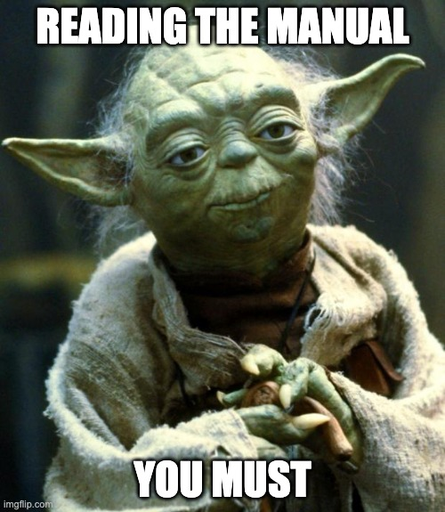
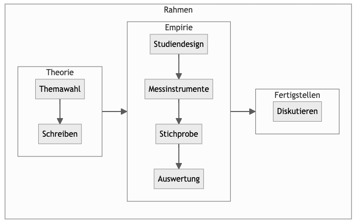
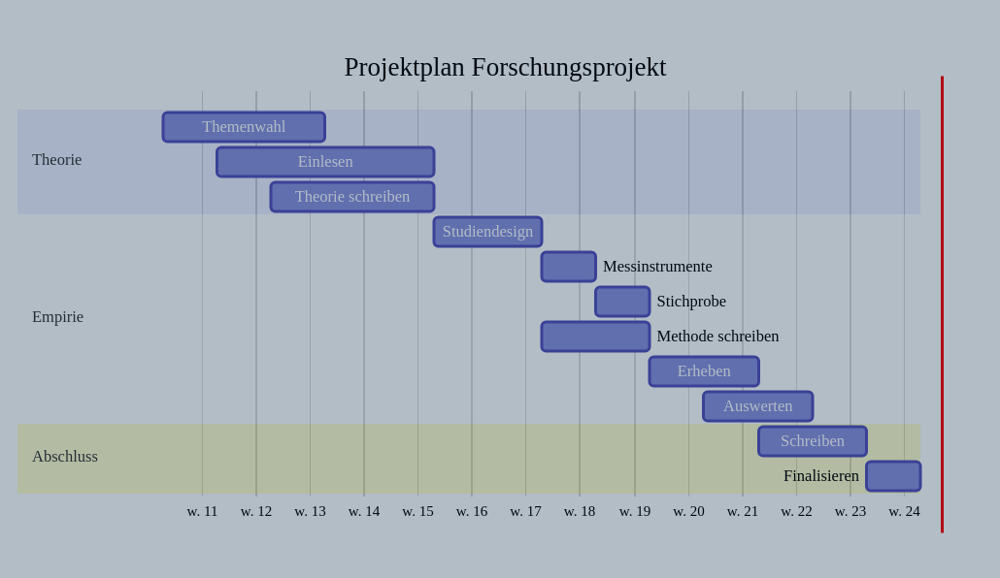

## Willkommen

{width="40%"}

::: {.xsmall}
Photograph by Orren Jack Turner, Princeton, N.J., Public Domain
:::

## Was rät Meister Yoda?

Meister Yoda rät: Lesen Sie die Hinweise.

{width="45%"}

::: {.xsmall}
Quelle: made at imageflip
:::

## Kurz gesagt

::: {.callout-important}
Sie lernen, eine echte, eigene Studie zu erstellen. $\square$
:::

## Lernziele {.smaller}

Die Studentis können eigenständig quantitative psychologische *Studien* in allen wesentlichen Schritten *durchführen*:

- **Versuchsplanung**: passende Versuchspläne auswählen, kritisch bewerten, Fallzahlen planen
- **Datenerhebung**: passende Messinstrumente, rechtliche/ethische Aspekte, Software, Störvariablen
- **Datenauswertung**: Verfahren aus QM1/QM2 praktisch anwenden
- **Interpretation**: Grenzen interner/externer Validität, Störfaktoren, "Researchers' Degrees of Freedom"
- **Berichtlegung**: Methoden aus Wissenschaftliches Arbeiten anwenden

Zusätzlich: Studien anderer kritisch auf ihre Güte hin untersuchen.

## Was lerne ich hier und wozu ist das gut? {.smaller}

- Ein Forschungsprojekt vereint Problemlösen, Kreativität und fundierte Analyse
- Viele Freiheitsgrade: echte Studie, unterstützt von den Dozentis
- Beispiele begeisternder studentischer Studien:
  - Follower kaufen $\rightarrow$ überproportionaler Like-Zuwachs
  - Sportwagen im Profilfoto $\rightarrow$ mehr Likes
- Generalprobe für die Abschlussarbeit
- Forschungskompetenz als zentrale berufliche Kompetenz

## Voraussetzungen

Um vom Kurs am besten zu profitieren:

- Bereitschaft, Neues zu lernen
- Kenntnis grundlegender Methoden wissenschaftlichen Arbeitens
- Kenntnis grundlegender statistischer Verfahren (EDA, Regression, Inferenz)

## Überblick

Das Diagramm zeigt den Ablauf einer typischen Datenanalyse.

## Modulverlauf {.smaller}

Ein typischer Kurs hat folgende Themen (je ein Kapitel im Buch):

1. Hallo, Forschung
2. Einlesen: Themenfindung, Literaturrecherche
3. Einlesen: Zettelkasten, Lesen 2.0 und Hypothesen
4. Wissenschaftliches Schreiben: Gliedern und Aufbau
5. Wissenschaftliches Schreiben: Schreibstil und Formatierung
6. Beschreiben und Erklären
7. Messen und Erheben
8. Kausalanalyse
9. Datenaufbereitung
10. Datenmodellierung: Grundlagen
11. Datenmodellierung: Typische Designs
12. Berichten von Statistiken

## Selbständige Vorbereitung

Vor der ersten Unterrichtsstunde:

- Laptop (oder Tablet) in jede Stunde mitbringen
- Programme bereithalten: R, RStudio (oder Positron), Obsidian, Zotero, Schreibprogramm (LibreOffice Writer/Google Docs)
- Überblick über das Kursbuch verschaffen

## Projektplanung {.smaller}

Grober Zeitplan für die empirische Projektarbeit:

| Nr | Arbeitsschritt | Zeitbedarf | Kommentar |
|---|---|---|---|
| 1 | Themawahl und Literaturarbeit | 5 Wochen | Sichten und Einarbeiten in Ihr Thema |
| 2 | Versuchsplanung | 4 Wochen | Forschungsdesign inkl. Messinstrumente |
| 3 | Versuchsdurchführung | 2 Wochen | Erheben der Daten |
| 4 | Datenauswertung | 3 Wochen | Statistik |
| 5 | Berichtlegung | 3 Wochen | Zusammenschreiben und Finalisieren |

Arbeitsschritte überlappen sich teilweise; Zeiten variieren je nach Thema, Person und Rahmenbedingungen.

## Projektplan – Zeitanteile

::: {.callout-caution}
### Vorsicht vor Aufschieberitis
Der häufigste Fehler in Projektarbeiten: die Arbeit zu lange aufschieben. $\square$
:::

## Kollaborationssoftware

Hinweise zu Software für gemeinsames Bearbeiten von Dokumenten und Lernstrategien:

[hinweisbuch.netlify.app](https://hinweisbuch.netlify.app/130-hinweise-software#kolloboration)

## Weitere Lernhilfen

Überblick über weitere Lernhilfen wie Videos oder Vorlagen:

[hinweisbuch.netlify.app](https://hinweisbuch.netlify.app/160-hinweise-lernhilfen-frame)

## Hinweise zum Unterricht {.smaller}

- Im Live-Unterricht werden Schwerpunkte gesetzt
- Vor- und Nachbereitung sollte **alle** Skript-Inhalte umfassen
- Prüfung: komplette Kenntnis der Skript-Inhalte sowie sonstiger im Unterricht behandelter Themen

Allgemeine Hinweise: [hinweisbuch.netlify.app](https://hinweisbuch.netlify.app/)

Didaktische Hinweise: [hier](https://hinweisbuch.netlify.app/110-hinweise-didaktik-frame)

Organisatorische Hinweise: [hier](https://hinweisbuch.netlify.app/hinweise-unterricht-frame)

## Prüfung

Prüfungsformat: *Projektarbeit*

- [Allgemeine Prüfungshinweise](https://hinweisbuch.netlify.app/010-hinweise-pruefung-allgemein-frame)
- [Hinweise zu Projekt- und Seminararbeiten](https://hinweisbuch.netlify.app/060-hinweise-pruefung-projektarbeit-frame)
- [Prüfungsvorbereitung](https://hinweisbuch.netlify.app/150-hinweise-pruefungsvorbereitung-frame)

## Zum Autor

Sebastian Sauer

Nähere Hinweise: [sebastiansauer-academic.netlify.app](https://sebastiansauer-academic.netlify.app/)

## Danke

Dieses Dokument entstand mit Unterstützung vieler Kolleginnen und Kollegen. Vielen Dank!

## Lizenz

Fragen oder Feedback? Gerne hier einstellen:

[github.com/sebastiansauer/fopra/issues](https://github.com/sebastiansauer/fopra/issues)

Die Online-Version des Buches ist frei verfügbar unter der CC-BY-NC-SA-4.0-Lizenz.

{width="30%"}
