```{r, setup, include=FALSE}
library(nomnoml)
library(DiagrammeR)
```




```mermaid
flowchart LR
  ff(Forschungsfrage)
  lit(Literaturrecherche)
  plan(Versuchsplanung)
  do(Durchführung)
  stat(Datenanalyse)
  interpret(Interpretation)

  ff --> lit
  lit --> plan
  plan --> do
  do --> stat
  stat --> interpret
  interpret --> ff
```

```{r}
nomnoml::nomnoml("
[F] -> [L]
[L] -> [P]
[P] -> [D]
[D] -> [S]
[S] -> [I]
[I] -> [F]")

```


```{nomnoml}
#stroke: orange
#.box: fill=#8f8 dashed visual=ellipse

[A]-[B]
[B]-[<box>C]
```
