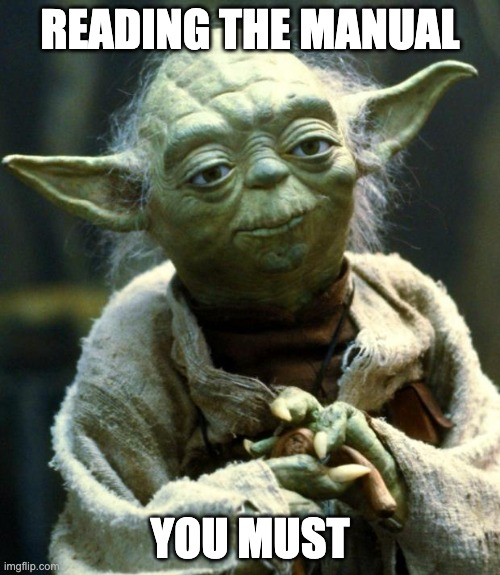
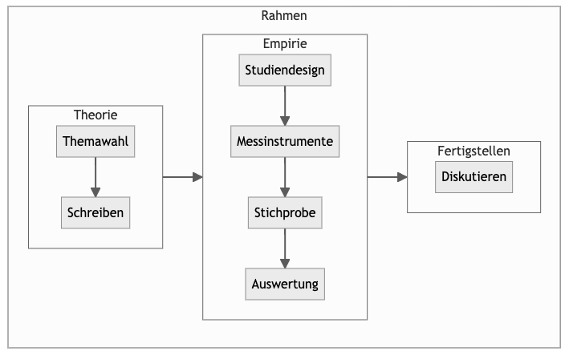
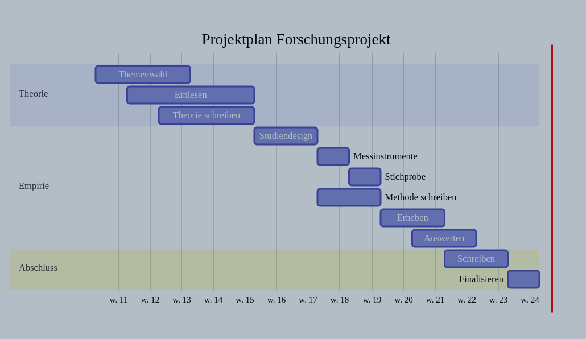

# Hinweise


```{r}
#| include: false
library(dplyr)
```


{width=25%}

[Photograph by Orren Jack Turner, Princeton, N.J., Public Domain](https://en.wikipedia.org/wiki/Albert_Einstein#/media/File:Albert_Einstein_Head.jpg)


## Was rät Meister Yoda?


Meister Yoda rät: Lesen Sie die Hinweise (@fig-yoda).

{#fig-yoda width="33%"}

:::{.xsmall}
[Quelle: made at imageflip]("https://imgflip.com/memegenerator")
:::


## Ihr Lernerfolg

### Lernziele


:::{.callout-important}
Kurz gesagt: Sie lernen, eine echte, eigene Studie zu erstellen.$\square$
:::


- Die Studentis können eigenständig einige Arten von quantitativen psychologischen *Studien* in allen wesentlichen Schritten *durchführen*, d.h. planen, erheben, auswerten, interpretieren und zusammenschreiben.
    - Im Hinblick auf *Versuchsplanung* können die Studentis Versuchspläne passend zu ihrer Forschungsfrage auswählen und kritisch bewerten; darüber hinaus können Sie Fallzahlen vorab planen.
    - Im Hinblick auf *Datenerhebung* können die Studentis für ihre Forschungsfrage passende Messinstrumente auswählen. Zentrale rechtliche und ethische Aspekte sind ihnen bekannt. Softwarelösungen zur Datenerhebung können sie auswählen und einsetzen. Probleme und Lösungen im Hinblick auf Störvariablen können sie diskutieren.
    - Im Hinblick auf *Datenauswertung* können die Studentis die Verfahren aus den Modulen QM1 und QM2 praktisch auf ihre eigenen Daten anwenden.
    - Im Hinblick auf *Interpretation* von Versuchsergebnissen wissen die Studentis um die Grenzen der internen und externen Validität bestimmter Versuchspläne, von Störfaktoren und “Researchers’ Degrees of Freedom”.
    - Im Hinblick auf die *Berichtlegung* von Studienergebnissen sind die Studentis in der Lage, die Methoden aus dem Modul Wissenschaftliches Arbeiten auf ihre eigene Studie hin anzuwenden.
- Die Studentis können quantitative psychologische Studien auf ihre Güte hin kritisch untersuchen.


### Was lerne ich hier und wozu ist das gut?


Ein Forschungprojekt ist das vielleicht schönste Projekt in Ihrem Studiengang: 
Es vereint echtes Problemlösen mit Kreativität und wohl fundierter Analyse. 
Sie haben viele Freiheitsgrade: 
Führen Sie eine echte Studie durch, unterstützt von den Dozentis 
und nach Ihren Vorstellungen. 
Jedes Mal erlebt man als Dozenti aufs Neue studentische Studien, die begeistern. Um nur ein Beispiel zu nennen: 
Vor einiger Zeit zeigt eine Gruppe, dass es sich lohnt, 
Follower bei Instagram zu kaufen -- die Anzahl der Likes steigt überproportional an. 
Ach ja, falls Sie es sich schon mal gefragt haben: Wer als Mann mit einem Sportwagen auf dem Profilfoto der Single-Börse posiert, 
erntet ebenfalls mehr Likes als ohne Karre, zumindest laut einem studentischen Experiment ... 
Vielleicht sollten Sie diese Studie auch dringend replizieren,
vielleicht wurde ja ein entscheidendes Detail übersehen? 
Die Forschung wartet auf Sie! 

Kurz gesagt lernen Sie also, wie man eine wissenschaftliche Studie durchzieht. 
Das können Sie als Generalprobe für die Abschlussarbeit nutzen. 
Für Ihre berufliche Laufbahn ist Forschungskompetenz vielleicht eine zentrale Kompetenz, wenn Sie nicht nur Bekanntes abarbeiten möchten, 
sondern Abläufe verbessern, Produkte erneuern, Chancen entdecken wollen – 
wenn Sie Neuland betreten und Dinge weiterentwickeln wollen.
Let's do it.


### Voraussetzungen

Um von diesem Kurs am besten zu profitieren,
sollten Sie Folgendes mitbringen:

    
- Bereitschaft, Neues zu lernen
- Kenntnis grundlegender Methoden wissenschaftlichen Arbeitens
- Kenntnis in grundlegenden statistischen Verfahren (EDA, Regression, Inferenz)


### Überblick

@fig-ueberblick gibt einen Überblick über den Verlauf und die Inhalte des Buches.
Das Diagramm hilft Ihnen zu verorten, wo welches Thema im Gesamtzusammenhang steht.


{#fig-ueberblick}


Das Diagramm zeigt den Ablauf einer typischen Datenanalyse.
Natürlich kann man sich auch andere sinnvolle Darstellungen dieses Ablaufs vorstellen.


### Modulverlauf


Ein typischer Kurs hat folgende Themen.
Die Themen entsprechend jeweils einem Kapitel dieses Buchs.


1. Hallo, Forschung
2. Einlesen: Themenfindung Literaturrecherche
3. Einlesen: Zettelkasten, Lesen 2.0 und Hypothesen
4. Wissenschaftliches Schreiben: Gliedern und Aufbau
5. Wissenschaftliches Schreiben: Schreibstil und Formatierung
6. Beschreiben und Erklären
7. Messen und Erheben
8. Kausalanalyse
9. Datenaufbereitung
10. Datenmodellierung: Grundlagen
11. Datenmodellierung: Typische Designs
12. Berichten von Statistiken

## Selbständige Vorbereitung

Bitte stellen Sie die folgenden Punkte sicher *vor der ersten Unterrichtsstunden*:

- Bringen Sie in jede Stunde einen Laptop oder ein Tablett mit (Laptop ist besser).
- Halten Sie die folgenden Computerprogramme bereit: R, RStudio (oder Positron), Obsidian, Zotero, ein Schreibprogramm wie LibreOffice Writer oder Google Docs.
- Verschaffen Sie sich einen Überblick über das Kursbuch.

## Lernhilfen


<!-- ### Folienskript -->

<!-- Ein Folienskript zum Kursbuch ist [hier verfügbar](https://sebastiansauer.github.io/fopra-slides/). -->

<!-- Das Folienskript zu diesem Kapitel finden Sie [hier](https://sebastiansauer.github.io/fopra-slides/thema01.html#/title-slide). -->


### Projektplanung

Wie lange dauert es von "Start" bis "Ziel"? 
@tbl-zeitplan überschlägt den Zeitbedarf grob und bricht in die wesentliche Arbeitsschritte herunter.


```{r}
#| echo: false
#| tbl-cap: "Grober Zeitplan für Ihre empirische Projektrarbeit"
#| label: tbl-zeitplan
#| out-width: 100%

d <- tibble::tribble(
  ~Nr, ~Arbeitsschritt, ~Zeitbedarf, ~Kommentar,
  "1", "Themawahl und Literaturarbeit", "5 Wochen", "Integratives Sichten und Einarbeiten in Ihr Thema",
  "2", "Versuchsplanung", "4 Wochen", "Planen des Forschungsdesigns inkl. der Messinstrumente",
  "3", "Versuchsdurchführung", "2 Wochen", "Erheben der Daten",
  "4", "Datenauswertung", "3 Wochen", "Statistik",
  "5", "Berichtlegung", "3 Wochen", "Zusammenschreiben und Finalisieren des Berichts"
)
knitr::kable(d)
```


Beachten Sie, dass die einzelnen Arbeitsschritte sich teilweise überlappen.

Es können nur grobe Richtwerte angegeben werden, 
da die Zeiten je nach Thema, Person und Rahmenbedingungen variieren. 
Es bietet sich an, die Ergebnisse jedes Arbeitsschrittes in Rohform zu strukturieren und zu dokumentieren, 
so dass während der Berichtlegung nur noch ein Zusammenschreiben stattfindet.

Tatsächlich ist ein großer Teil der Arbeit lesen und sich Gedanken machen - nicht schreiben. Denn sobald man weiß, was man schreiben soll, 
schreibt's sich auch schnell. Andernfalls ist es eine Qual. 🙅‍♀️ Don't do it.

@fig-projektplan gibt Ihnen eine  Orientierung, welchen Zeitanteil Sie für die einzelnen, wesentlichen Arbeitsschritte bei der Durchführung Ihrer Studie (bzw. der Dokumentation dazu) Sie einplanen sollten.


{#fig-projektplan}  


```{r}
#| echo: false
#| eval: false
#| fig-cap: "Projektplan"
#| label: fig-projektplan
library(DiagrammeR)

mermaid("
gantt
dateFormat  YYYY-MM-DD
title Projektplan Forschungsprojekt

section Theorie
Themenwahl                    :               first_1,    2024-03-13, 21d
Einlesen                      :               first_2,    2024-03-20, 28d
Theorie schreiben             :               first_3,    2024-03-27, 21d

section Empirie
Studiendesign                 :               import_1,   after first_3, 14d
Messinstrumente               :               import_2,   after import_1, 7d
Stichprobe                    :               import_3,   after import_2, 7d
Methode schreiben             :               import_4,   2024-05-01, 14d
Erheben                       :               import_5,   after import_4, 14d
Auswerten                     :               import_6,   2024-05-22, 14d

section Abschluss
Schreiben                     :               extras_1,   2024-05-29, 14d
Finalisieren                  :               extras_2,   after extras_1, 7d

")

```


Dieser Plan geht von ca. 15 Wochen Laufzeit (in tutto) aus mit Beginn in KW 11 (`w.11`) und Ende in KW 24 (`w.24`); 
passen Sie den Plan ggf. auf Ihre Projektlaufzeit an.

:::{.callout-caution}
### Vorsicht vor Aufschieberitis
Der häufigste Fehler (mit potenziell schwerwiegenden Folgen) in Projektarbeiten wie dieser ist, die Arbeit zu lange aufzuschieben.
Das führt zu Stress gegen Ende der Projektlaufzeit - und mitunter zu (erheblichen) Qualitätseinbußen.$\square$
:::


### Kollaborationssoftware 

Hinweise zu Software zum gemeinsamen Bearbeiten von Dokumenten und Lernstrategien finden Sie [hier](https://hinweisbuch.netlify.app/130-hinweise-software#kolloboration).


### Weitere Lernhilfen


[Hier](https://hinweisbuch.netlify.app/160-hinweise-lernhilfen-frame) finden Sie einen Überblick über weitere Lernhilfen wie Videos oder Vorlagen.


## Hinweise zum Unterricht

Im Live-Unterricht werden Schwerpunkte auf bestimmte Themen gesetzt.
Im Rahmen Ihrer individuellen Vor- und Nachbereitung des Live-Unterrichts sollten Sie nicht nur die Schwerpunkte des Live-Unterrichts, sondern alle Inhalte des Skripts erarbeiten.
Für die Prüfung wird die komplette Kenntnis der Inhalte des Skripts sowie sonstiger im Unterricht behandelter Themen vorausausgesetzt.
[Hier](https://hinweisbuch.netlify.app/) finden Sie allgemein Hinweise zu diesem Modul.
[Hier](https://hinweisbuch.netlify.app/110-hinweise-didaktik-frame) finden Sie didaktische Hinweise zu diesem Modul.


::: {.content-visible unless-format="pdf"}

{width="50%"}

:::{.xsmall}
[Quelle: Giphy](https://giphy.com/gifs/qrlOmXoTgHAd2)

:::
:::


[Hier](https://hinweisbuch.netlify.app/hinweise-unterricht-frame) finden Sie organisatorische Hinweise zum Unterricht in diesem Modul.


## Prüfung

Das Prüfungsformat ist: *Projektarbeit*.

- [Allgemeine Prüfungshinweise](https://hinweisbuch.netlify.app/010-hinweise-pruefung-allgemein-frame)


- [Hinweise zu Projekt- und Seminararbeiten](https://hinweisbuch.netlify.app/060-hinweise-pruefung-projektarbeit-frame)


- [Prüfungsvorbereitung](https://hinweisbuch.netlify.app/150-hinweise-pruefungsvorbereitung-frame)


## Zum Autor


Nähere Hinweise zum Autor, Sebastian Sauer, finden Sie [hier](https://sebastiansauer-academic.netlify.app/).


## Danke

Dieses Dokument entstand mit Unterstützung vieler Kolleginnen und Kollegen. Vielen Dank!


## Reproduzierbarkeit

Hier sind einige technische Details zur Reproduzierbarkeit des Buchs. 

Die verwendeten R-Pakete sind mit [renv](https://rstudio.github.io/renv/) dokumentiert.

Der Quellcode ist in [diesem Github-Repo](https://github.com/sebastiansauer/fopra) dokumentiert.

